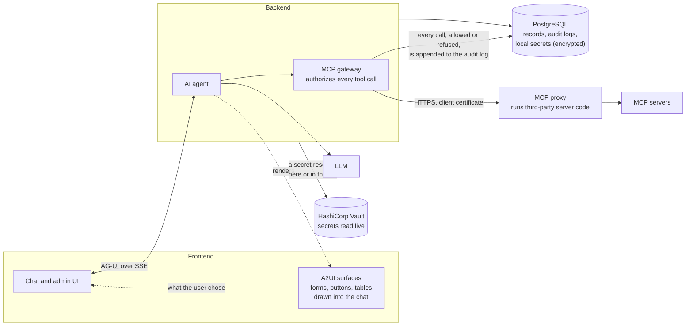

# A2Flow


**A2Flow is a workflow engine rebuilt from the ground up around an AI agent.** Not an
engine with an AI step bolted into it: an engine whose runtime *is* an agent. It reads
the procedure, plans the task graph, binds the tools each step needs, pauses for the
people who have to sign off, and executes the rest itself.

There is no flowchart to draw and no diagram to return to. A workflow is not something
the agent takes part in — it is what the agent does.

📖 **[Read the manual](https://kaitoy.github.io/a2flow/)** ([日本語](https://kaitoy.github.io/a2flow/ja/))

## Features

| | |
|---|---|
| **[Workflows designed in conversation](https://kaitoy.github.io/a2flow/docs/guides/workflows)** | Start from an [Agent Skill](https://kaitoy.github.io/a2flow/docs/guides/agent-skills) — a `SKILL.md` in a Git repository — and talk to the AI. It drafts the task graph, you adjust it, you publish it. |
| **[A run is one shared chat](https://kaitoy.github.io/a2flow/docs/guides/workflow-executions)** | The applicant states the intent, the agent walks the task graph, and the approver decides in the same thread. No ticket queue, no side channel. |
| **[Approvals that carry real authority](https://kaitoy.github.io/a2flow/docs/guides/approvals)** | Each task holds a short-lived X.509 certificate over exactly the tools it was granted. The tool proxy refuses any call that does not present one, signed — a prompt injection cannot talk its way past it, and the agent cannot widen a grant afterwards. |
| **[MCP servers, sandboxed](https://kaitoy.github.io/a2flow/docs/guides/mcp-servers)** | Register the servers whose tools your workflows use. Third-party server code runs in a [separate proxy](https://kaitoy.github.io/a2flow/docs/architecture/mcp-proxy), away from the database credentials and API keys. |
| **[Tool mocks](https://kaitoy.github.io/a2flow/docs/guides/tool-mocks)** | Exercise a draft workflow end to end with no side effects: mocked tools return a configured result, so no request reaches the server and nobody is emailed. |
| **[Secrets](https://kaitoy.github.io/a2flow/docs/guides/secrets)** | Named key/value bundles, referenced from server headers and environment as `${secret:name/key}` — never pasted into a form twice. |
| **[Append-only audit logs](https://kaitoy.github.io/a2flow/docs/guides/audit-logs)** | Every tool call the proxy allowed or refused, every certificate issued, every impersonated session, every mail sent. Nothing in the screens edits or removes a record. |
| **[Admin UI](https://kaitoy.github.io/a2flow/docs/guides/admin-ui)** | Thirteen sections that all behave the same way, over [multiple tenants](https://kaitoy.github.io/a2flow/docs/concepts/tenants), [role-based authorization](https://kaitoy.github.io/a2flow/docs/concepts/authorization), and [notifications](https://kaitoy.github.io/a2flow/docs/guides/notifications). |

## Architecture



The UI talks to the agent over the
[AG-UI protocol](https://docs.ag-ui.com/concepts/events), and the agent answers with more
than text: it draws [A2UI](https://a2ui.org/) surfaces — forms, choices, tables — into
the chat, and what the reader does with them comes back as the next turn. Every record
lives in PostgreSQL, the audit log among them, append-only. A secret is held by name and
resolved only when it is used, from whichever store backs it: the database, encrypted, or
HashiCorp Vault, read live. No tool call reaches a server directly — the gateway decides
whether it may happen, and the MCP proxy is where it happens, a separate process because
it runs third-party code and so must not sit next to the database credentials or the API
keys. See the
[architecture overview](https://kaitoy.github.io/a2flow/docs/architecture/overview) for
the full picture.

## Quick start

The whole stack — PostgreSQL, the backend, the outgoing-email worker, the MCP proxy, and
the frontend — comes up with [compose.yml](compose.yml):

```bash
echo GOOGLE_API_KEY=your_google_api_key_here > .env
docker compose up --build
```

The first start takes longer than later ones: the images are built and the database
schema is created. When it settles, open **<http://localhost:3000>**.

Sign in as the seeded `admin` user. Its password comes from `ADMIN_PASSWORD` in `.env`;
leave that unset and one is generated and printed to `docker compose logs backend` on
first start — as are the `root` and demo-account passwords.

Demo data is on by default under Compose, so there is something to run straight away:
[Demo data](https://kaitoy.github.io/a2flow/docs/getting-started/demo-data) walks an
approval-gated "launch an EC2 instance" workflow from generation to approval, signing in
as a developer, a requester, and an approver in turn — and it can be played through with
tool mocks, without an AWS account.

To use a model other than Google Gemini, see
[LLM configuration](https://kaitoy.github.io/a2flow/docs/getting-started/llm-configuration).
To run the backend and the frontend directly instead of in containers, see
[Quick start](https://kaitoy.github.io/a2flow/docs/getting-started/quick-start).

## Documentation

The user and operator manual lives at **<https://kaitoy.github.io/a2flow/>**
([日本語](https://kaitoy.github.io/a2flow/ja/)). It is built from [`website/`](website/)
and deployed by [pages.yml](.github/workflows/pages.yml).

| | |
|---|---|
| [Introduction](https://kaitoy.github.io/a2flow/docs/intro) | What A2Flow is: an agent that is the workflow, not a step inside one |
| [Quick start](https://kaitoy.github.io/a2flow/docs/getting-started/quick-start) | Get the backend and the frontend running |
| [Terminology](https://kaitoy.github.io/a2flow/docs/concepts/terminology) | Workflows, design sessions, executions, workflow sessions |
| [Roles and authorization](https://kaitoy.github.io/a2flow/docs/concepts/authorization) | Who may do what |
| [Guides](https://kaitoy.github.io/a2flow/docs/guides/workflows) | One page per feature, from workflows to notifications |
| [Configuration reference](https://kaitoy.github.io/a2flow/docs/operations/configuration) | Every environment variable the backend reads |
| [Deployment](https://kaitoy.github.io/a2flow/docs/operations/deployment) | Reverse proxies, scaling, what has to persist |

## License

Apache License 2.0 — see [LICENSE](LICENSE).

## Contributing

```
a2flow/
├── backend/   # FastAPI + Google ADK agent (Python)
├── frontend/  # Next.js 16 chat UI (TypeScript)
└── website/   # The manual site (Docusaurus → GitHub Pages)
```

The toolchain is pinned in [mise.toml](mise.toml) and the git hooks run every check, so
setting up is three commands from the repository root:

```bash
mise install        # Python, Node.js, pnpm, uv, lefthook at the pinned versions
lefthook install    # wire the pre-commit / pre-push hooks into .git/hooks/
cd backend && uv sync && cd ../frontend && pnpm install
```

Then the tests:

```bash
cd backend && uv run pytest       # parallel via pytest-xdist; no API keys needed
cd frontend && pnpm test          # vitest + Testing Library + MSW on happy-dom
```

**[CONTRIBUTING.md](CONTRIBUTING.md)** has the rest: running the two services locally,
bumping a pinned version, testing against PostgreSQL, the OpenAPI → Zod contract, and
building the manual site.
