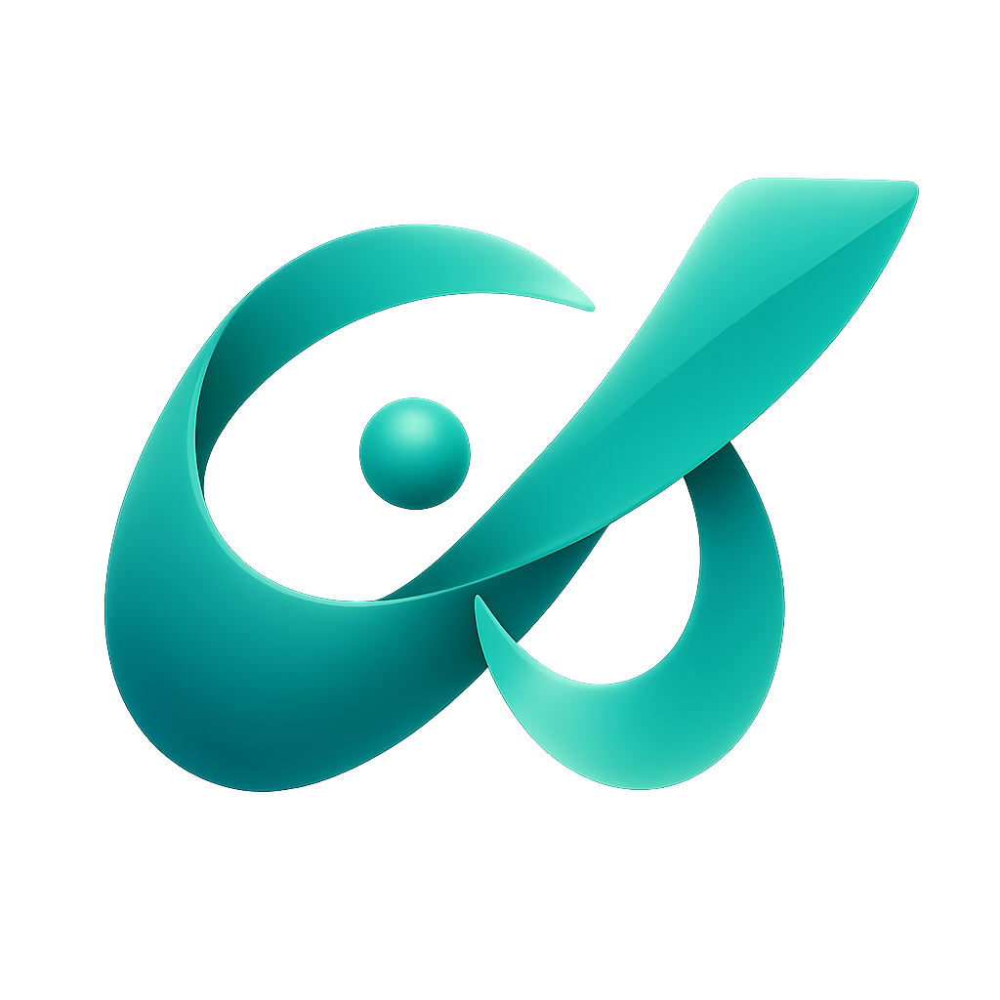

# A2Flow



A chat application that connects a [Google ADK](https://google.github.io/adk-docs/) agent to a Next.js UI using the [AG-UI protocol](https://docs.ag-ui.com/concepts/events). A2Flow rebuilds ITSM-style, multi-person, approval-gated workflows around that agent: it plans the work as a task graph, pauses for the humans who must sign off, and executes the rest.

```
┌──────────────────────────────────┐    AG-UI RunAgentInput (JSON)    ┌──────────────────────┐
│   Next.js frontend               │  (render_a2ui tool injected by   │  FastAPI backend     │
│   @ag-ui/client                  │ ───────────────────────────────► │  Google ADK agent    │
│   @ag-ui/a2ui-middleware         │   A2UIMiddleware)                 │  AGUIToolset         │
│   Redux Toolkit                  │                                   │  DB SessionService   │
│   Admin UI (/admin)              │ ◄─────────────────────────────── │  SQLite/PostgreSQL   │
└──────────────────────────────────┘  AG-UI events (SSE) incl.        └──────────────────────┘
     :3000                            A2UI (TOOL_CALL_*)                    :8000
```

## Documentation

The user and operator manual lives at **<https://kaitoy.github.io/a2flow/>** ([日本語](https://kaitoy.github.io/a2flow/ja/)). It is built from [`website/`](website/) and deployed by [pages.yml](.github/workflows/pages.yml).

| | |
|---|---|
| [Introduction](https://kaitoy.github.io/a2flow/docs/intro) | What A2Flow is and how the pieces fit together |
| [Quick start](https://kaitoy.github.io/a2flow/docs/getting-started/quick-start) | Get the backend and the frontend running |
| [Terminology](https://kaitoy.github.io/a2flow/docs/concepts/terminology) | Workflows, design sessions, executions, workflow sessions |
| [Roles and authorization](https://kaitoy.github.io/a2flow/docs/concepts/authorization) | Who may do what |
| [Guides](https://kaitoy.github.io/a2flow/docs/guides/workflows) | One page per feature, from workflows to notifications |
| [Configuration reference](https://kaitoy.github.io/a2flow/docs/operations/configuration) | Every environment variable the backend reads |
| [Deployment](https://kaitoy.github.io/a2flow/docs/operations/deployment) | Reverse proxies, scaling, what has to persist |

The rest of this file is for **working on** A2Flow rather than using it.

## Repository layout

```
a2flow/
├── backend/   # FastAPI + Google ADK agent
├── frontend/  # Next.js 16 chat UI
└── website/   # The manual site (Docusaurus → GitHub Pages)
```

## Quick start

### 0. Toolchain ([mise](https://mise.jdx.dev/))

Python, Node.js, pnpm, uv, and lefthook versions are pinned in [mise.toml](mise.toml) and provisioned by mise, so every machine runs the same toolchain. Install mise once:

| OS | Command |
|---|---|
| Windows | `winget install jdx.mise` |
| macOS | `brew install mise` |
| Linux | See the [installation docs](https://mise.jdx.dev/installing-mise.html) |

Activate it in your shell (see [activation docs](https://mise.jdx.dev/installing-mise.html#shells) for bash/zsh/fish; on Windows add `(&mise activate pwsh) | Out-String | Invoke-Expression` to your PowerShell `$PROFILE`), then install the tools from the repository root:

```bash
mise trust
mise install
```

On Windows, also put mise's shims directory (`%LOCALAPPDATA%\mise\shims`) on your `PATH`. Git hooks and editor integrations are spawned outside an activated shell and resolve `uv` / `pnpm` / `python` from `PATH` alone.

Not using mise? The minimum versions are Python 3.11+, Node.js 20+, plus [uv](https://docs.astral.sh/uv/), pnpm, and lefthook installed by hand.

### 1. Backend

```bash
cd backend
uv sync
cp .env.example .env
# Edit .env — set LLM_MODEL and the corresponding API key
uv run uvicorn main:app --reload
```

The API is now available at `http://localhost:8000`. See [LLM configuration](https://kaitoy.github.io/a2flow/docs/getting-started/llm-configuration) for the model and API-key settings.

### 2. Frontend

```bash
cd frontend
pnpm install
# Optional: cp .env.local.example .env.local  (only needed if backend is not on :8000)
pnpm dev
```

Open [http://localhost:3000](http://localhost:3000).

### 3. Git hooks (lefthook)

Pre-commit / pre-push hooks run linters, formatters, type checkers, and tests. `mise install` already provides the `lefthook` binary; run `lefthook install` once from the repository root to wire it into `.git/hooks/`. See [.claude/rules/git-workflow.md](.claude/rules/git-workflow.md) for what each hook runs.

### Or: Docker Compose

The whole stack — PostgreSQL 17, the backend, the outgoing-email worker, and the frontend — comes up with [compose.yml](compose.yml):

```bash
echo GOOGLE_API_KEY=your_google_api_key_here > .env
docker compose up --build
```

See [Run with Docker Compose](https://kaitoy.github.io/a2flow/docs/getting-started/docker-compose) for the details.

## Development

### Toolchain versions

[mise.toml](mise.toml) is the single source of truth for the Python, Node.js, pnpm, uv, and lefthook versions. Run `mise install` after cloning or after any change to it.

Bumping a version there means updating the places that pin the same tool independently, in the same change:

| `mise.toml` entry | Also update |
|---|---|
| `python` | `backend/.python-version`, `backend/Dockerfile` and `frontend/Dockerfile` base image tags |
| `node` | `backend/Dockerfile` and `frontend/Dockerfile` base image tags |
| `pnpm` | `packageManager` in `frontend/package.json` and `website/package.json` (corepack reads it during the Docker build, and pnpm self-switches to it) |

`backend/pyproject.toml` sets `[tool.uv] python-preference = "only-system"` so `uv sync` builds `backend/.venv` from the mise-pinned interpreter on `PATH` instead of downloading its own. `requires-python`, ruff's `target-version`, and mypy's `python_version` stay at the 3.11 support floor and are deliberately not bumped alongside `mise.toml`.

### Testing

```bash
cd backend && uv run pytest       # parallel via pytest-xdist; no API keys needed
cd frontend && pnpm test          # vitest + Testing Library + MSW on happy-dom
```

Both suites also run from the pre-commit hook, gated so a backend-only or frontend-only commit skips the other side. See [backend/README.md](backend/README.md#testing) and [frontend/README.md](frontend/README.md#testing) for the options each takes.

### API contract (OpenAPI → Zod)

The REST endpoints are described by the FastAPI app and exported as OpenAPI 3.1. The frontend consumes that spec to generate Zod schemas and TypeScript types, which are then used for runtime response validation.

```
backend/main.py (FastAPI app)
   │
   │  uv run python -m scripts.export_openapi
   ▼
backend/openapi.yaml ◄─── gitignored (regenerated locally / in CI)
   │
   │  pnpm generate:api  (frontend)
   ▼
frontend/src/generated/api/{types.gen.ts, zod.gen.ts}  ◄─── gitignored
```

The AG-UI streaming endpoint (`POST /agent`) is marked `include_in_schema=False` and is intentionally excluded from the spec — its events are typed by `@ag-ui/core`. The `{meta, data, error}` response envelope is built by the routes themselves (each declares `response_model=ApiResponse[T]` and returns `ApiResponse(meta=…, data=…)`) and by the exception handlers for errors, so its shape **is** part of the spec. The generated Zod schemas therefore describe the whole envelope; the frontend's internal `fetchEnvelope()` helper parses it and returns the inner `data` (throwing `ApiClientError` if the envelope carries an error body).

`pnpm generate:api` (frontend) runs the backend export step via `uv` first, then the Zod codegen — so a single command keeps both layers in sync. The frontend's `predev` and `prebuild` hooks invoke it automatically, so `pnpm dev` and `pnpm build` regenerate the spec and schemas on every run. `uv` must be available on `PATH`.

Regenerating can rename the Zod schema exports in `zod.gen.ts`, since they embed the full URL path segments — adding an `/api/v1/` prefix turns `zListAgentSkillsAgentSkillsGetResponse` into `zListAgentSkillsApiV1AgentSkillsGetResponse`. After any regeneration, `cd frontend && pnpm build` is the quick check: a module-not-found error on a `zod.gen` import is a name mismatch to fix.

Every collection endpoint accepts a shared set of `limit` / `offset` / sort (`s`) / filter (`q`) query parameters, with camelCase field names. See [.claude/rules/api-conventions.md](.claude/rules/api-conventions.md) for the full reference.

#### Interactive API reference

An interactive [Scalar](https://scalar.com/) reference is served at [http://localhost:3000/api-doc](http://localhost:3000/api-doc). It loads the FastAPI app's live OpenAPI document (`/openapi.json`, proxied to the backend by `next.config.ts`), so it always reflects the running backend. The page is behind the same login gate as the rest of the app.

### The manual site

```bash
cd website
pnpm install
pnpm start                 # dev server on http://localhost:3100/a2flow/ (English)
pnpm start --locale ja     # dev server in Japanese (one locale at a time)
pnpm build                 # builds every locale; fails on broken links
pnpm serve                 # serves the build — the only way to exercise search
```

Every page has an English original under `website/docs/` and a Japanese translation under `website/i18n/ja/docusaurus-plugin-content-docs/current/`; **both are updated in the same change**. What belongs on the site and what stays in this repository is described in [website/README.md](website/README.md).

## Further reading

- [backend/README.md](backend/README.md) — API reference, implementation notes, environment variables
- [frontend/README.md](frontend/README.md) — project structure, component overview, environment variables
- [docs/a2ui-flow.md](docs/a2ui-flow.md) — how A2UI surfaces are generated and rendered, end to end
- [DESIGN.md](DESIGN.md) — the design system: colors, typography, spacing, component styles
