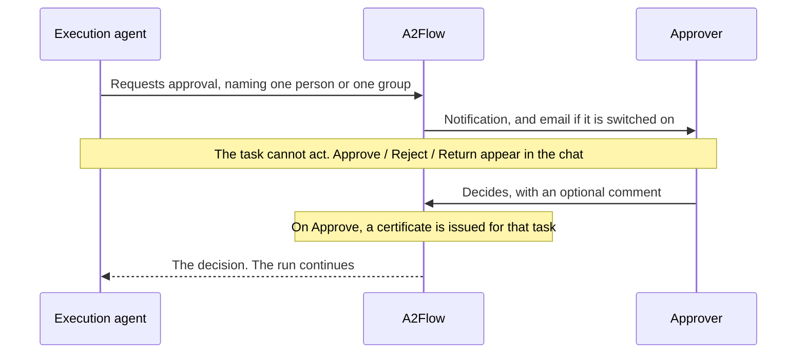

# Approval gate

An [approval](../guides/approvals.md) does two things at once. It stops a task until a person decides, and it turns that decision into a signed grant saying exactly what the task may do afterwards.

## What "blocked" means

The pause is not the agent politely waiting.

| While a task's approval is undecided | |
|---|---|
| What the task may call | None of its bound MCP tools — the call is refused before it reaches a server |
| Who enforces that | The [proxy](./mcp-proxy.md), as a rule it checks; not a sentence in the agent's instructions |
| What triggers the gate | The *existence* of an approval on the task. A pending one and a rejected one block alike, so the gate fails closed |
| What is unaffected | Tasks with no approval attached — they keep running under the ordinary tool-binding rule |

A prompt injection or a bug therefore cannot talk its way past the gate, because there is nothing to persuade. The only thing that opens it is a decision recorded against the approval.

## The certificate

Granting an approval issues a short-lived certificate for that task, signed by a certificate authority the deployment generates for itself on first use.

| The certificate carries | Why it matters |
|---|---|
| Which tenant, run, task and approval it speaks for | A certificate minted for one run is useless in another |
| **The tools the task had bound at the moment the approver decided** | The agent can rewrite its own task's bindings mid-run, but it cannot re-issue a certificate. Approving a task to read a file never becomes approval to delete one |

### The task an approval covers

Both halves of the mechanism belong to **one task: the one that carries out the approved action**. The gate closes on the task the approval names, and the grant is that same task's tools — so naming the wrong one disables both at once.

That matters because a workflow usually shows the request as a step of its own:

| Step | Tools it uses | What the approval must name |
|---|---|---|
| Request approval | None | — |
| Launch instance | The one that launches | **This one** |

Naming the first step would freeze an empty set of tools into the certificate and leave the second step with no approval on it at all, and therefore unguarded — the gate would be absent on exactly the call it exists for. So a request naming a step that uses no tools while a step after it does is **refused**, and the agent is told which step to name instead. A step with no tools and nothing tool-using after it is accepted: that is an approval covering an action no tool performs.

Every later tool call from that task must present it, and the proxy checks all of the following before the call goes anywhere:

- the certificate speaks for this run and this task,
- it is one this deployment issued, and it has not been revoked,
- the approval behind it is still granted,
- the caller can prove the certificate is theirs rather than one they copied,
- the tool being called is inside the signed set.

A certificate is revoked once its task reaches a terminal status. Safety does not depend on that — a finished task is no longer `in_progress`, so its calls are already refused — but it makes the record say *why* the grant stopped counting, and keeps a certificate's life matched to the work it authorized. Its maximum lifetime is adjustable in the [configuration reference](../operations/configuration.md#mcp-tools-and-approvals).

## What the record answers

Every decided call — allowed or refused — is recorded together with the certificate it presented, so "which approval authorized this, and who granted it" can be answered long after the run has finished. Arguments are kept only as a digest; the raw values are never stored. The run's Tool Invocations page is where that record is read.

**Scope of the guarantee.** The proxy runs inside the backend process, so a certificate proves possession to a verifier sharing that process — it is not a defence against an attacker who already controls the backend. What it does provide is a single fail-closed enforcement point, a grant that cannot be widened after the fact, and a record that can be checked afterwards.
