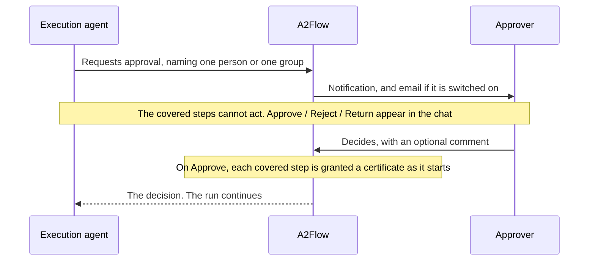
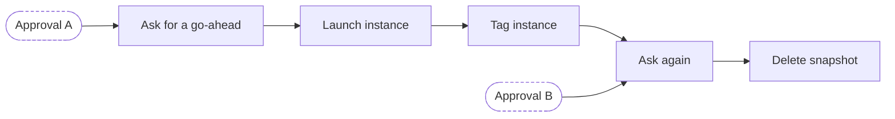

# Approval gate

An [approval](../guides/approvals.md) does two things at once. It stops a run at one step until a person decides, and it turns that decision into a signed grant saying exactly what the steps it covers may do afterwards.

## What "blocked" means

The pause is not the agent politely waiting.

| While an approval is undecided | |
|---|---|
| What the covered steps may call | None of their bound MCP tools — the call is refused before it reaches a server |
| Who enforces that | The [proxy](./mcp-proxy.md), as a rule it checks; not a sentence in the agent's instructions |
| What triggers the gate | The *existence* of an approval covering the step. A pending one and a rejected one block alike, so the gate fails closed |
| What is unaffected | Steps no approval covers — they keep running under the ordinary tool-binding rule |

A prompt injection or a bug therefore cannot talk its way past the gate, because there is nothing to persuade. The only thing that opens it is a decision recorded against the approval.

## The certificate

Each step an approval covers is granted a short-lived certificate when it starts, signed by a certificate authority the deployment generates for itself on first use.

The certificate is not what an approval adds — **every** step that calls a tool has one. What an approval changes is who it comes from: a step nobody was asked to approve is granted one on the authority of whoever started the run, and an approval replaces that with the approver's own. So the question the record answers is never "was this call authorized" but "by whom".

| The certificate carries | Why it matters |
|---|---|
| Which tenant, run and step it speaks for, and whose authority it carries — an approver's, or the run initiator's | A certificate minted for one run is useless in another, and one kind of authority cannot stand in for the other |
| **The tools the step had bound at the moment it started** | A run's steps and their tools are fixed at execute time from the workflow's published design, the certificate freezes them again at issuance, and a covered step's tools can no longer be edited at all — so neither the agent nor a later change can widen a grant. Approving a step to read a file never becomes approval to delete one |

### The steps an approval covers

An approval covers **the step it names and every step after it, up to the next approval**. So a workflow can put the request in a step of its own and let the decision reach the work that follows:

Approval A covers *Ask for a go-ahead*, *Launch instance* and *Tag instance*. Approval B takes over from *Ask again* onwards. Nothing above a request is ever covered by it — an approval reaches forward only.

| Situation | What happens |
|---|---|
| The named step uses no tools itself | Fine, and usual. The decision is carried by the steps after it |
| A step sits after two approvals on different branches | **Both** must be granted before it may act. One approver clearing their own branch does not speak for the other's |
| A second approval is requested on a step already covered by an earlier one | The nearer request takes over immediately, and the earlier decision stops authorizing that step |
| A step is returned for rework and re-submitted | The new request replaces the old decision as that step's gate, so a rejection cannot leave the step stuck for good |

Every later tool call from a covered step must present its certificate, and the proxy checks all of the following before the call goes anywhere:

- the certificate speaks for this run and this step,
- it is one this deployment issued, and it has not been revoked,
- the approval behind it still covers the step, and every approval that does is still granted,
- the caller can prove the certificate is theirs rather than one they copied,
- the tool being called is inside the signed set.

A certificate is revoked once its step reaches a terminal status. Safety does not depend on that — a finished step is no longer running, so its calls are already refused — but it makes the record say *why* the grant stopped counting, and keeps a certificate's life matched to the work it authorized. Because each covered step is granted its own certificate as it starts, a long chain of steps does not have to finish inside one certificate's lifetime; that maximum lifetime is adjustable in the [configuration reference](../operations/configuration.md#mcp-tools-and-approvals).

## What the record answers

Every decided call — allowed or refused — is recorded together with the certificate it presented, so "who authorized this, and on what basis" can be answered long after the run has finished. Arguments are kept only as a digest; the raw values are never stored. The run's Tool Invocations page is where that record is read.

**Scope of the guarantee.** The proxy runs inside the backend process, so a certificate proves possession to a verifier sharing that process — it is not a defence against an attacker who already controls the backend. What it does provide is a single fail-closed enforcement point, a grant that cannot be widened after the fact, and a record that can be checked afterwards.
