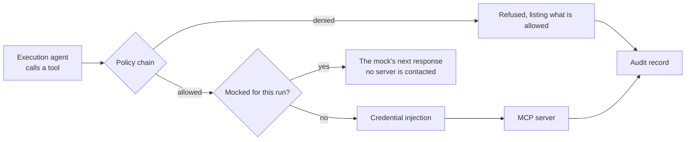
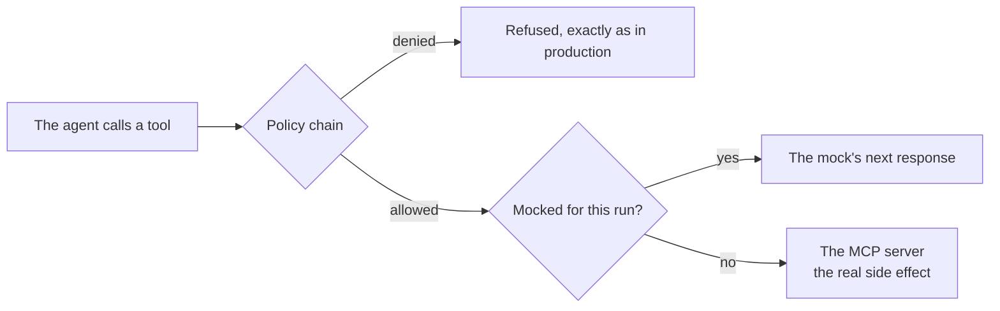

# MCP proxy

The agent never talks to a registered [MCP server](../guides/mcp-servers.md) directly. Every call goes through A2Flow's own proxy, which decides whether the call is allowed, whether it should be answered from a stub, and what credentials the connection needs — and records what it decided.

| The proxy owns | What it does |
|---|---|
| **Identity** | Establishes which tenant and which run a call belongs to, from the conversation it arrived on |
| **Authorization** | Consults an ordered chain of policies, any of which may veto |
| **Stubbing** | Answers from a [tool mock](./mcp-proxy.md#tool-mocks-and-dry-runs) when the run has one for this tool |
| **Credentials** | Expands the registered server's [secret](./secrets.md) references into a connection, at connect time only |

## The policy chain

| Order | Policy | What it requires |
|---|---|---|
| 1 | **In-progress tool binding** | The `(server, tool)` pair must be bound to a task the run currently has `in_progress`. Listing what a server advertises is deliberately unrestricted — that is how the design agent decides what to bind |
| 2 | **Approval certificate** | If every in-progress task binding this tool has an [approval](./approvals.md) attached, the call must present that approval's certificate, and its signed grant must cover the tool |

The chain stops at the first veto and is ordered cheapest first, so a call that already fails the binding rule never pays for a signature check. Adding a rule means adding a policy to the chain rather than editing the proxy, which is what keeps "what may run" readable as one ordered list.

Refusals are written for the caller rather than for a log: a denied call comes back naming the tools that *are* allowed, so the model can correct itself instead of guessing.

## What is recorded

| Recorded per decided call | Deliberately not recorded |
|---|---|
| The tool, the server, and whether it was allowed or denied | The arguments themselves — only a digest of them is kept |
| The refusal reason, when denied | |
| The certificate presented, when the call was approval-gated | |

That record is the run's Tool Invocations page, and it is what makes "which approval authorized this call" answerable after the fact.

## Tool mocks and dry runs {#tool-mocks-and-dry-runs}

A [tool mock](../guides/tool-mocks.md) lets a **draft** workflow be exercised end to end without its tools' side effects. What matters here is *where* the stub sits.

The stub is consulted **after** the policy chain, never before it. A dry run therefore rehearses the same authorization a real run faces: the tool must still be bound to a task in progress, and a task with an approval attached must still present its certificate. The only thing a mock skips is the part that has an effect outside A2Flow.

Two consequences are worth knowing:

- **Responses follow the call count.** The first response answers the run's first call to that tool, the second its second, and the last one repeats once the list runs out. The counter belongs to the run, so it survives the many requests — and the possible replicas — that one agent run spans.
- **A stubbed call leaves no audit record.** That record is for calls that reached, or were stopped on their way to, a real server; a row for a call that was always going to be answered from a snapshot would misread in either direction. The chat transcript is where a stubbed call is inspected, badged `Mocked`.
