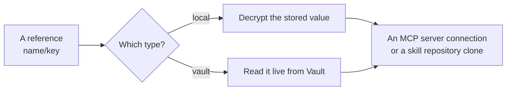

# Secret storage

A [secret](../guides/secrets.md) is a named bundle of key/value entries, and every reference names exactly one entry — `${secret:name/key}` in an MCP server's headers or environment, a name and a key on an agent skill. References are held by name and **resolved only when they are used**, so nothing that needs a credential ever stores one.

| | **Local** | **HashiCorp Vault** |
|---|---|---|
| What is stored | The entries themselves, each value encrypted | Only a KV v2 reference — a mount and a path |
| Where values come from | The encrypted store | Vault, read at the moment of resolution |
| How keys are listed | From the stored map, without decrypting anything | Read from Vault at that moment |
| What a client can read back | Keys only — never a value, plaintext or encrypted | Keys only |

## Local secrets

Values are encrypted with a single key belonging to the deployment. The entry keys stay in plaintext beside them, which is what lets a picker list them without decrypting anything, and no value is ever handed back to a client in any form — which is why a local secret's detail page shows its keys with blank values.

The encryption key is resolved once per process: taken from the environment if it is set there, otherwise read from a key file, otherwise generated on first use and written to that file with a warning in the log.

**Back that key up.** Losing it makes every stored local secret undecryptable — and, because the same key protects the signing key of the authority that issues [approval certificates](./approvals.md), it also stops certificates from being issued or verified. Both live in the [configuration reference](../operations/configuration.md#secret-management).

## HashiCorp Vault secrets

For a Vault-backed secret, A2Flow stores no values at all — only the mount and path to read them from. Both the values and the list of keys are fetched live each time they are needed, so rotating a value in Vault takes effect without touching A2Flow.

One Vault connection is configured for the whole deployment, authenticating either with a static token or with AppRole credentials; an AppRole token is reused until its lease is nearly up and then refreshed by logging in again. Until Vault is configured, `vault`-type secrets cannot be resolved at all.

## Where resolution happens

| Consumer | Resolved when |
|---|---|
| An MCP server's header and environment values | The [proxy](./mcp-proxy.md) connects to that server |
| An agent skill's repository password | The repository is cloned or pulled |

Because resolution is lazy, renaming or deleting a secret that something still references does not fail at edit time. The next use fails instead, naming the secret it could not find; the underlying reason stays in the server's log rather than being handed to the caller.
