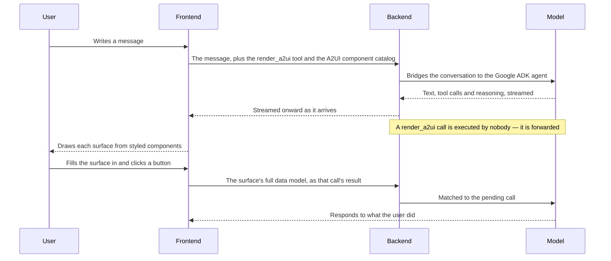

# Sessions

A session is a chat several parties share: the agent, the person who opened it, and whoever else the work brings in. It is also where the agent draws interactive surfaces, so an exchange can be a form to fill in rather than a paragraph to answer in prose.

## Who shares one

| Session | Shared by | Everyone else |
|---|---|---|
| **Workflow session** | The run's initiator, and the designated approver of any of its [approvals](./approvals.md) | An Admin of the tenant sees it read-only; nobody else has access |
| **Design session** | Every Developer in the tenant, plus Super Admins and the workflow's creator | No access |

An approval addressed to a group brings in every member holding `approver`, so the chat follows the group's membership — deciding is what that access exists to enable. Because several people post into one conversation, every message carries a **sender avatar**, and the page refreshes itself every few seconds so each participant sees the others' messages and the agent's progress without reloading.

## How a turn runs

The backend bridges the AG-UI protocol to a Google ADK agent: it translates events both ways, keeps the conversation in step, and streams events back to the browser as they arrive, so text appears incrementally rather than in one block at the end. Conversation state is kept under the chat's id, so reopening it continues where it left off.

## Interactive surfaces

The `render_a2ui` tool is attached by the frontend rather than by the backend, and it carries the schema of the [A2UI](https://a2ui.org) component catalog the agent may draw from. When the model calls it the backend executes nothing — it forwards the call, and the browser is what draws the result.

| Component | Used for |
|---|---|
| `Text`, `Card`, `Row`, `Column` | Structure and copy |
| `TextField` | Free input |
| A choice picker | Selecting among allowed values. A single-choice picker with five or more options collapses into a dropdown, so the agent can list every EC2 instance type or region without burying the conversation |
| `Button` | Submitting the surface |

Clicking a button sends the surface's **whole data model** back — every value typed or selected, not just the button that was pressed. That is what lets the agent respond to what the user actually entered, and what lets a reloaded chat redisplay an answered surface filled in with the user's own values rather than the agent's defaults.

## Agent activity in the chat {#agent-activity-in-the-chat}

So you can see what the agent is doing between replies, its intermediate work is surfaced inline in the chat stream:

- **Working indicator** — while a run is in flight but nothing is on screen yet, a subtle pulse appears at the bottom of the message list.
- **Tool-call lines** — every backend tool call (e.g. `list_workflow_tasks`, `update_workflow_task`) becomes a compact status line that transitions from a spinner (`running…`) to a check (`done`). Calls routed through the [tool proxy](./mcp-proxy.md) are shown under the **real MCP tool name** with an `MCP` tag. The `render_a2ui` and `render_approval` client tools, the tool that writes a session file, and the one that proposes [suggested replies](../guides/workflow-executions.md#suggested-replies) keep their dedicated UI and are not shown as tool lines.
- **Call details** — a tool line with arguments or a result **expands on click** to show both as formatted JSON, so what the agent actually sent and got back is inspectable without leaving the chat. A line answered by a [tool mock](./mcp-proxy.md#tool-mocks-and-dry-runs) carries a `Mocked` badge — and the chat is the *only* place to inspect one, since a stubbed call never reaches the proxy and so leaves no audit record.
- **Reasoning** — when a thinking-capable model streams its reasoning, the thoughts render as a muted "Thinking" panel. A model that reasons internally without emitting thought summaries produces no panel.

On session resume, **MCP tool calls**, **file cards** and the **suggested replies** of the last turn are reconstructed from history; other internal A2Flow tool calls and reasoning are live-only. A file card is rebuilt because the file outlives the run that produced it and the chat is the only place its download link appears; the suggestions are rebuilt because the question they answer is still open.

## Files in a session {#files-in-a-session}

A workflow session carries files as well as messages: ones a participant attached from the chat input, and ones the agent wrote while working. A design session has none.

Three rules define them:

- **Scope.** A file belongs to exactly one run. Nothing addresses a file without naming the run it is in, so one session's files are unreachable from another.
- **Lifetime.** Files live as long as their run and are removed with it. There is no separate cleanup and no expiry.
- **Access.** No permission of their own: attaching needs the standing to drive the run, downloading the standing to read its chat. Those are the same two rules the chat itself uses.

The agent may read and add, never replace or remove — a write under a name already taken is stored under a numbered variant. So a file a participant attached stays exactly as they attached it, whatever the run does afterwards.

What the agent knows about the files does not come from the browser. The server reads the session's file list and injects it into the run's context alongside the workflow description, the same way and for the same reason: a client-supplied list would be a client-supplied instruction.

Files are stored in the database, so they inherit its durability and its backup, and need no shared volume across replicas. Downloads are always served as an attachment under a generic content type, so nothing a participant or the agent stored can be rendered by a browser.
