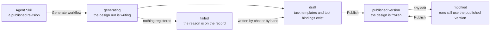

# Designing a workflow

A workflow is never created bare. It is generated from an [Agent Skill](../guides/agent-skills.md) — a Git repository A2Flow clones and keeps up to date — and then refined until the design is worth freezing.

A skill with no published revision can be neither generated from nor run against. The clone is what both agents follow, so until one exists there is nothing to follow.

## The design run

Generating registers the workflow immediately and does the design work in the background. It is a full agent run against an LLM, so the record refreshes itself while the work proceeds rather than holding a screen open for it.

1. The prompt from the Generate dialog is sent as the first message of the workflow's **design session**.
2. The design agent reads the skill, breaks the request into steps, and registers them as **task templates** — a dependency graph, each step declaring which steps must finish before it.
3. For each step that needs one, it binds the MCP tools that step is allowed to call.
4. The conversation is summarized into the workflow's **Generated description**, and the workflow becomes `draft`.

The prompt is not kept as a field of the workflow. It lives on as the first message of the design conversation, which is why the same chat can be reopened later to refine the result — and why a run that registered nothing still leaves a usable starting point rather than an empty record.

## What a task template carries

| A template carries | Notes |
|---|---|
| **Title and description** | The step as the execution agent will read it. Titles are held short so they read as chips in the task lists. |
| **Depends on** | Edges to other templates of the same workflow. An edge that would close a cycle is refused. |
| **MCP tools** | The `(server, tool)` pairs this step is allowed to call. |
| *No status* | The lifecycle belongs to a run, not to the design. |

Templates are refined from the design chat, from the admin forms, or in any mix of the two — [Workflows](../guides/workflows.md#adjusting-the-task-templates) covers those screens. The design agent edits the templates directly and executes nothing, which is what makes the design session safe to share with a whole team.

## Binding tools at design time

Choosing tools and calling them are governed differently, on purpose.

| Operation | Who does it | How it is restricted |
|---|---|---|
| **Listing** what a server advertises | The design agent, while deciding | Not restricted — discovering tools is the whole point of a design run |
| **Calling** a tool | The execution agent, mid-run | Restricted to the tools bound to a task the run currently has in progress — see [MCP proxy](./mcp-proxy.md) |

So a binding written here is not a hint to the model. It is the grant the [proxy](./mcp-proxy.md) enforces at run time, and the set an [approval certificate](./approvals.md) freezes if the task turns out to need one.

## Publishing

Publishing freezes the design. The workflow's name, its effective description, and its full template list — dependency edges and tool bindings included — are captured as the published version, replacing the previous one. No AI runs at this point; publishing is a snapshot, not a review.

Editing afterwards moves the workflow to `modified` and changes nothing about what runs: runs keep using the published version until it is published again. A run already under way is unaffected either way, because it took its own copy the moment it started.

The published version is also the only version most people ever see. While a workflow is `modified`, its unpublished name, description and task templates are shown to a **Developer** or **Super Admin** and to nobody else; every other role reads the published version throughout — including in the workflows list, where searching and sorting by name follow the published name too — and sees the status as `published`. A Developer can run either design: the published one as a real request, or the edits as a [test run](../guides/workflows.md#trying-the-edits-out) that may stub its tools and is left out of the operations metrics.
