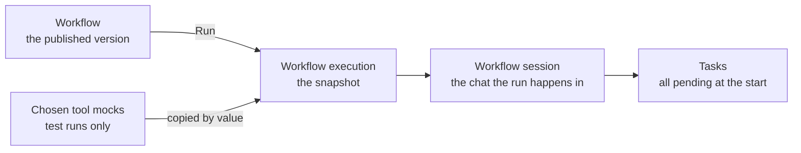
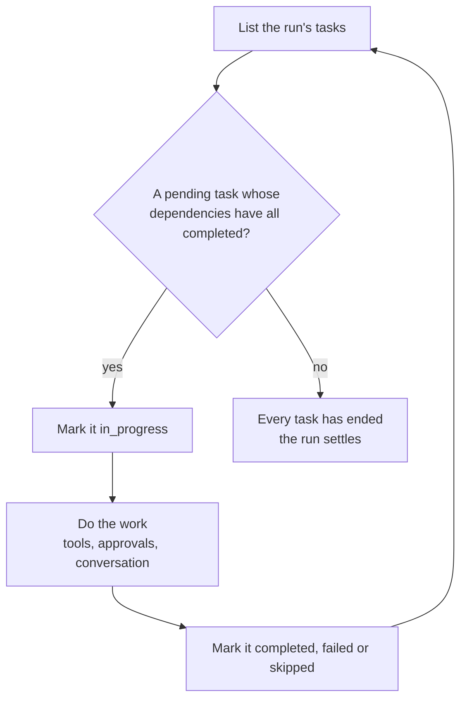

# Running a workflow

Running a workflow does not point a run at the workflow. It **copies** the published design onto a new [workflow execution](../guides/workflow-executions.md), and that record is what the run lives in from then on.

| Copied onto the run | Taken from |
|---|---|
| Name and effective description | The last published version — or the current rows, for a workflow still in `draft`, or when a Developer chose to run a `modified` workflow's [unpublished edits](../guides/workflows.md#trying-the-edits-out) |
| Tasks, all `pending`, with their dependencies and tool bindings | The same design's task templates |
| The agent skill revision the run follows | The skill's published revision at that moment |
| The chosen [tool mocks](./mcp-proxy.md#tool-mocks-and-dry-runs), by value | The mocks as they read at that moment |

Nothing in that list is read back from its source later. Editing the workflow, pulling the skill, or deleting either never reaches into a run already under way — and a finished run stays readable after the workflow it came from is gone.

## How the run advances

The workflow session opens with a fixed kickoff message and the execution agent already working. Publishing was the approval of the plan, so there is nothing to confirm before starting.

A run ends `completed` when every task reached a terminal status with no failure among them, and `failed` when at least one failed. The statuses can be watched live in the run's read-only task view, as a table or as the dependency graph.

## Why in_progress matters

Marking a task `in_progress` is not bookkeeping. It is what unlocks that task's tools: the [proxy](./mcp-proxy.md) allows a call only when the tool is bound to a task the run currently has in progress. A task that has ended can no longer act, and one not yet started never could.

The run's task list and every task's tool bindings are fixed when the run starts — copied from the workflow's published design — and the agent only advances statuses. It cannot add, remove, or re-bind a task. That is also why an [approval](./approvals.md) does not re-read a task's bindings when it matters: it signs the set it saw at the moment the approver decided, so no later change to the workflow can widen a grant already given.
