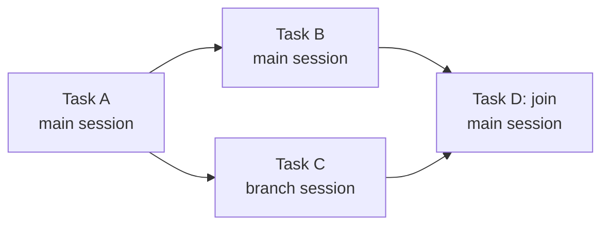
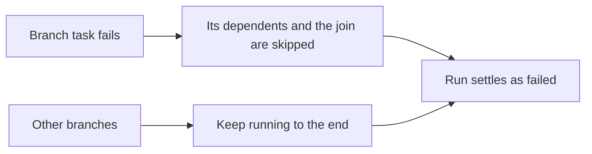

# Running a workflow

Running a workflow does not point a run at the workflow. It **copies** the published design onto a new [workflow execution](../guides/workflow-executions.md), and that record is what the run lives in from then on.

| Copied onto the run | Taken from |
|---|---|
| Name and effective description | The last published version — or the current rows, for a workflow still in `draft`, or when a Developer chose to run a `modified` workflow's [unpublished edits](../guides/workflows.md#trying-the-edits-out) |
| Tasks, all `pending`, with their dependencies and tool bindings | The same design's task templates |
| The agent skill revision the run follows | The skill's published revision at that moment |
| The chosen [tool mocks](./mcp-gateway-and-proxy.md#tool-mocks-and-dry-runs), by value | The mocks as they read at that moment |

Nothing in that list is read back from its source later. Editing the workflow, pulling the skill, or deleting either never reaches into a run already under way — and a finished run stays readable after the workflow it came from is gone.

## How the run advances

The workflow session opens with a fixed kickoff message and the execution agent already working. Publishing was the approval of the plan, so there is nothing to confirm before starting.

The agent does not choose which task comes next. The moment a task's dependencies have all completed, A2Flow **assigns** it to the session that will work it, and the agent works only the tasks assigned to it. Starting any other task — one assigned elsewhere, or one whose dependencies have not finished — is refused.

A run ends `completed` when every task reached a terminal status with no failure among them, and `failed` when at least one failed. The statuses can be watched live in the run's read-only task view, as a table or as the dependency graph.

When a task fails, every task still waiting on it — directly or further down the chain — is set to `skipped`, because it can no longer run. That is what lets the run settle as `failed` instead of waiting forever on a task that will never start. Tasks on other branches that do not depend on the failed one keep running as normal.

## Parallel branches {#parallel-branches}

When the task graph branches, the branches do not wait for each other. A run is worked in one **main session** to begin with; when a task becomes ready while the session that would take it is still busy with another, A2Flow **forks** a **branch session** for it. The branch starts with a copy of everything the main session knew up to that point, then works its own chain of tasks alongside the main session. An approval one branch waits on stops only that branch.

```mermaid
flowchart LR
  A[Task A<br/>main session] --> B[Task B<br/>main session]
  A --> C[Task C<br/>branch session]
  B --> D[Task D: join<br/>main session]
  C --> D
```

| Situation | Where the task goes |
|---|---|
| A root task, or one whose dependencies the main session worked | The main session — forked into a new branch session if the main session is still busy with another task |
| A task whose dependencies one live branch session worked | That branch session, again forked if it is busy |
| A task whose dependencies a finished branch session worked | The main session |
| A **join** — dependencies worked by more than one session | The main session, once every branch feeding it has finished |

- A branch session that runs out of tasks finishes with a short summary of what it did. The main session reads those summaries before it works a join.
- A branch can fork again, but only so many sessions run at once. At the limit, a ready task waits for its session instead — the run falls back to working one task after another.
- A failed task stops only its own chain: the tasks waiting on it, and any join it feeds, are `skipped` as described above, while other branches finish their work. The run then settles as `failed`.

```mermaid
flowchart LR
  F[Branch task fails] --> S[Its dependents and the join are skipped]
  O[Other branches] --> K[Keep running to the end]
  S --> R[Run settles as failed]
  K --> R
```

## Why in_progress matters

Marking a task `in_progress` is not bookkeeping. It is what unlocks that task's tools: the [gateway](./mcp-gateway-and-proxy.md) allows a call only when the tool is bound to a task the run currently has in progress. A task that has ended can no longer act, and one not yet started never could.

The run's task list and every task's tool bindings are fixed when the run starts — copied from the workflow's published design — and the agent only advances statuses. It cannot add, remove, or re-bind a task. That is also why an [approval](./approvals.md) does not re-read a task's bindings when it matters: it signs the set it saw at the moment the approver decided, so no later change to the workflow can widen a grant already given.
