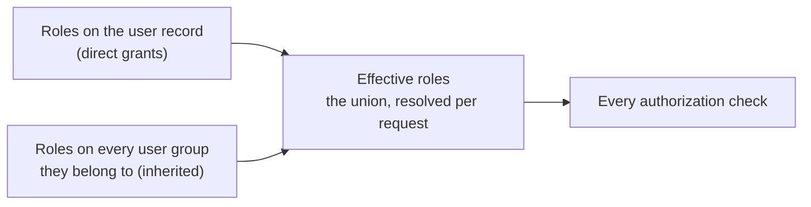
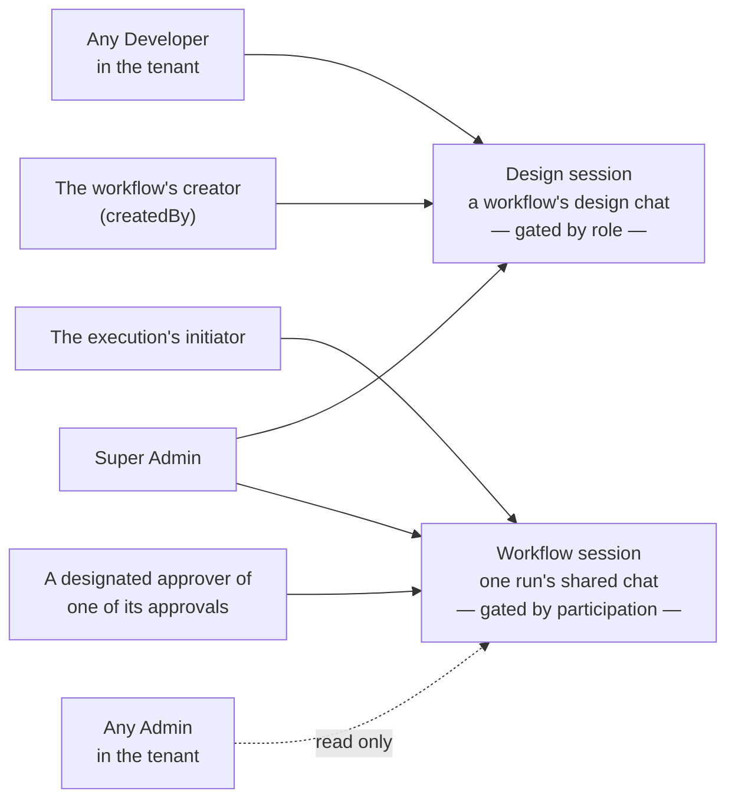

# Roles and authorization

Every user holds a set of **roles** granting the operations they may perform. Roles are **independent** — there is no hierarchy — with one exception: **Super Admin bypasses every role-based check** and, for that reason, is **mutually exclusive** with every other role — a user is either a Super Admin or holds some combination of the other four roles, never both. Two ownership-layer checks are a deliberate exception to the bypass, and both are visible in the [session access matrix](./authorization.md#workflow-execution-access) below. A user with **no roles at all** is valid: they can still manage their own [account](../guides/users-and-groups.md#users) (avatar), but nothing else.

## Effective roles {#effective-roles}

A role reaches a user in one of two ways, and every authorization check uses the **union** of the two — a user's **effective roles**:

- **Directly**, granted on the user record from the [Users](../guides/users-and-groups.md#users) page.
- **Inherited** from a [user group](../guides/users-and-groups.md#user-groups) they belong to: assigning a role to a group grants it to every member.

A role held only through a group is worth exactly as much as a directly granted one: it passes the same gates, makes the user eligible as an approver, and protects them from [impersonation](./impersonation.md) the same way. Nothing is cached — the union is resolved on every request — so adding someone to a group, or removing them, takes effect immediately with no re-sync step.

A group is also addressable in its own right: an [approval](../guides/approvals.md#human-approval) can be sent to a group instead of a person, and any member holding `approver` can settle it.

**A group can never grant `super_admin`**: the option is not offered in the UI, the API rejects it (HTTP 422), and a database check constraint backs both up. Since a Super Admin is platform-scoped and a group belongs to exactly one [tenant](./tenants.md), a Super Admin can never be a member of one either.

## The roles {#the-roles}

| Role | Grants |
|---|---|
| `super_admin` | Everything (bypasses every role gate; does **not** bypass the two designated-approver checks in the [matrix below](./authorization.md#workflow-execution-access)) |
| `admin` | User CRUD, secrets CRUD, deleting workflow executions, and read-only visibility into every workflow execution, its tasks, and its chat history, and every approval, in their tenant (see [Workflow execution and its workflow session](./authorization.md#workflow-execution-access) — apart from deleting one, an Admin cannot drive an execution's agent, create/edit/delete its tasks, or resolve an approval) |
| `developer` | Secrets CRUD, MCP server CRUD, [tool-mock](../guides/tool-mocks.md) CRUD, agent-skill CRUD, workflow generation/editing/publishing/deactivating — including regenerating a workflow's AI-generated `generatedDescription`, though only a Super Admin may edit that field directly — task-template CRUD, design-session chat, running workflows (`POST /workflows/{id}/execute`) — including `draft` workflows and the unpublished edits of a `modified` one, for pre-publish testing. It is also the only role that can **see** those unpublished edits: a workflow's name, description and task templates read as they were at the last publish for every other role |
| `requester` | Running **published** (and `modified`) workflows (`POST /workflows/{id}/execute`), always against the last published design |
| `approver` | Eligibility to be a workflow approval's designated approver — individually, or as a member of a group an approval is addressed to — and resolving their own approvals |

The initial seeded **`root`** user holds `super_admin` and is platform-scoped (no tenant). The **`admin`** user seeded inside the **Default** tenant holds `admin`, scoped to that tenant; every other user starts with no roles.

## What roles gate {#what-roles-gate}

**Reads stay open.** Only writes, workflow execution, and approvals are role-gated; every authenticated user may `GET` the collections (the UI needs them to resolve names, pick approvers, and list workflows). Secret *values* are never returned by the API regardless of role.

Roles are assigned from the [Users](../guides/users-and-groups.md#users) admin page, or in bulk from the [User Groups](../guides/users-and-groups.md#user-groups) page; only a Super Admin may grant or revoke `super_admin`. A rejected request returns HTTP 403 (`FORBIDDEN`).

### What the UI hides {#what-the-ui-hides}

The admin UI hides the actions and nav entries a user's roles do not allow, so a rejected request is normally unreachable rather than merely refused:

| Screen | Without the role |
|---|---|
| **List page** | The Add button and the per-row Actions column are hidden — Delete, and MCP Servers' "Browse registry", which only leads to the create form |
| **Detail page** | Renders **read-only**: every field shows as a recessed value instead of an input, Save and Delete are absent, and Cancel becomes Back |
| **Create form** (`/admin/<section>/new`) | An access-denied screen — reaching it means a deep link, since the Add button that leads there is already hidden |

Because reads stay open, a detail page can be opened by someone who may not write it: agent skills, MCP servers, tool mocks, secrets, tenants, users, workflows, and task templates all take the read-only rendering above. A secret's entries then list their keys alone (values are never returned anyway), and the password field on a user is omitted entirely. Fields that are immutable for *everyone* — a tenant's `name`, a user's `username` — render the same way regardless of role. The create forms have no read-only reading, which is why they answer with a screen rather than a form.

## Session access {#session-access}

A2Flow has two kinds of chat, and they are gated in two different ways:

- A **design session** is the chat a workflow is designed in. Access is decided by **role**: designing is developer work, so the tenant's Developers share it.
- A **workflow session** is the chat one run happens in. Access is decided by **participation**: the person who started the run and the people asked to approve something in it share it, whatever their roles.

### Design session {#design-session-access}

A workflow's design chat (`GET /workflows/{id}/messages`, `POST /workflows/{id}/agent`) is shared along role lines rather than per-record participation, so a team can refine a design together.

| Who | Read the history | Drive the agent |
|---|---|---|
| Any **Developer** in the tenant | ✅ | ✅ |
| The workflow's **creator** (`createdBy`), even after losing `developer` | ✅ | ✅ |
| **Super Admin** | ✅ | ✅ |
| Everyone else | ❌ 403 | ❌ 403 |

Admitting the creator explicitly means nobody is locked out of a chat they started. Another tenant's workflow id is a **404**, never a 403 — except `GET .../messages` under a Super Admin's [All tenants](./tenants.md#all-tenants) selection, where the workflow resolves regardless of tenant and this same role/creator/Super-Admin check is what stands in for the tenant boundary.

### Workflow execution and its workflow session {#workflow-execution-access}

Beyond roles, each operation on a workflow execution requires the caller to be the execution's **initiator** (the user who ran the workflow) or a **designated approver of one of its approvals** — the named user, or a member holding `approver` of a group one is addressed to (see [Human approval](../guides/approvals.md#human-approval)). This preserves the approver-sharing design — the approver joins the initiator's chat — while keeping third parties out. Reading is broader, and two operations are narrower:

| Operation | Endpoint | Initiator | Designated approver | Admin (same tenant) | Super Admin |
|---|---|---|---|---|---|
| Read the execution | `GET /workflow-executions/{id}` | ✅ | ✅ | ✅ | ✅ |
| List or open its tasks | `GET .../workflow-tasks` | ✅ | ✅ | ✅ | ✅ |
| Read the workflow session's history | `GET .../messages` | ✅ | ✅ | ✅ | ✅ |
| Drive its agent | `POST .../agent` | ✅ | ✅ | ❌ | ✅ |
| Create, update or delete a task | `/workflow-tasks` | ✅ | ✅ | ❌ | ✅ |
| Change a task's status **when that task has a linked approval** | `PATCH /workflow-tasks/{id}` | ✅ | Only that approval's approver | ❌ | ❌ |
| Resolve an approval | `PATCH /approvals/{id}` | ❌ | Only that approval's approver | ❌ | ❌ |
| Delete the execution | `DELETE /workflow-executions/{id}` | Only if Admin | Only if Admin | ✅ | ✅ |

Anyone outside those columns gets HTTP 403. The same `GET /approvals` list shows an Admin every approval in the tenant, matching the read row above.

**The last three rows are the ones worth reading twice.**

The two approval rows are the **ownership-layer exceptions to the Super Admin bypass** promised at the top of this page: only the designated approver may resolve an approval, and only the initiator or that specific approval's approver may flip the linked task's status — not merely any approver of the execution, and not a Super Admin or Admin who is neither. Otherwise, flipping a task straight to `completed` would let anyone stand in for the addressee (see [Human approval](../guides/approvals.md#human-approval)).

**Deleting** an execution is the opposite shape: it is a plain role gate with no ownership component at all, so an Admin may delete any execution in the tenant while a non-Admin initiator may not delete their own. Deleting removes the run's tasks and its ADK session with it.

## Platform-wide sections {#platform-wide-sections}

[Tenants](../guides/users-and-groups.md#tenants) and [System Settings](../guides/system-settings.md) are the two admin sections **Super Admin** keeps to itself. Unlike everywhere else, reads are gated too: both hold platform-level configuration rather than tenant data, so the sidebar entry, the welcome card, and every endpoint behind them are closed to all other roles.

## Approver eligibility over time {#approver-eligibility}

⚠️ Approver eligibility is validated when the approval is created: `list_users` / `list_user_groups` only offer destinations that can actually approve, and `request_approval` rejects anything else (including a group with no eligible member). What happens *afterwards* differs by destination, and the difference is deliberate:

- **User destination** — revoking the `approver` role later does **not** invalidate approvals already addressed to that user. They can still resolve them, so an in-flight workflow never gets stuck.
- **Group destination** — membership and role are re-checked at decision time, because "the group" is a moving set rather than a fixed person. That is what lets a newly added member pick up a pending request, but it cuts both ways: removing the group's `approver` grant, or emptying it of eligible members, leaves the pending request **resolvable by nobody** and its run waiting indefinitely. Re-granting the role or re-adding a member unblocks it immediately.
