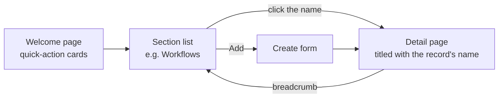

# Admin UI

The admin area is where every record in A2Flow is created, inspected and edited. It is a single shell — an app bar across the top, a section sidebar down the left — and every section inside it works the same way, so learning one list teaches you all thirteen.

## Welcome page {#welcome-page}

The welcome page is the landing screen: you arrive here after signing in, when you open the site root, and whenever you click the **A2Flow** logo in the app bar. It greets you with quick-action cards, one per admin section your roles allow.

The breadcrumb trail above every title mirrors that path — `Admin › Workflows › my-workflow` — and every crumb but the last one links back up.

## The sections

| Section | What it holds | Shown in the sidebar to |
|---|---|---|
| **Tenants** | Tenant organizations | Super Admin |
| **Users** | Accounts and their roles | Admin, Developer |
| **User Groups** | Named bundles that grant roles to several accounts at once | Admin, Developer |
| **Tags** | The labels records are classified by | Admin, Developer |
| **Secrets** | Credentials for tools and repositories | Admin, Developer |
| **Agent Skills** | Agent capabilities, cloned from Git repositories | Developer, Admin |
| **MCP Servers** | Tool servers the agent can call | Developer, Admin |
| **Tool Mocks** | Stand-ins that stub tools for draft workflow runs | Developer, Admin |
| **Workflows** | Multi-step flows and their task templates | Developer, Requester, Admin |
| **Workflow Executions** | Workflow runs and their history | Everyone signed in |
| **Approvals** | Approval requests and their decisions | Everyone signed in |
| **Audit Logs** | Tool calls, impersonation, granted authority, and sent mail | Admin, Super Admin |
| **System Settings** | The mail server notifications are sent through | Super Admin |

A section missing from your sidebar is one your roles cannot write to. Reads stay open, so a colleague can still send you a direct link to a record inside it — see [Roles and authorization](../concepts/authorization.md).

[Audit Logs](./audit-logs.md) is the exception: its reads are restricted too, and a direct link into it gets an access-denied screen without the Admin role.

## The list screen

Every section opens on a table, and every table offers the same controls:

| Control | What it does |
|---|---|
| **Column header menu** | Sorts and filters by that column. Both are applied across the whole dataset, not just the page on screen. |
| **Column edges** | Drag to resize. Widths last for the session and are not saved. |
| **Hover on a cell** | Reveals the full text of anything clipped to the column width. |
| **▥ Columns** | Opens the column picker (below). |
| **Refresh** | Re-reads the list. |
| **Add** | Opens the create form. Hidden without the write role. |
| **Actions column** | Per-row actions — Delete, and whatever else the record type offers. Hidden without the write role. |

### Choosing columns

The **▥** button next to Refresh lists every column the table can show:

- **Show all** / **Hide all** toggles the lot; **Reset to default** returns to the shipped set.
- Some columns start hidden so the ones that matter get the width — an MCP server's transport, a secret's reference, an agent skill's ref and revision, a user's email and verification flag.
- The identifier column and the Actions column are always shown, so they are not listed.
- Your choices are remembered per table in the browser and survive a reload. Only your departures from the default are kept, so a column added to a table later still arrives at its intended default.
- Hiding a column that a sort or filter is using clears that sort or filter, so the rows on screen are never narrowed by a criterion nothing on the page can show.

The panel always fits the screen: it opens upwards when there is no room below, scrolls its list internally while keeping the bulk toggles in view, and splits into two columns once a table has more than eight toggleable ones — so even Agent Skills, at seventeen columns, stays reachable on a short laptop screen.

## The detail screen

Clicking a record's name in the identifier column opens its detail page. That page is the one screen for the record: its attributes, plus every action it supports — saving edits, deleting it, and whatever else the type offers, such as publishing a workflow or pulling a skill's repository. It is titled with the **record's own name** rather than with the operation.

Without the write role the same page renders read-only: fields show as recessed values instead of inputs, Save and Delete are gone, and Cancel becomes Back.

[Workflow executions](./workflow-executions.md) are the exception to all of this. A run is a history rather than a record to edit, so its row opens the run's chat or its read-only task list instead of an edit form.
