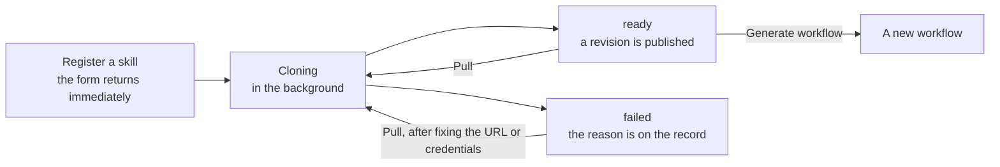

# Agent Skills

An Agent Skill is what an agent knows how to do, kept in a Git repository. A2Flow holds a catalog of them: each record names a repository, and A2Flow clones it and keeps the clone up to date.

Open **Agent Skills** in the admin sidebar to manage the catalog.

A skill is usable only once it has published a revision. Until then, generating or running a workflow against it is refused.

## What a skill record holds

| Field | Notes |
|---|---|
| **Name** | How the skill is named everywhere else. |
| **Repo URL** | The repository to clone. |
| **Repo Path** | Where inside the repository the skill lives, when it is not at the root. |
| **Ref** | Optional. A branch or tag name to pin every clone and pull to. Left empty, the repository's default branch is used. |
| **Description** | Free text. |
| **Auth Username** / **Auth Password** | For a private repository — see below. |
| **Tags** | The [tags](./tags.md) the skill is classified by. |

## Status and revision

The list and detail pages show two pieces of state, and they mean different things:

| Column | What it tells you |
|---|---|
| **Status** | How the *last* clone or pull went: `Cloning`, `ready`, or `failed` with the reason. |
| **Revision** | The revision currently published. A skill is runnable only once this is set. |

The two are deliberately independent: a pull that fails does **not** clear the published revision, so a skill that was working keeps working at the revision it had. Only the status and the error change.

## Pulling

**Pull** re-clones the repository at its configured **Ref**, or at the default branch when none is set. It is how a skill picks up upstream changes, and how a failed registration is retried after fixing the URL or the credentials. A moved branch tip or a re-pointed tag is picked up the next time the skill is pulled.

Each published revision is kept as long as something still needs it, and a workflow execution stays pinned to the revision it started with, so pulling never changes what an in-flight run is following. The store's location and its retention are covered in the [configuration reference](../operations/configuration.md#agent-skill-store).

## Private repositories

Credentials are not typed into the skill form. Register them once as a [secret](./secrets.md), then point the skill at one entry of it:

1. Set **Auth Username**. It defaults to `x-access-token`, which suits a GitHub personal access token; set a real account name for hosts that need one.
2. Pick the **secret** in the first dropdown of **Auth Password**, then one **Entry Key** within it in the second. That entry's value is used as the password when the repository is cloned.

Both secret types are offered. A Vault-backed secret has its entry keys read live from Vault, since they are not stored locally.

The reference is stored as a name and a key, and resolved at clone time — so deleting or renaming the secret later does not fail on the spot, it makes the next pull fail and records the reason on the skill. The detail page does not quietly drop a reference that no longer resolves: it stays selected, marked `(not found)`, with a warning. Clearing it is your call.

## Generating a workflow from a skill

Each row's Actions column carries **Generate workflow**, and a skill's detail page carries the same action as an icon button in its header. Both open the same dialog, and both are disabled until the skill has published a revision. See [Generating a workflow](./workflows.md#generating-a-workflow).
