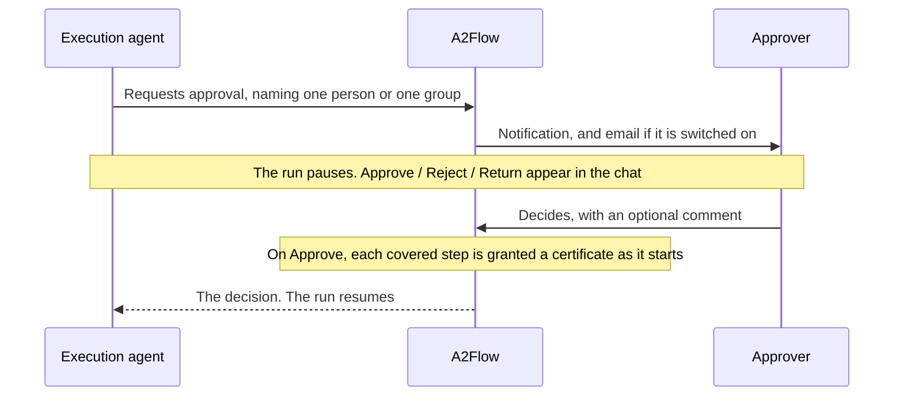

# Approvals

An approval is how a run stops and waits for a person. The agent asks for one mid-execution, the designated approver decides in the chat, and that decision is what unlocks the tools of the steps it covers.

## Human approval {#human-approval}

When a task needs an explicit go-ahead before the agent acts — a destructive or irreversible operation, say — the agent asks for an approval and pauses.

### Who is asked

A request is addressed to **exactly one destination**, never both and never neither.

| Destination | Who is notified | Who can decide |
|---|---|---|
| **One user** | That person alone | That person alone |
| **A [user group](./users-and-groups.md#user-groups)** | Every member holding the `approver` role, each with their own notification | Any of them — the **first** decision settles it |

Addressing a group means an approval is not blocked on one person's availability. A group with no member who can approve is refused up front, since such a request could never be settled. Nothing dismisses the other members' notifications once someone decides; they simply stop being actionable. Whoever actually decided is recorded, because the group's name alone does not answer "who approved this?".

The agent is instructed to prefer a group whenever any member of a team may decide, and to name a single person when the Skill calls for one.

### Deciding

The agent explains the request in plain text, and the controls appear in the chat below it — but **only for the designated approver**. For a group destination, several people may hold them at once. Everyone else sees a read-only "waiting" message.

| Decision | What it means | What the agent does |
|---|---|---|
| **Approve** | Go ahead | Proceeds, with the covered steps' tools unlocked |
| **Reject** | Do not do this | Marks the task `failed` or `skipped` |
| **Return** | Revise and ask again | Sends the work back rather than settling the request |

**Return** is a third decision alongside the other two, not a variant of Reject: a high return rate points at an upstream quality problem, rather than at work that should not have been requested at all.

Each decision takes an optional **comment**. The decision itself is **final** — two members of an approver group can genuinely race each other, so a second decision that would change the recorded one is refused rather than overwriting it. Editing the comment afterwards is still allowed, and it moves neither the recorded decider nor the decision time, so the turnaround from request to decision stays the approver's real one.

Only the designated approver may decide, with **no exception — not even a Super Admin** who is not the addressee. The same rule extends to the linked task's status: marking such a task `completed` by hand is limited to the person who started the run and to an eligible approver, since flipping the status would otherwise let any approver of the run stand in for the addressee.

### What a request authorizes {#what-a-request-authorizes}

A request is not only a sentence to agree with. Under **This authorizes** it lists every
call it would permit: the tool, and for each of its inputs the values that input is
allowed to take. That list is what you are deciding on, and it is what the server holds
the run to afterwards.

An input's bound is written one of five ways:

| Shown as | Means |
|---|---|
| `is "ap-northeast-1"` | Exactly that value, and nothing else |
| `is one of ["t3.micro", "t3.small"]` | Any one of the listed values |
| `is at most 2` | A number no greater than that |
| `is at least 8` | A number no less than that |
| `matches "^dev-"` | Text of that shape — here, anything starting with `dev-` |

An input marked **optional** may be left out; every other input listed must be supplied.
Anything **not listed at all is refused**, so a run cannot slip in an input you were never
shown.

Read the bounds before deciding, and treat a wide one as a wide decision: approving
`is at most 100` where the work needs two is a hundred servers' worth of authority. If
the bounds are wider than the work warrants, **Return** the request and say so — the
agent can ask again with narrower ones.

A call marked **Any input** is the one exception. The workflow's design said that tool
only reads — a listing, a lookup — so the request does not ask you to agree to the values
it is called with, and the run may call it with whatever it needs. Everything else about
it is unchanged: it is covered by your decision, and it cannot be called until you grant
it. If a tool shown this way looks like it could change something, that is a reason to
**Return** the request and ask about it.

Take care to read this the right way round. A call listed with **no** inputs beneath it
means the opposite — that tool may be called, and with nothing at all.

A request that authorizes no tool call at all shows no such list. That is an approval
gating an action A2Flow does not carry out itself, such as agreeing to the wording of a
notice.

### What approval unlocks

**The approval gate is enforced by the server, not by the agent.** A step an approval covers cannot call any of its bound [MCP tools](./mcp-servers.md) until that approval is granted — the call is refused before it reaches the server. Each covered step is granted a short-lived **certificate** when it starts, and every subsequent tool call from it must present that certificate.

Every step needs such a certificate, not only the ones somebody was asked to approve. A step no approval covers is granted one the moment it is marked **In Progress**, on the authority of whoever started the run — so the record always says who a tool call was made on behalf of, and there is no unattributed path to a tool. An approval simply replaces that with the approver's own authority.

Two things this buys that an instruction to the model could not:

- **A prompt injection or a bug cannot skip the approval.** The gate is a rule the server checks, not a sentence in the agent's instructions plus a frontend that declines to resume.
- **The granted tools are frozen.** A certificate carries the tools its step had bound when the step started, and a covered step's tools can no longer be edited at all. A run's steps and their tools come from the workflow's published design and the agent cannot change them, so nothing that happens after the decision can widen a grant. Approving a step to read a file does not become approval to delete one.
- **The approved arguments are frozen too.** A request also carries the calls it authorizes — each tool together with bounds on the values it may be called with — and that is what the request shows you before you decide. Every later call is checked against it, so approving "start one small server in Tokyo" never becomes approval to start ten large ones somewhere else. See [What a request authorizes](#what-a-request-authorizes).

**What a decision covers** is the step the request names **and every step after it, up to the next approval**. A workflow usually shows the request as a step of its own — "Request approval" followed by "Launch instance" — and one decision covers both, so the approver is not asked again for each step of the same piece of work. Two consequences worth knowing:

- Where two approved branches meet, the step they meet at needs **both** decisions before it may act.
- Nothing before the request is ever covered by it. An approval reaches forward only.

Every decided tool call — allowed or refused — is recorded on the run's [Tool Invocations](./workflow-executions.md#tool-invocations) page with the certificate it presented, so "who authorized this, and on what basis" can be answered afterwards.

Nothing needs configuring for any of this; the certificate's lifetime is adjustable in the [configuration reference](../operations/configuration.md#mcp-tools-and-approvals).

> **Scope of the guarantee.** The tool proxy currently runs inside the backend process, so a certificate proves possession to a verifier sharing that process — it is not a defence against an attacker who already controls the backend. What it provides is a single fail-closed enforcement point, a grant that cannot be widened after the fact, and a verifiable record.

## Browsing approvals {#browsing-approvals}

Open **Approvals** in the admin sidebar to browse every approval request. This view is for looking: decisions are made from the Approve / Reject / Return controls in the chat.

| Column | Shown by default |
|---|---|
| Title, status (`pending` / `approved` / `rejected` / `returned`), description, created time | Yes |
| Workflow execution — a link to the run it came from | Yes |
| Decided By — the user or the approver group's name, linked to its page | Through the column picker |
| The approver's comment, and the decision time | Through the column picker |

Each row also carries an **Open Workflow Session** action that jumps straight into the run's chat, mirroring the one on the [Workflow Executions](./workflow-executions.md) list.

A granted approval's detail page additionally shows what it authorized under **Authorized MCP tools**: one entry per covered step that has started, each with the tools granted to it, the validity window, and whether its certificate has been revoked. The panel filling in gradually is normal — a step gets its certificate when it starts, so a freshly granted approval may show nothing yet. An entry with an empty tool list is not a fault either; it means that step does its work without calling any MCP tool.

**Authorized Calls** shows the same list the approver read before deciding — the calls the request permitted and the bounds on their inputs. Unlike the panel above it, this is filled in the moment the request is made rather than as steps start, and it never changes afterwards: it is the record of what the decision was actually about. An approval made before A2Flow recorded these bounds shows a dash here.

The **Takes Effect From** field names the step the approval starts at. Everything after it, up to the next approval, is covered too.
