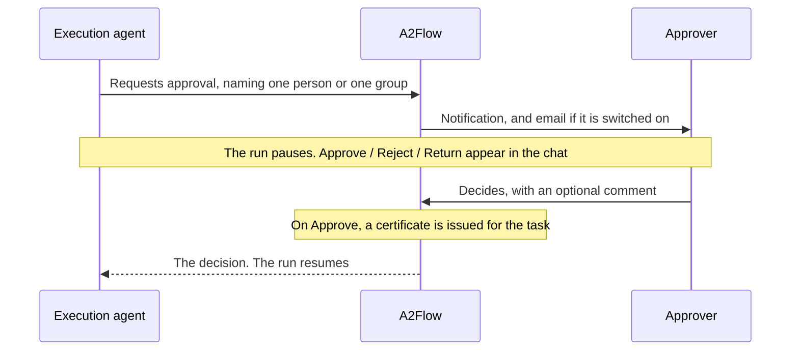

# Approvals

An approval is how a run stops and waits for a person. The agent asks for one mid-execution, the designated approver decides in the chat, and that decision is what unlocks the task's tools.

## Human approval {#human-approval}

When a task needs an explicit go-ahead before the agent acts — a destructive or irreversible operation, say — the agent asks for an approval and pauses.

### Who is asked

A request is addressed to **exactly one destination**, never both and never neither.

| Destination | Who is notified | Who can decide |
|---|---|---|
| **One user** | That person alone | That person alone |
| **A [user group](./users-and-groups.md#user-groups)** | Every member holding the `approver` role, each with their own notification | Any of them — the **first** decision settles it |

Addressing a group means an approval is not blocked on one person's availability. A group with no member who can approve is refused up front, since such a request could never be settled. Nothing dismisses the other members' notifications once someone decides; they simply stop being actionable. Whoever actually decided is recorded, because the group's name alone does not answer "who approved this?".

The agent is instructed to prefer a group whenever any member of a team may decide, and to name a single person when the Skill calls for one.

### Deciding

The agent explains the request in plain text, and the controls appear in the chat below it — but **only for the designated approver**. For a group destination, several people may hold them at once. Everyone else sees a read-only "waiting" message.

| Decision | What it means | What the agent does |
|---|---|---|
| **Approve** | Go ahead | Proceeds, with the task's tools unlocked |
| **Reject** | Do not do this | Marks the task `failed` or `skipped` |
| **Return** | Revise and ask again | Sends the work back rather than settling the request |

**Return** is a third decision alongside the other two, not a variant of Reject: a high return rate points at an upstream quality problem, rather than at work that should not have been requested at all.

Each decision takes an optional **comment**. The decision itself is **final** — two members of an approver group can genuinely race each other, so a second decision that would change the recorded one is refused rather than overwriting it. Editing the comment afterwards is still allowed, and it moves neither the recorded decider nor the decision time, so the turnaround from request to decision stays the approver's real one.

Only the designated approver may decide, with **no exception — not even a Super Admin** who is not the addressee. The same rule extends to the linked task's status: marking such a task `completed` by hand is limited to the person who started the run and to an eligible approver, since flipping the status would otherwise let any approver of the run stand in for the addressee.

### What approval unlocks

**The approval gate is enforced by the server, not by the agent.** A task with an approval attached cannot call any of its bound [MCP tools](./mcp-servers.md) until that approval is granted — the call is refused before it reaches the server. Granting the approval issues a short-lived **certificate** for the task, and every subsequent tool call from that task must present it.

Every task needs such a certificate, not only the ones somebody was asked to approve. A task with no approval on it is granted one the moment it is marked **In Progress**, on the authority of whoever started the run — so the record always says who a tool call was made on behalf of, and there is no unattributed path to a tool. Approving a task simply replaces that with the approver's own authority.

Two things this buys that an instruction to the model could not:

- **A prompt injection or a bug cannot skip the approval.** The gate is a rule the server checks, not a sentence in the agent's instructions plus a frontend that declines to resume.
- **The granted tools are frozen at the moment the certificate is issued.** It carries the tools the task had bound when the approver clicked Approve — or, for a task nobody approved, when the task started. An agent can rewrite its own task's tool bindings mid-run, so a check that re-reads the bindings at call time is a check the agent could widen. Approving a task to read a file does not become approval to delete one, and a running task cannot pick up a tool it did not start with.

Both halves — the pause and the unlocked tools — belong to **one task: the one that carries out the approved action**. A workflow often shows the request as a step of its own, as in "Request approval" followed by "Launch instance", and it is the second of those the approval covers, since that is where the tools are. A request that names a step with no tools of its own while a later step in the run has some is refused, so a run cannot end up with an approval that authorizes nothing.

Every decided tool call — allowed or refused — is recorded on the run's [Tool Invocations](./workflow-executions.md#tool-invocations) page with the certificate it presented, so "who authorized this, and on what basis" can be answered afterwards.

Nothing needs configuring for any of this; the certificate's lifetime is adjustable in the [configuration reference](../operations/configuration.md#mcp-tools-and-approvals).

> **Scope of the guarantee.** The tool proxy currently runs inside the backend process, so a certificate proves possession to a verifier sharing that process — it is not a defence against an attacker who already controls the backend. What it provides is a single fail-closed enforcement point, a grant that cannot be widened after the fact, and a verifiable record.

## Browsing approvals {#browsing-approvals}

Open **Approvals** in the admin sidebar to browse every approval request. This view is for looking: decisions are made from the Approve / Reject / Return controls in the chat.

| Column | Shown by default |
|---|---|
| Title, status (`pending` / `approved` / `rejected` / `returned`), description, created time | Yes |
| Workflow execution — a link to the run it came from | Yes |
| Decided By — the user or the approver group's name, linked to its page | Through the column picker |
| The approver's comment, and the decision time | Through the column picker |

Each row also carries an **Open Workflow Session** action that jumps straight into the run's chat, mirroring the one on the [Workflow Executions](./workflow-executions.md) list.

A granted approval's detail page additionally shows what its certificate authorized: the **Authorized MCP tools**, the validity window, and whether the certificate has been revoked. An empty tool list is not a fault — it means the approved step performs its work without calling any MCP tool.
