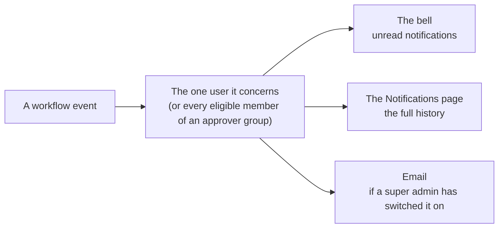

# Notifications

Workflow work happens in the background — a design run finishes while you are elsewhere, an approval waits for someone who has not opened the app. Notifications are how those events reach the person who needs them.

A **bell icon** sits in the top toolbar, on both the chat header and the admin sidebar, with an unread-count badge.

## The four events

| Type | Raised when | Who receives it |
|---|---|---|
| `workflow_draft_ready` | The background design run of [Generate workflow](./workflows.md#generating-a-workflow) finished and the draft's task templates are ready for review. | Whoever started the generation |
| `workflow_generation_failed` | That same design run failed. It runs unattended with no client watching, so this is how you find out; the reason is on the workflow's detail page and in its design chat. | Whoever started the generation |
| `approval_request` | The agent asks for a mid-execution decision and waits. | The [designated approver](./approvals.md#human-approval) — one per eligible member, for a group destination |
| `execution_completed` | Every task in a run has reached a terminal state. Raised once per run. | Whoever started the run |

Clicking a notification marks it read and takes you where it points: run-scoped events to the run's chat, workflow-scoped ones to the workflow's detail page.

## Where notifications appear

| | **The bell dropdown** | **The [Notifications page](./notifications.md#notification-history-page)** |
|---|---|---|
| **Shows** | Unread only — what still needs attention | The full history, read items included |
| **Reached from** | The bell in the toolbar | The toolbar profile button → **Notifications** |
| **Mark as read** | Per row (✓), and **Mark all read** in the panel header while unread items remain | Per row (✓) |
| **Delete** | Not offered | Per row (✕), after a confirmation |

Nothing in the dropdown deletes a notification; marking it read only moves it out of the way. The list refreshes itself every half minute, so a new notification arrives without a reload.

## Notification history page {#notification-history-page}

The Notifications page lists every notification you have received as a sortable, filterable table of title, type and creation time. An **All / Unread** switch above it toggles the read-state filter. This is the only place a notification can be permanently deleted.

Notifications are per-user throughout: you see only your own, and one disappears with the account, run or workflow it belongs to.

## Email delivery {#email-delivery}

Once a `super_admin` has configured an SMTP server under [System Settings](./system-settings.md), the same four events are **also emailed** to the recipient, so an approval request does not have to wait for someone to open the app.

The message carries the notification's title as its subject, its body as the text, and a link back to what it is about — the run, or the workflow. The link is built from the configured **Application Base URL**; when none is set, the message is sent without one.

Recipients who cannot be reached are skipped before any relay is contacted: the internal system user, disabled or deleted accounts, accounts whose address is unverified, and any account without an address. There is no per-user opt-out — email delivery is on or off for the whole platform.

### The delivery queue {#the-delivery-queue}

Nothing is sent while a workflow operation is still in flight. The notification and its fully rendered message are written together, so a crash can never leave a notification whose email was never queued. A worker then drains that queue:

- **Paced.** A rate limit holds the relay to a sustained rate with a small burst, and a whole batch goes out over one reused connection.
- **Retried.** A transient failure — the relay is down, or rejects the credentials — schedules another attempt with a growing backoff: 15s, 30s, 1m, 2m, doubling to an hour. The default budget rides out roughly an hour of downtime.
- **Written off when hopeless.** A failure the relay reports as permanent, an unknown recipient say, is not retried at all. A message that is out of attempts, or failed permanently, stays on the queue as `failed` with its last error — a dead letter to look at, not a silent loss. Delivered messages are purged after 30 days; dead letters are kept.

Exactly one process sends at a time, which is what makes the rate limit exact rather than approximate. Running more than one worker buys failover, not throughput. A sender that dies mid-batch does not consume an attempt: the next pass reclaims its work.

By default the API process runs the worker itself. Under Docker Compose a dedicated worker service runs instead, keeping mail off the process serving requests. Every tunable is listed in the [configuration reference](../operations/configuration.md#outgoing-email-queue).

Backlog and stuck-relay symptoms are visible on the [metrics endpoint](../operations/metrics.md).
