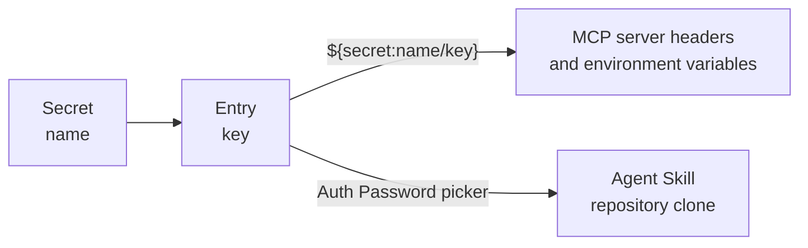

# Secrets

A secret is a **named bundle of key/value entries** — the same shape [HashiCorp Vault's KV engine](https://developer.hashicorp.com/vault/docs/secrets/kv/kv-v2) uses, where one path holds a map of keys to values. Credentials that belong together, such as an AWS access key id and its secret access key, live in one secret as two entries rather than in two separate secrets.

Open **Secrets** in the admin sidebar to manage them. Each record has a **Name**, an optional **Description**, its [tags](./tags.md), and a type.

## Where a secret is used

- **[MCP servers](./mcp-servers.md)** — any header value or environment variable value may embed `${secret:name/key}`, expanded when connecting.
- **[Agent Skills](./agent-skills.md)** — a skill's **Auth Password** is a reference to one entry, chosen from dropdowns rather than typed.

A single entry is always addressed as **`name/key`**. The key is required even when the secret holds only one entry — a bare name identifies a map, not a value — so a key-less `${secret:name}` fails to resolve rather than being passed through as a literal string.

## The two types

| | **Local (encrypted)** | **HashiCorp Vault** |
|---|---|---|
| **What is stored** | The entries themselves, each value encrypted | Only a KV v2 reference — **Vault Mount** and **Vault Path** |
| **Where values come from** | The encrypted store | Read live from Vault each time they are resolved |
| **What the detail page shows** | Every stored key, with a blank value | The mount and path |
| **Editing an entry** | Leave the value blank to keep it, retype it to replace it, remove the row to delete the entry | In Vault |

Values are **never returned** for either type — not in plaintext, not as ciphertext — which is why the local type's detail page shows keys with blank values. Keys alone are readable, so a picker can list them: for a local secret they come from the stored map, and for a Vault secret they are read from Vault at that moment.

Vault's own connection, and the key local secrets are encrypted with, are set up once in the [configuration reference](../operations/configuration.md#secret-management). Until Vault is configured, `vault`-type secrets cannot be resolved.

## Renaming and deleting

Secrets are referenced **by name** and resolved lazily. Renaming or deleting one that something still references does not fail at edit time — the next use fails instead, naming the secret it could not find. An [agent skill](./agent-skills.md) whose reference has gone stale records the reason on its own record the next time it is pulled.
