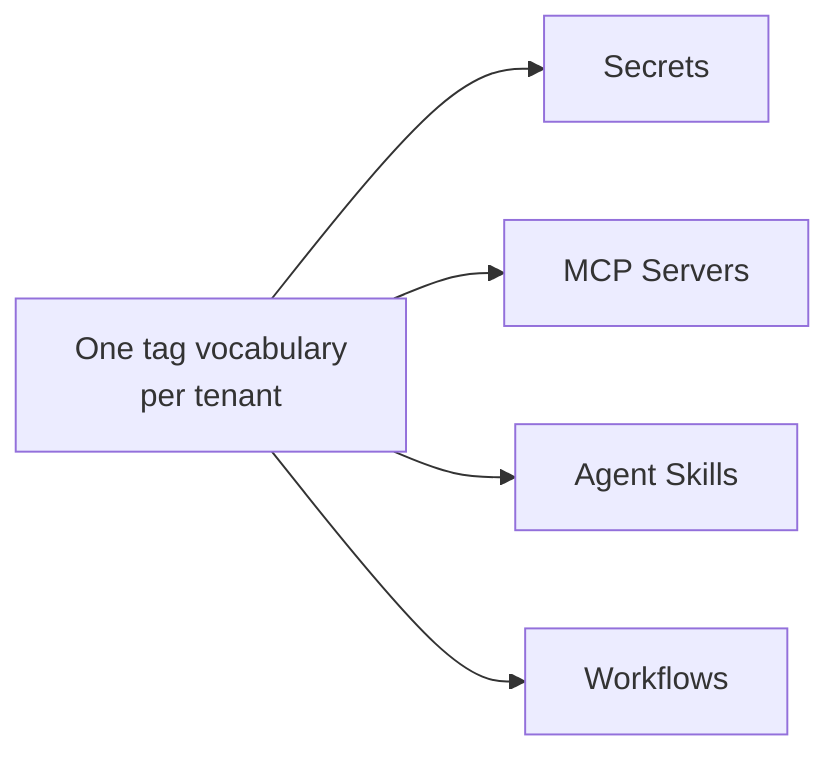

# Tags

Tags are the labels records are classified by. One vocabulary is shared by all four taggable registries, so an `aws` tag narrows secrets and MCP servers alike.

Open **Tags** in the admin sidebar to curate the vocabulary. Each tag has a **Name**, unique within the tenant, an optional **Description**, and a **color** picked from a fixed eight-slot palette — an arbitrary color value is refused.

Creating a tag requires `admin` **or** `developer`, matching the union of the roles that can write to any of the four taggable resources, so a tag can always be minted by whoever is about to need it. Reads stay open like every other section.

## Attaching tags to a record

Every taggable record's create form and detail page carries a **Tags** picker: the current selection shows as removable colored chips above a **Select tags…** button, so the field stands as tall as the selection rather than as tall as the vocabulary.

1. Click **Select tags…**. The dialog shows the whole vocabulary as a wrapping grid of colored chips, each one a toggle. A pressed chip takes a stronger fill *and* a leading check, so its state never rests on color alone.
2. Narrow the grid if you need to. Two filters compose: a name box, and a row of the eight palette swatches, any number of which can be pressed at once. Pressing them all off is the cleared state.
3. Confirm with **Select**, or throw the draft away with **Cancel**. A tag you selected and then filtered out of view stays selected.

Attaching tags is gated by the record's own write role, independent of whatever minted the tag itself.

## Filtering by tag

Every taggable list has a **Tags** column showing each record's chips, and its column header menu offers a multi-select. The selection is **conjunctive** — stated in the menu as "Filter (all of)" — so a record must carry *every* tag you pick, and adding one narrows the result. It applies across the whole dataset, not just the page on screen.

Tags are a separate axis from the other column filters, but they follow the same rule about visibility: hiding the Tags column through the [column picker](./admin-ui.md) clears the tag filter, exactly as hiding any other column clears its own.

## Renaming and deleting

**Renaming is safe at any time.** Records reference a tag by identity, never by its name, so every record carrying it follows the new name with nothing to re-sync — which is the whole reason tags are registered up front instead of typed free-form on each record.

**Deleting** a tag works the other way round: rather than being blocked by the records that carry it, it is removed from all of them. The confirmation says so.
