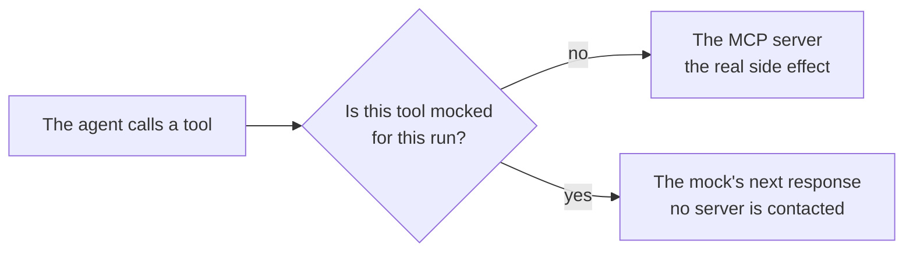

# Tool Mocks

A tool mock is a stand-in that lets a **draft** workflow run be exercised end to end without its tools' side effects. A mocked tool is not called: the mock's configured result is returned instead, so no request reaches the MCP server, no approval is recorded, and nobody is emailed.

Open **Tool Mocks** in the admin sidebar to manage them.

## Using one

1. Create a mock for the tool you want to stub.
2. Click **Run** on a **draft** workflow — or on a `modified` one, choosing **Unpublished edits** in the dialog. Under **Mock tools** the dialog lists the mocks that stand in for a tool one of this workflow's tasks uses, together with every mock of a built-in tool.
3. Check the ones this run should use, and start the run.

A mock for a tool that none of this workflow's tasks use is left out of the list — bind that tool to a task first. Mocks are offered only for a [test run](./workflows.md#trying-the-edits-out); the dialog offers none for a run of a published design, and asking for one anyway is refused. Starting the run **copies** what each chosen mock currently says onto the execution, so editing or deleting a mock afterwards never changes a run already under way — and can never silently turn a stubbed call back into a real one.

Mocking is chosen **per tool**, not per run, because a dry run is only useful if it stays realistic. A workflow that searches a system and then writes to it can stub only the write: the read still hits the real server, and the agent still reasons over real data.

## What a mock holds

| Field | Notes |
|---|---|
| **Name** / **Description** | How you recognize it in the Run dialog. |
| **Target** | Either one tool of a [registered MCP server](./mcp-servers.md) — choose **Select MCP server**, pick the server, then choose its **Tool Name** from the list loaded from that server — or a **built-in** A2Flow tool. |
| **Responses** | An ordered list, indexed by call ordinal. |

The only built-in tool currently mockable is `request_approval`: the one whose side effects otherwise need a human to clear before the run can continue.

### What the tool returns

Once a tool is chosen, **Output format** opens under it, showing the tool's own description and the shape it says it returns. Use it as the reference for what to write below — a mock is only useful if the workflow can read it the way it would read the real thing.

Not every tool says what it returns. When one doesn't, the panel says so and leaves the shape up to you.

### Responses

The first response answers the run's first call to that tool, the second its second, and so on. Once the list runs out, the last response repeats — so a single response behaves as a constant. That is what lets one mock express a *scenario* rather than a fixed value: approve the first request, reject the second, and see how the workflow handles both.

| Kind | Meaning |
|---|---|
| `structured` | A JSON object placed in the result's structured content — for a tool whose caller reads fields off the result |
| `text` | A string placed in the result's textual content |
| `error` | A message returned as a failed call, so the agent sees the tool report an error |

When the tool declares an output format, a `structured` response offers **Insert from schema**: it fills the box with that shape, keys and all, so you edit values instead of transcribing the structure. It replaces whatever is in the box, and asks first if you have already written something there.

## What a mock does not skip

A mock buys past the side effect, not past the rules. A mocked call is still checked against the tools the run's current task is allowed to use, and against any [approval](./approvals.md) that task is waiting on, so a workflow that would be refused in production is refused in its dry run too. It is checked against the **inputs** that approval allowed as well, so a dry run catches a call the approver would not have authorized rather than sailing through it. A mocked approval request still validates its destination and the calls it declares, so a workflow naming an ineligible approver — or declaring calls that do not match what its steps would make — fails in a dry run exactly as it would for real.

## Seeing what a mocked call did

The run's chat transcript is where a stubbed call is inspected: its tool line expands to show the arguments and the result, badged **Mocked**. It deliberately does not appear on the run's [Tool Invocations](./workflow-executions.md#tool-invocations) page — that page records the decisions the tool proxy actually made, and a stub never reaches it. The run itself is badged **Mocked** in the [executions list](./workflow-executions.md).
