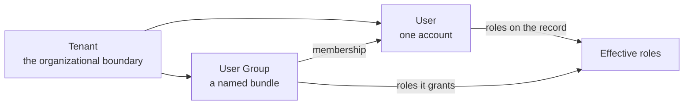

# Users, groups and tenants

Three admin sections cover who may sign in and what they belong to: the individual accounts, the named bundles that grant roles in bulk, and the tenant every one of them sits inside.

A user belongs to at most one tenant and to any number of that tenant's groups. Every authorization check uses the **union** of the roles granted on the account and the roles inherited from its groups — see [Roles and authorization](../concepts/authorization.md).

## Users {#users}

Open **Users** in the admin sidebar to manage accounts. The list shows one row per account; clicking a username opens its detail page, where the same fields can be edited or the account deleted.

| Field | Notes |
|---|---|
| **Username** | Unique within the tenant. Not editable after creation. |
| **First Name** / **Last Name** | Shown together as the display name everywhere a user is named. |
| **Email** | Where notification email is sent. |
| **Password** | Never shown back. On edit, leaving it blank keeps the current password. |
| **Enabled** | Clear it to block sign-in without deleting the account. |
| **Email verified** | Unverified addresses are skipped by [email delivery](./notifications.md#email-delivery). |
| **Roles** | Checkbox per role — see below. |
| **Groups** | Memberships, editable from either side. |

### Roles

The create form and the detail page carry a roles picker, one checkbox per role, and the list shows a **Roles** column.

- **Super Admin** is only offered to a signed-in Super Admin. Granting or revoking it otherwise is refused.
- Super Admin is mutually exclusive with every other role, so checking it disables the rest (and vice versa), with a hint explaining why.
- The Roles column cannot be sorted or filtered, because roles are stored as a list rather than as a single value.

**Roles from groups.** The picker edits **direct** grants only. Roles inherited from a [user group](./users-and-groups.md#user-groups) appear beneath it under **Roles from groups** as read-only chips — only editing the group can change them. The list's Roles column shows both, with inherited ones muted, so it stays obvious which grants this page can change.

### Groups

Current memberships show as removable chips; **Select groups…** opens a paged, filterable table of the tenant's groups for adding more. The button is hidden for a platform-scoped account (a Super Admin, or the seeded system user), which belongs to no tenant and so can never be a member. The same membership is editable from the [group's](./users-and-groups.md#user-groups) side.

### Impersonate

Rows you are allowed to impersonate carry an **Impersonate** action. It is hidden for your own row, for any Super Admin row, and — unless you are a Super Admin — for any Admin row. Confirming takes you to the welcome page acting as that user. See [Impersonation](../concepts/impersonation.md) for the full rules and for how to stop.

### Deleting a user

Deleting an account that nothing else references removes it outright. An account that still owns records — anything it created or last updated — is kept instead, disabled and hidden from the user list, so the records it owns still resolve to a name. Either way the account can no longer sign in.

Records never show a raw user id. Every detail page and list resolves the owner to a name; two accounts get a label instead, because they own records across tenant boundaries: the internal account shows as **System User**, and a Super Admin you cannot see shows as **Super Admin**.

## Your own account {#your-own-account}

Click the profile button in the app bar and choose **Profile** to review your own account. The page opens with an identity card — a banner, your avatar across its lower edge, your display name as the heading, and your `@username`, roles and status pills beside it — followed by two read-only cards:

| Card | Shows |
|---|---|
| **Account** | Username, email, first and last name |
| **Access** | Roles, Roles from Groups, and Groups |

Everything there is read-only: changing those attributes requires the `admin` role and the admin user detail page. The avatar is the one thing you can edit yourself, and clicking it is how you edit it.

### Avatars

Every user has an avatar, shown on the profile button and in the admin user list and detail page. By default it is generated from the user's tenant and username, so no image is stored and the same username in two tenants gets two distinct faces.

Clicking the avatar on your Profile page opens a dialog with two ways to change it:

- **Upload** a custom image — PNG, JPEG, WebP or GIF, up to 2 MB. Uploading commits immediately and closes the dialog. Removing it falls back to the generated avatar.
- **Customize** the generated avatar by editing the color palette it is drawn from. The palette is the dialog's only unsaved state: **Reset to default** rewinds the swatches, **Save** commits them, and closing the dialog discards anything unsaved.

| Precedence | Used when |
|---|---|
| 1. Uploaded image | An image has been uploaded |
| 2. Generated avatar, custom palette | A palette has been saved |
| 3. Generated avatar, default palette | Neither |

The seed still decides which colors land where, so users stay visually distinct even on a shared palette. A palette identical to the default is stored as no palette at all, so resetting and saving really clears it. Avatar editing is self-service only — the admin user detail page shows the avatar read-only.

## User Groups {#user-groups}

Open **User Groups** in the admin sidebar to manage groups — named bundles of users that grant their roles to every member. A group belongs to exactly one tenant, and its name is unique within it.

| Field | Notes |
|---|---|
| **Name** | Unique within the tenant. |
| **Description** | Free text. |
| **Roles granted** | Held by every member on top of their own grants. |
| **Members** | The accounts in the group. |

**Roles granted** uses the same picker as the Users pages, minus **Super Admin** — a group can never grant it, and the option is hidden from everyone, Super Admins included. Since a Super Admin belongs to no tenant, one can never be a member either.

**Members** show as removable chips; **Select members…** opens a paged, filterable table of the tenant's users. Platform-scoped accounts are omitted, because they belong to no tenant. Supplying members replaces the membership wholesale; leaving the field untouched on an edit keeps it as it is. The same membership is editable from each [user's](./users-and-groups.md#users) side.

Nothing is copied onto the user record, so changing a group's roles or membership takes effect for everyone affected on their very next request. **Deleting** a group leaves the accounts alone but takes away the roles it was granting them.

Writing to this section requires the `admin` role. Reads stay open, so a viewer without it still sees the list and a read-only detail page.

## Tenants {#tenants}

Open **Tenants** in the admin sidebar to manage tenants — the top-level organizational boundary for multi-tenancy. What that boundary means for everything else, and how a Super Admin picks a tenant to act as, is covered under [Tenants](../concepts/tenants.md); this section is about the records themselves.

Unlike every other admin section, this one is **Super Admin only**. It is hidden from the sidebar and the welcome page for every other role, and writes from anyone else are refused.

| Field | Notes |
|---|---|
| **Display Name** | The human-readable label. Unique. |
| **Name** | A URL-safe identifier, lowercase kebab-case. Unique, and not editable after creation. |
| **Enabled** | Clear it to deactivate a tenant without deleting it: its users can no longer sign in, and anyone already signed in is signed out on their next request. |

A **Default** tenant is seeded on first startup and holds the initial seeded `admin` user. A tenant cannot be deleted while any user is still assigned to it — reassign or delete those accounts first.
