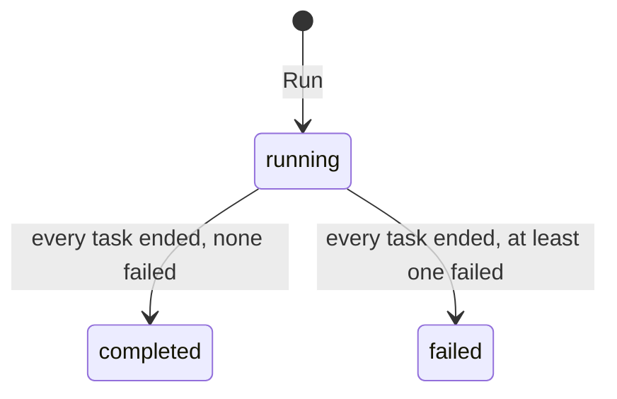
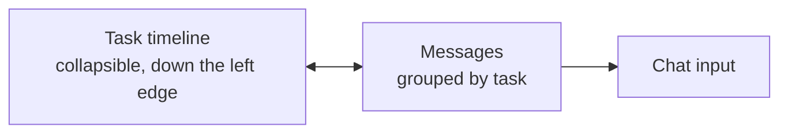

# Workflow Executions

A workflow execution is one run of a [workflow](./workflows.md). It holds its own copy of the workflow's name, description and tasks, so a run's history stays faithful to what actually ran even after the workflow it came from is edited or deleted.

Open **Workflow Executions** in the admin sidebar to browse them. Unlike the other sections, a run is a history rather than a record to edit, so there is no edit form — its screens either show the run or let you join it.

| Screen | How to get there | What it shows |
|---|---|---|
| **Workflow Executions** list | Admin sidebar → Workflow Executions | Every run, with its status, and per-row actions |
| **Workflow session** | The Open Workflow Session action on a row | The chat the run happens in — join it, watch it, answer it |
| **Workflow Tasks** | A row's tasks link | The run's tasks and their statuses, read-only, as a Table or a Graph |
| **Tool Invocations** | The run detail header | The MCP tool calls the run made, and how each was decided |

**Mocked** marks a run that stubbed any of its tools with a [tool mock](./tool-mocks.md).

The [**Columns** menu](./admin-ui.md#choosing-columns) offers two more columns that start hidden. **Workflow** shows the run's parent workflow under its current name and links to it — each row's own name is a snapshot fixed when the run started, so this column is how you see what that workflow is called today. **Draft** shows a checkmark for a run started from a workflow that was still `draft` — a [pre-publish test run](./workflows.md#running-a-workflow), left out of the [operations metrics](../operations/metrics.md) — and works as a Yes/No filter to hide them.

## Run status

A run starts `running` and settles once it has at least one task and every task has reached a terminal state — `completed`, `failed` or `skipped`. A run whose tasks include a failure ends `failed`. The finish time is stamped at that moment and is never moved by a later edit, and a run with no tasks at all stays `running`. These are the numbers the [operations metrics](../operations/metrics.md) count.

## The workflow session screen {#the-workflow-session-screen}

The workflow session is the chat one run happens in. It opens with the run's kickoff message and the agent already working.

### Who shares it

A run's chat is **shared by its participants**, not private to whoever started it:

| Who | What they get |
|---|---|
| The **initiator** who started the run | The full conversation, and the chat input |
| A **designated approver** of one of its [approvals](./approvals.md) | The same conversation and state — approving resumes the original run rather than starting a fresh, empty one |
| An **Admin** of the tenant | Read-only visibility |
| Anyone else | No access |

When an approval is addressed to a **group**, every member holding `approver` is a participant, so the chat follows the group's membership: adding someone to an approver group opens every run that group has been asked to approve, and removing them closes it again. That is the direct consequence of "any member can settle it" — deciding is what the chat access exists to enable. A member who does not hold `approver` gets nothing from the membership.

### Sender avatars

Because several people post into one chat — the applicant, the approvers, and the agent — every message carries a **sender avatar**. Hovering it reveals the sender's name; the agent's badge reveals the workflow name. Clicking a button inside a rendered interactive surface is attributed the same way, showing the acting user's avatar beside that surface once the click resolves.

### The task timeline

A collapsible **task timeline** runs down the left edge: the run's tasks in order, each with a numbered, status-coloured badge, the in-progress one highlighted. The chat wraps each run of consecutive messages belonging to the same task in a **task group** — a status-coloured left rail with a numbered heading matching the timeline badge — so the boundary of each task is obvious at a glance.

The two are linked both ways:

- Scrolling the chat highlights the task at the top of the viewport in the timeline.
- Hovering either a timeline entry or a chat group highlights its counterpart.
- Clicking a timeline entry scrolls the chat to that task's group.

### Live updates

The page refreshes itself every few seconds so each participant sees the others' messages, and the agent's progress, without reloading. Refreshing pauses while your own message is being answered, so it never disturbs the live reply, and the view follows new messages to the bottom only when you are already scrolled near the bottom.

The [design session](./workflows.md#adjusting-the-task-templates) is a shared chat too, with the same avatars and the same live updates. It is shared by the tenant's Developers rather than by a run's participants.

## Workflow Tasks

The run's tasks are read-only here: the templates are edited on the [workflow](./workflows.md#adjusting-the-task-templates), and a run's statuses are advanced by the execution agent and the approval flow.

Each task carries a status — `pending`, `in_progress`, `completed`, `failed` or `skipped` — and its dependencies. A **Table / Graph** toggle switches between the list and the dependency graph, which stacks the tasks in a single vertical column in dependency order, prerequisites above the tasks that depend on them, each branching rightward into the MCP servers it binds tools from and then into the individual tools. The graph pans, zooms and fits; it does not edit.

## Tool Invocations

This page lists the MCP tool calls made during the run and what the [proxy](./workflows.md#mcp-tools-for-tasks) decided about each one: `allowed` calls that went upstream, and `denied` ones a rule vetoed — with the tool, the server, the denial reason, and the [approval certificate](./approvals.md#human-approval) presented. Arguments appear only as a digest; the raw values are never stored.

Calls to a [mocked](./tool-mocks.md) tool are absent here whichever way they went. The proxy checks a mocked call like any other, but a call that was always going to be answered from a stored response reaches no server, so neither its approval nor its refusal belongs in this record. The run's chat transcript is where a stubbed call is inspected.

## Deleting a run

A row's **Delete** action removes the run after a confirmation prompt: the record, its tasks, and its workflow session all go with it.
