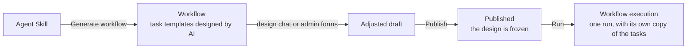
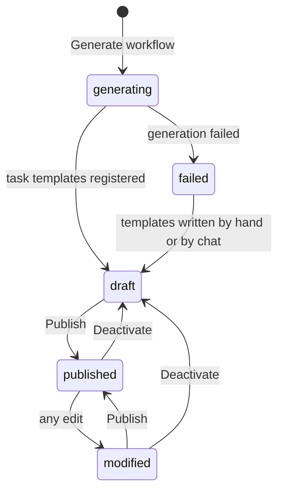
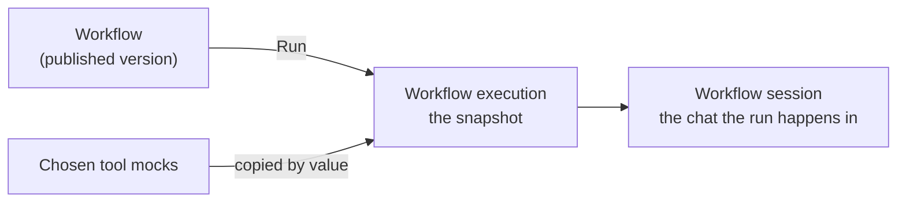
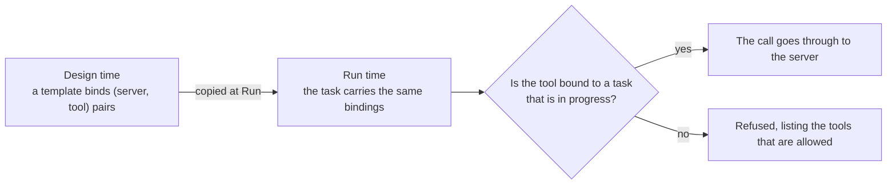

# Workflows

A workflow is a reusable unit of work: an [Agent Skill](./agent-skills.md) paired with a **pre-designed task list**, its *task templates*. The templates are settled *before* any run, so executing a workflow starts working immediately instead of redesigning the same steps every time.

Open **Workflows** in the admin sidebar to manage them.

There is no way to create a bare workflow: generating one from a skill is how a workflow is born.

## Statuses

| Status | What it means | Who can run it |
|---|---|---|
| `generating` | The background design run is still writing the task templates. | Nobody |
| `draft` | The design exists but has never been published, or was deactivated. | Developer and Super Admin, for pre-publish testing |
| `failed` | The design run ended without producing templates. The reason is shown on the detail page and in the design chat. | Nobody |
| `published` | The design is frozen and executable. | Anyone holding `requester` or above |
| `modified` | Published once, then edited. Runs still use the published version. | Same as `published` |

`modified` is a status only a **Developer** or **Super Admin** ever sees. To everyone else the workflow reads as `published`, showing the name, description and task templates recorded at the last publish — the unpublished edits are not theirs to see, and the design they *can* see is the one their run would execute.

## The screens

| Screen | How to get there | What you do there |
|---|---|---|
| **Workflows** list | Admin sidebar → Workflows | Browse, filter by [tag](./tags.md), and **Run** a workflow |
| Workflow detail | Click a workflow's name | Edit its fields, **Publish**, **Deactivate**, **Discard changes**, **Open design session** |
| **Task Templates** | The workflow detail page's Task Templates link | Add, edit and reorder the steps by hand, as a Table or a Graph |
| Design session | **Open design session** on the detail page | Refine the steps by talking to the design agent |

Each workflow record carries a **Name**, the [tags](./tags.md) it is classified by, the **Agent Skill** it follows, its status, and two description fields.

## Generating a workflow {#generating-a-workflow}

**Generate workflow** is reachable from two places, both opening the same dialog without leaving the page: the row action in the [Agent Skills](./agent-skills.md) list, and the Generate Workflow icon button in the header of a skill's detail page. Either is disabled until the skill has published a revision.

1. Fill in the **Workflow Name** (prefilled with the skill name) and the **Prompt** describing the work. Because generating navigates away, the detail page offers to save unsaved edits first — declining leaves the page untouched and does not generate.
2. The workflow is registered right away as `generating`, and you land on its detail page, which refreshes itself while the work runs.
3. In the background, the prompt is sent as the first message of the workflow's **design session**. The design agent follows the skill, breaks the request into steps, and registers them as the workflow's task templates — a dependency graph, where each step declares which steps must finish before it, plus any [MCP tools](./workflows.md#mcp-tools-for-tasks) it needs.
4. When the run finishes, the design conversation is summarized into **Generated description**, the status becomes `draft`, and a [notification](./notifications.md) deep-links you back to the workflow.

If the run fails — or finishes without registering a single template — the workflow lands on `failed` with the reason, and a notification says so. The design chat stays usable: writing the task templates from there, or from the Task Templates admin pages, recovers the workflow to `draft` and clears the failure.

The prompt itself is not stored on the workflow. It lives on as the first message of the design conversation, and the generated summary carries the intent forward.

## The two description fields

Whichever description is in effect is handed to the execution agent as context for the run, so it is worth knowing which one that is.

| Field | Written by | Who can edit it directly |
|---|---|---|
| **Generated description** | The AI, summarizing the design conversation | Super Admin only |
| **Description** | A person, usually by hand-editing the AI's summary | Any Developer |

**Description** wins when it is non-empty; otherwise **Generated description** is used. Since the override usually starts life as a copy of the summary, the Description field carries a **Show diff from the generated description** action, which opens a word-level diff between the two. It reads the values currently in the form, so unsaved edits are diffed too.

### Regenerating the description {#regenerating-the-description}

The AI summary goes stale as the task templates are adjusted, so **Generated description** carries a **Generate from the design conversation** action that re-summarizes the design conversation on demand and saves the result straight away. Nothing is summarized at publish time: whether and when to refresh it is your call.

The same action is offered from the design session's chat input, under its "+" menu, where it previews the change through the same diff dialog before saving — handy for regenerating without leaving the conversation. The menu is hidden while the task templates are still generating.

Both are Developer actions. Rewriting the summary of a `published` workflow moves it to `modified`, because a run whose Description is empty falls back to the summary and would otherwise drift from the published version.

## Adjusting the task templates {#adjusting-the-task-templates}

A draft's task templates can be refined in two ways, in any mix.

**By chat.** **Open design session** on the workflow detail page opens the design chat: the same chat as a run, with the template list down the left edge, driven by a design agent that edits the templates directly. The design agent never executes anything. The session is shared by every **Developer** in the tenant, plus Super Admins and the workflow's creator, so a team can refine a design together — with the same shared-chat behavior as a [workflow session](./workflow-executions.md#the-workflow-session-screen), including per-message sender avatars.

**By hand.** The **Task Templates** pages offer a **Table** and a **Graph** view, a create form, and a detail page per template with **Depends on** and **MCP Tools** pickers. The Graph stacks the templates in one vertical column in dependency order, each branching rightward into the MCP servers it binds tools from and then into the individual tools.

Templates mirror a run's tasks structurally — title, description, dependency edges, and tool bindings — but carry **no status**: the lifecycle belongs to a run, not to the design. Dependencies must point at templates of the same workflow, and an edge that would close a cycle is refused.

## Publishing

**Publish**, on the workflow detail page, is what makes a workflow executable. It needs at least one template, and no generation in flight.

Publishing **freezes the design**: the workflow's name, its effective description, and its full template list — dependency edges and tool bindings included — are captured as the published version, replacing the previous one. No AI runs here; refreshing the summary is a [separate action](./workflows.md#regenerating-the-description). Re-adjust and re-publish as often as you like: runs already started are unaffected, because each run took its own copy of the tasks.

## Editing a published workflow

Editing a workflow after it has been published does not silently change what runs. Saving the detail form, regenerating the AI description, or adding, editing or deleting a task template — including a change the design agent makes in the chat — moves the workflow to `modified`.

| While `modified` | |
|---|---|
| What runs use | The **last published version** — its name, effective description, and templates — not the edits, unless a Developer asks for them (see [Trying the edits out](#trying-the-edits-out)) |
| Who can run it | The same people as while `published`; the Run button is not gated differently |
| Who sees the edits | Developer and Super Admin only |
| **Publish** | Promotes the edits into future runs, and into what everyone else sees |
| **Discard changes** | Throws the edits away: the templates are rewritten from the published version, the name is restored, the published version's description is written back, and the workflow returns to `published` |

**Discard changes** is the undo icon in the detail page's status bar, next to Publish. Discarding a workflow that has no unpublished changes does nothing but report as much.

Everyone without the Developer role is served the published version instead, throughout: the workflow's name and description on the list and detail pages, its **Task Templates** screens, and even what a name search in the list matches. Its status reads `published`, and a task template added since the last publish is simply not there for them. So an unfinished redesign never confuses the people who only need to run the workflow — and what they see always matches what their run would do.

## Deactivating a workflow

**Deactivate** — the power-off icon that appears next to Publish while a workflow is `published` or `modified` — returns it to `draft`. That revokes the `requester` role's execute access, the same gate a never-published workflow starts under, while a Developer or Super Admin can still run it for testing. Task templates, both description fields, and the published snapshot are left exactly as they were, so publishing again promotes it straight back.

## Running a workflow {#running-a-workflow}

Clicking **Run** in the workflows list creates a **workflow execution** — an independent record that captures a snapshot of the workflow at that moment.

For a **test run** the Run dialog additionally lists, under **Mock tools**, the [tool mocks](./tool-mocks.md) for a tool one of the workflow's tasks uses, plus every mock of a built-in tool; checking one stubs that tool for this run, so a pre-publish test can be repeated without the tool's side effects. A test run means a `draft` workflow, or the unpublished edits of a `modified` one (below). The dialog offers no mocks otherwise, and asking for one anyway is refused — a run that looked real and quietly did nothing would be worse than no run at all.

### Trying the edits out {#trying-the-edits-out}

While a workflow is `modified` it holds two designs, so the Run dialog asks a **Developer** which one to run:

| Choice | What it runs | How it is recorded |
|---|---|---|
| **Published version** | The design captured at the last publish — what everyone else gets | A real request |
| **Unpublished edits** | The design as it stands in the editor right now | A **test run**: it can stub tools, and it is left out of the [operations metrics](../operations/metrics.md) |

The published version is preselected, because that is what a real request means here. Choosing the edits is how you rehearse a redesign end to end before committing to it — and it is a Developer action, since nobody else can see those edits in the first place. The choice does not appear for a `draft` or `published` workflow: there is only one design to run.

Everything the run needs is copied onto the execution when it starts, so later edits never reach back into it:

| Copied onto the run | Taken from |
|---|---|
| Name and effective description | The last published version — or the editor's current state, for a `draft` workflow, or when a Developer chose the unpublished edits |
| Task templates, as `pending` tasks with their dependencies and tool bindings | The same design |
| The agent skill revision the run is pinned to | The skill's published revision |
| The chosen tool mocks, by value | The mocks as they read at that moment |

You are then taken to the **workflow session** — the chat the run happens in. It opens with a fixed kickoff message, and the agent begins immediately: the tasks were approved by publishing, so there is nothing to confirm first. From there the run behaves like any chat, including rendered interactive surfaces and the buttons inside them. The [Workflow Executions](./workflow-executions.md) guide covers that screen.

### How the agent works through the tasks

The execution agent lists the run's tasks, picks the next runnable one — a `pending` task whose dependencies have all completed — marks it `in_progress`, does the work as the skill directs, and marks it `completed`, `failed` or `skipped`. When every task has reached a terminal state, a [notification](./notifications.md) says the run is done.

You can watch the statuses update live in the read-only **Workflow Tasks** view of the run, as a Table or a Graph. The run's task list is fixed — it is the one frozen when the workflow was published — so the agent only moves each task through its statuses, never adds or removes one.

## MCP tools for tasks {#mcp-tools-for-tasks}

Tasks can use tools from the servers registered under [MCP Servers](./mcp-servers.md). Tools are bound at design time and enforced at execution time.

While designing, the agent can list the tools every registered server advertises and give a step the ones it needs. Those bindings live on the template and are copied onto the run's tasks when it starts.

At execution time every call is checked before it reaches a server: the `(server, tool)` pair must be bound to a task that is currently in progress. Calls to unbound tools are refused with a message listing what is allowed, so an agent shared across workflows can never reach for a tool a task was not granted. A task that also has an [approval](./approvals.md) attached is gated by that too.

**Binding tools by hand.** The template forms carry an **MCP Tools** picker that works in two steps: choose a server through a paged dialog, then add one of its tools from a dropdown, each added tool becoming a removable chip. Only the chosen server is queried, so opening the form does not go out to every registered server; one that cannot be reached says so in place of its tool list, and an already-bound tool keeps its chip either way. Bound tools appear as chips in the **Tools** column of the Task Templates and Workflow Tasks lists.

**Task titles.** Both of those lists show every record instead of paginating, which lets the **Depends on** column work as a cross-reference: each dependency is named by its title, and hovering that chip highlights the row it points at. The design agent is held to terse imperative titles — 2 to 4 words, 30 characters — so they read cleanly as chips; a longer one is refused with a note telling it to move the detail into the description. The limit binds the agent, not people: a title edited through the admin form may run to 200 characters, and one that overflows its chip is clipped and revealed on hover.

## Deleting a workflow

Deleting a workflow also deletes its task templates, its published version, and its design session. Existing [workflow executions](./workflow-executions.md) survive: each holds its own snapshot, so a run's history stays readable after the workflow it came from is gone.
