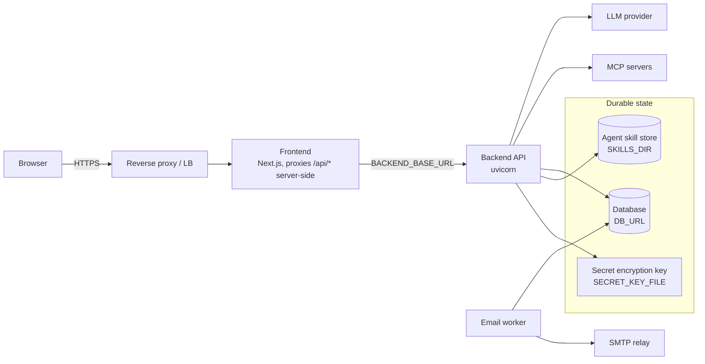

# Deployment

A deployment is the frontend, the backend, and one relational database; [Run with Docker Compose](../getting-started/docker-compose.md) is the shortest path to all three. What follows is what changes once the stack sits behind a proxy and holds data worth keeping.

The browser only ever talks to the frontend. Its server-side proxy forwards `/api/*` to the backend, which keeps the auth cookies first-party — so the backend needs no public route of its own. Every variable named here is described under [Configuration reference](./configuration.md).

## Reverse proxy and load balancer

**Sticky sessions / session affinity are not required.** See [Horizontal scaling](./scaling.md) — a PostgreSQL advisory lock, not routing affinity, is what keeps one conversation pinned to one driver at a time, and only for the duration of a single SSE stream.

The SSE agent routes (`POST /api/v1/workflow-executions/{id}/agent` and `POST /api/v1/workflows/{id}/agent`) need the following at the proxy layer:

| Setting | Required value | Why |
|---|---|---|
| Response buffering | Off for those two paths | The app sends `X-Accel-Buffering: no`, which nginx honors per-response even with buffering on globally. Every other proxy needs it disabled in its own config |
| Compression | Never applied to `text/event-stream` | The app never compresses a response, so any compression the client sees comes from this layer |
| Read / idle timeout | Well above the longest agent run you expect | An agent run has no server-side time limit, so a proxy read timeout is the only thing that can end a stream — and a low one silently truncates a legitimate long response. Size it against your longest run, not a typical request |

A rolling deploy forcibly ends any SSE stream still open 30 seconds after the container receives SIGTERM (`--timeout-graceful-shutdown 30`, set in the backend `Dockerfile`'s `CMD`). That is safe: the advisory lock releases with the connection and the client resumes with a fresh request, exactly as an abandoned stream already behaves.

## Behind HTTPS

Three settings default to values that only suit local HTTP development. Change all three before a deployment faces real users:

| Variable | Set it to | Left at the default |
|---|---|---|
| `SESSION_COOKIE_SECURE` | `true` | Session and CSRF cookies go out without `Secure`, so a browser will also send them over plain HTTP |
| `CORS_ORIGINS` | The browser-facing origin, e.g. `https://a2flow.example.com` | Only `http://localhost:3000` is allowed to call the API |
| `APP_BASE_URL` | The same origin | Notification email is sent without the deep links back into the app — see [Notification email](./configuration.md#notification-email) |

## Process layout

The backend ships as two entry points against the same database. Which one you run decides where notification email is delivered from:

| Layout | How | Use it when |
|---|---|---|
| API only | The default — `EMAIL_WORKER_IN_PROCESS` is `true`, so `uvicorn main:app` also drains the email queue | A single-process deployment, or one small enough that a stalled relay on the request path is acceptable |
| API + worker | Run `python -m worker` alongside the API and set `EMAIL_WORKER_IN_PROCESS=false` on it | Anything where a hung relay must not cost anything that serves requests. This is what `compose.yml` does |

Two things about the worker process:

- **It does not migrate or seed.** The API's startup owns both, so the worker has to start after the API is up — `compose.yml` gates it on the API's health check.
- **More than one replica buys failover, not throughput.** They contend on the `email-queue` advisory lock and all but one sit idle by design, which is what keeps the send rate exact.

## Health checks

Point your orchestrator or load balancer at `GET /api/v1/health`. See [Health checks](./health.md).

## State that has to persist

Three things outlive a container and have to sit on durable storage for a deployment to come back up intact:

| What | Where it lives | Losing it means |
|---|---|---|
| **The database** | The database named by `DB_URL` | Everything — every record lives there. See [Database](../architecture/database.md) |
| **The agent skill store** | `SKILLS_DIR` | Executions cannot load the skill revision they are pinned to (HTTP 409 `SKILL_NOT_READY`). It is durable state, not a cache — see [Agent skill store](./configuration.md#agent-skill-store) |
| **The secret encryption key** | `SECRET_ENCRYPTION_KEY`, or the file at `SECRET_KEY_FILE` | Every stored local secret becomes undecryptable, and the approval CA can no longer issue or verify certificates. See [Secret management](./configuration.md#secret-management) |

How to take and restore each of them is in [Backup and restore](./backup.md).
