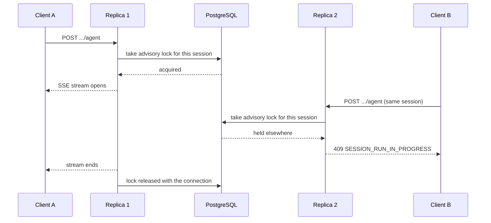

# Horizontal scaling

The frontend holds no state of its own — it proxies `/api/*` and keeps nothing between requests — so it scales freely. Everything below is about the backend.

## What running more than one replica requires

| Requirement | Why |
|---|---|
| **PostgreSQL** | SQLite is single-writer and single-process. All replicas share one database, which is also what coordinates them |
| **A shared `SKILLS_DIR`** | Every replica must mount the same [agent skill store](./configuration.md#agent-skill-store) (ReadWriteMany). A run pins the skill revision it started with, and any replica may serve the next request in that run |
| **No transaction-pooling proxy** | See [Connection pooling](#connection-pooling) below |
| Sticky sessions | Not required. The advisory lock below does the job routing affinity would be reached for |

## One driver per conversation

Writes to one conversation are already safe across replicas: the session service takes `SELECT ... FOR UPDATE` on the row it appends to for the whole transaction, so appends are serialized and neither the conversation's state nor its event rows can be lost.

Reads are the part that needs help. The ADK `Runner` holds one in-memory session for the length of an invocation, so events another replica appends during that window never reach it, and the rest of the run reasons over a conversation that is missing them. Serializing writes cannot repair that — only keeping a session to one driver at a time can.

So each agent run (`POST /api/v1/workflow-executions/{id}/agent`, `POST /api/v1/workflows/{id}/agent`) takes a **PostgreSQL session-level advisory lock** and holds it for the whole SSE stream:

A second concurrent run of the same session is refused before any SSE headers are sent, rather than being left to diverge quietly. Different sessions never contend, and the lock is briefly waited on before it gives up, so a client that aborts a stream and immediately retries is not rejected while the abandoned run is still tearing down.

Human-in-the-loop is unaffected: a frontend tool call ends the run and closes the stream, releasing the lock, and the approval resumes as a *new* agent request that may land on any replica.

## Connection pooling {#connection-pooling}

Because the lock is session-level rather than transaction-level, the deployment must not place a **transaction-pooling** proxy — PgBouncer in `transaction` mode, and most serverless PostgreSQL poolers — between the app and PostgreSQL. The lock would not survive between statements. Session-level pooling, or a direct connection, is required.

## Notification email

The outgoing-email worker needs no coordination from you: whether it runs in the API processes or as a dedicated one, the `email-queue` advisory lock elects exactly one sender across the whole deployment, so replicas never double-send and the configured rate limit stays exact. Adding worker replicas buys failover, not throughput — see [Process layout](./deployment.md#process-layout).
