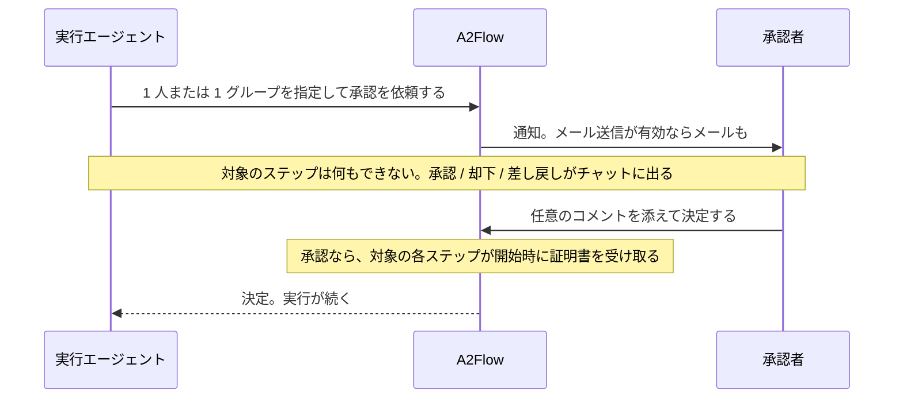
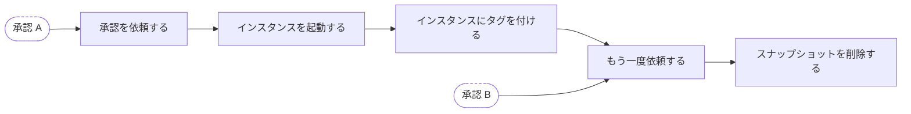

# 承認ゲート

[承認](../guides/approvals.md)は 2 つのことを同時にします。人が決めるまで実行をあるステップで止めること、そしてその決定を、以後その承認が対象とするステップが何をしてよいかを言い切る署名済みの許可に変えることです。

## 「止まる」とは何か {#what-blocked-means}

この停止は、エージェントが行儀よく待っているという意味ではありません。

| 承認が決まっていないあいだ | |
|---|---|
| 対象のステップが呼べるもの | 束ねられた MCP ツールはどれも呼べません。呼び出しはサーバーに届く前に拒否されます |
| 誰が強制するか | [プロキシ](./mcp-proxy.md)が規則として確認します。エージェントへの指示文ではありません |
| ゲートの引き金 | そのステップを対象とする承認が*存在すること*です。保留中も却下済みも同じく止めるので、ゲートは閉じる方向に倒れます |
| 影響を受けないもの | どの承認の対象でもないステップです。通常のツールバインディングの規則のまま動き続けます |

つまりプロンプトインジェクションやバグがゲートを言いくるめることはできません。説得する相手がいないからです。ゲートを開けるのは、その承認に対して記録された決定だけです。

## 証明書 {#the-certificate}

承認が対象とする各ステップは、開始した時点で短命な証明書を受け取ります。署名するのは、配備が最初の使用時に自分のために生成する認証局です。

証明書は承認が足すものではありません。ツールを呼ぶステップは**どれも**持っています。承認が変えるのは、それが誰の権限かです。誰にも承認を求めなかったステップはその実行を始めた人の権限で証明書を受け取り、承認はそれを承認者自身の権限に差し替えます。だから記録が答えるのは「この呼び出しは許可されていたか」ではなく、つねに「誰の許可だったか」です。

| 証明書が持つもの | なぜ効くのか |
|---|---|
| どのテナント・どの実行・どのステップのものか、そして誰の権限を持つのか(承認者か、実行を始めた人か) | ある実行のために発行された証明書は別の実行では役に立たず、片方の権限がもう片方の代わりになることもありません |
| **そのステップが開始した瞬間に束ねられていたツール一覧** | 実行のステップとそのツールは、公開されたワークフローの設計から実行時に固定され、証明書が発行時にもう一度それを固定し、承認の対象になったステップのツールはそもそも変更できなくなります。ですからエージェントも、あとからの変更も、許可を広げられません。ファイルを読む承認がファイルを消す承認に化けることはありません |

### 承認が対象とするステップ {#the-steps-an-approval-covers}

承認は、**指定されたステップと、その後ろに続くステップすべてを、次の承認までの範囲で**対象とします。ですから依頼そのものを 1 つのステップにしておけば、その決定は後続の作業まで届きます。

承認 A が対象とするのは「承認を依頼する」「インスタンスを起動する」「インスタンスにタグを付ける」です。「もう一度依頼する」から先は承認 B が引き継ぎます。依頼より前にあるものが対象になることはありません。承認が届くのは前方だけです。

| 状況 | どうなるか |
|---|---|
| 指定したステップ自体はツールを使わない | 問題ありませんし、それが普通です。決定は後続のステップが担います |
| 別々の分岐にある 2 つの承認の後ろにステップがある | **両方**が承認されるまで動けません。片方の承認者の判断が、もう片方の代わりにはなりません |
| すでに別の承認の対象になっているステップに、あとから承認を依頼した | 近いほうの依頼がただちに引き継ぎ、前の決定はそのステップを認可しなくなります |
| ステップが差し戻され、再提出された | 新しい依頼が古い決定に代わってそのステップのゲートになるので、却下によってステップが永久に止まったままになることはありません |

以後、対象のステップから出るツール呼び出しは、すべてその証明書を提示しなければなりません。プロキシは、呼び出しをどこかへ通す前に次のすべてを確認します。

- 証明書がこの実行・このステップのものであること
- この配備が発行したもので、失効していないこと
- 背後の承認がいまもそのステップを対象としていて、対象とする承認がすべて承認されたままであること
- 呼び出し元が、コピーしただけではなく本当にその証明書の持ち主だと示せること
- 呼ぼうとしているツールが署名済みの集合に入っていること

証明書は、そのステップが終端ステータスに達した時点で失効します。安全性はこれに依存しません(終わったステップはもう動いていないので、呼び出しはすでに拒否されます)。これが足すのは、その許可が「なぜ効かなくなったのか」を記録が語ることと、証明書の寿命が、それが認可した作業の長さに沿うことです。対象の各ステップは自分が開始したときに自分の証明書を受け取るので、長く続くステップの連なりが 1 枚の証明書の有効期間に収まる必要はありません。その最大の有効期間は[設定リファレンス](../operations/configuration.md#mcp-tools-and-approvals)で変えられます。

## 記録が答えられること {#what-the-record-answers}

判定されたツール呼び出しは、許可も拒否も、提示された証明書とともに記録されます。だから「この操作を誰が、どんな根拠で許可したのか」に、実行が終わってからずっとあとでも答えられます。引数はダイジェストだけが残り、生の値は保存されません。この記録を読む場所は、実行の Tool Invocations の画面です。

**保証の範囲。** プロキシはバックエンドのプロセスの中で動くので、証明書は同じプロセスを共有する検証者に対して所持を証明します。すでにバックエンドを掌握した攻撃者への防御ではありません。得られるのは、閉じる方向に倒れる単一の強制点、あとから広げられない許可、そしてあとから確認できる記録です。
