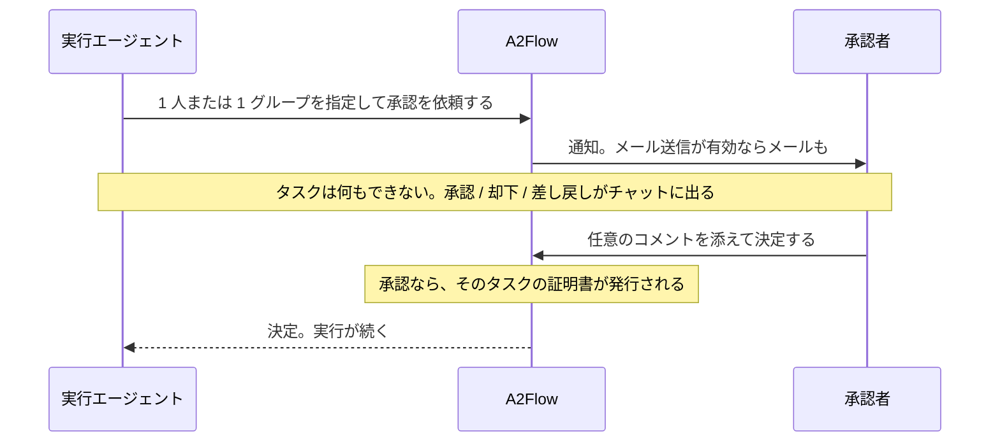

# 承認ゲート

[承認](../guides/approvals.md)は 2 つのことを同時にします。人が決めるまでタスクを止めること、そしてその決定を、以後そのタスクが何をしてよいかを言い切る署名済みの許可に変えることです。

## 「止まる」とは何か {#what-blocked-means}

この停止は、エージェントが行儀よく待っているという意味ではありません。

| 承認が決まっていないあいだ | |
|---|---|
| タスクが呼べるもの | 束ねられた MCP ツールはどれも呼べません。呼び出しはサーバーに届く前に拒否されます |
| 誰が強制するか | [プロキシ](./mcp-proxy.md)が規則として確認します。エージェントへの指示文ではありません |
| ゲートの引き金 | タスクに承認が*存在すること*です。保留中も却下済みも同じく止めるので、ゲートは閉じる方向に倒れます |
| 影響を受けないもの | 承認が付いていないタスクです。通常のツールバインディングの規則のまま動き続けます |

つまりプロンプトインジェクションやバグがゲートを言いくるめることはできません。説得する相手がいないからです。ゲートを開けるのは、その承認に対して記録された決定だけです。

## 証明書 {#the-certificate}

承認されると、そのタスク向けの短命な証明書が発行されます。署名するのは、配備が最初の使用時に自分のために生成する認証局です。

| 証明書が持つもの | なぜ効くのか |
|---|---|
| どのテナント・どの実行・どのタスク・どの承認のものか | ある実行のために発行された証明書は、別の実行では役に立ちません |
| **承認者が決めた瞬間にそのタスクへ束ねられていたツール一覧** | エージェントは実行中に自分のタスクのバインディングを書き換えられますが、証明書を発行し直すことはできません。ファイルを読む承認が、ファイルを消す承認に化けることはありません |

### 承認が対象とするタスク {#the-task-an-approval-covers}

この仕組みの両側、つまり止める側と開ける側は、どちらも**承認された行為を実際に行う 1 つのタスク**のものです。ゲートが閉じるのは承認が指定したタスクであり、許可されるツールもその同じタスクのものなので、指定を間違えると両方が同時に空振りします。

これが効いてくるのは、依頼そのものが 1 つのステップになっているワークフローが多いからです。

| ステップ | 使うツール | 承認が指定すべきもの |
|---|---|---|
| 承認を依頼する | なし | — |
| インスタンスを起動する | 起動用のツール | **こちら** |

最初のステップを指定すると、証明書には空のツール一覧が焼き込まれ、2 番目のステップには承認が付かないまま、つまり守られないまま残ります。ゲートが存在する理由そのものである呼び出しに、ゲートが無いという状態です。そこで、ツールを使わないステップを指定していて、その後ろにツールを使うステップがある依頼は**拒否**され、代わりにどのステップを指定すべきかがエージェントに伝えられます。ツールを使わず、後ろにもツールを使うステップが無いステップなら、そのまま受け付けます。これはツールを使わない行為を対象とした承認です。

以後そのタスクから出るツール呼び出しは、すべてこの証明書を提示しなければなりません。プロキシは、呼び出しをどこかへ通す前に次のすべてを確認します。

- 証明書がこの実行・このタスクのものであること
- この配備が発行したもので、失効していないこと
- 背後の承認がいまも承認されたままであること
- 呼び出し元が、コピーしただけではなく本当にその証明書の持ち主だと示せること
- 呼ぼうとしているツールが署名済みの集合に入っていること

証明書は、そのタスクが終端ステータスに達した時点で失効します。安全性はこれに依存しません(終わったタスクはもう `in_progress` ではないので、呼び出しはすでに拒否されます)。これが足すのは、その許可が「なぜ効かなくなったのか」を記録が語ることと、証明書の寿命が、それが認可した作業の長さに沿うことです。最大の有効期間は[設定リファレンス](../operations/configuration.md#mcp-tools-and-approvals)で変えられます。

## 記録が答えられること {#what-the-record-answers}

判定されたツール呼び出しは、許可も拒否も、提示された証明書とともに記録されます。だから「この操作をどの承認が許可し、誰が承認したのか」に、実行が終わってからずっとあとでも答えられます。引数はダイジェストだけが残り、生の値は保存されません。この記録を読む場所は、実行の Tool Invocations の画面です。

**保証の範囲。** プロキシはバックエンドのプロセスの中で動くので、証明書は同じプロセスを共有する検証者に対して所持を証明します。すでにバックエンドを掌握した攻撃者への防御ではありません。得られるのは、閉じる方向に倒れる単一の強制点、あとから広げられない許可、そしてあとから確認できる記録です。
