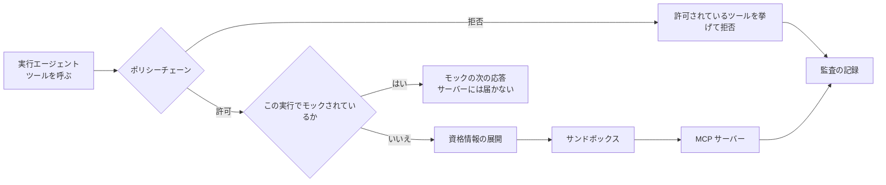
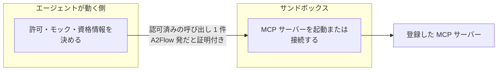
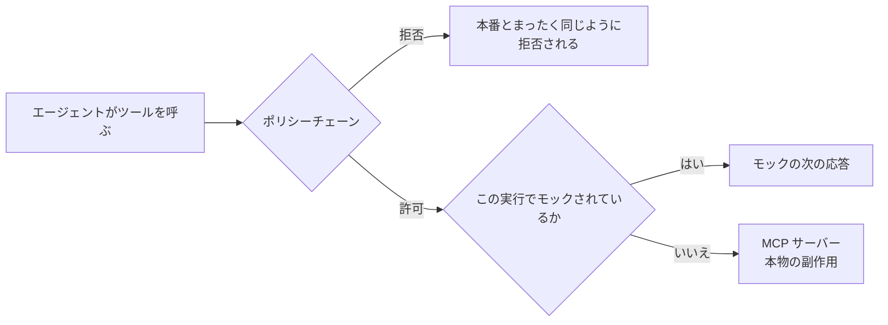

# MCP プロキシ

エージェントが登録済みの [MCP サーバー](../guides/mcp-servers.md)に直接話しかけることはありません。呼び出しはすべて A2Flow 自身のプロキシを通ります。プロキシは、その呼び出しが許されるか、スタブで答えるべきか、接続にどの資格情報が要るかを決め、決めた内容を記録します。

| プロキシが受け持つもの | 何をするか |
|---|---|
| **同一性** | 呼び出しが届いた会話から、どのテナント・どの実行のものかを確定します |
| **認可** | 順序付きのポリシーチェーンに諮ります。どのポリシーも拒否権を持ちます |
| **スタブ** | 実行がそのツールの[ツールモック](./mcp-proxy.md#tool-mocks-and-dry-runs)を持っていれば、それで答えます |
| **資格情報** | 登録されたサーバーの[シークレット](./secrets.md)参照を、接続時にだけ展開して接続情報にします |
| **隔離** | 許可した呼び出しを、実際にサーバーを動かす[サンドボックス](#the-sandbox)に渡します |

## 登録したサーバーが動く場所 {#the-sandbox}

登録した MCP サーバーは A2Flow のコードではありません。ローカルのものは A2Flow が代わりに起動するプログラムですし、リモートのものは A2Flow が外向きに接続していくサービスです。どちらにせよ、動き始めたあとの振る舞いは A2Flow の管理外です。

そのため、A2Flow 自身の秘密がある場所では動かしません。Docker Compose の構成では**別のコンテナ**で動き、そのコンテナは以下のいずれも持ちません。

| サンドボックスに無いもの | どこに残るか |
|---|---|
| データベースと、そこに記録されたすべて | エージェント側 |
| [シークレット](./secrets.md)を暗号化している鍵 | エージェント側 |
| 外部シークレットストアの資格情報 | エージェント側 |
| LLM プロバイダの API キー | エージェント側 |
| [エージェントスキル](../guides/agent-skills.md)のリポジトリ | エージェント側 |

サンドボックスが受け取るのは 1 回分の呼び出しだけです。到達先となるサーバー 1 つのアドレスまたはコマンド、そのサーバーが必要とする値(シークレット参照は展開済み)、そしてツール名と引数。それ以外は最初からありません。

**両端は互いに身元を証明し合います。** 通信は暗号化されており、どちらの端も素性の分からない相手を受け付けません。サンドボックスは、この環境が発行した証明書を持たない接続を拒否します。さらに個々の呼び出しには、それを行うタスクの[証明書](#who-authorized-a-call)が付きます。サンドボックスは何かに到達する前にその証明書を再度確認します。ここで発行されたものか、期限が切れていないか、提示した相手のものか、そしてまさにこのツールを対象に含んでいるか。

この 2 つ目の確認は 1 つ目とは別の問いです。A2Flow であることと、あるツールを呼ぶ権限があることは同じではありませんし、タスクの証明書を持っていることと、その要求が A2Flow の送ったものであることも同じではありません。両方が成り立つ必要があるので、正当な認可を保ったまま、こっそり別のプログラムをサンドボックスに指し示すことはできません。

サンドボックスは二重の防壁であって、判断する側ではありません。タスクがまだ進行中か、承認がまだ有効か、証明書が取り消されていないか — そこでは答えられませんし、いずれもプロキシ側に残っています。

## ポリシーチェーン {#the-policy-chain}

| 順 | ポリシー | 何を要求するか |
|---|---|---|
| 1 | **進行中タスクのツールバインディング** | `(サーバー, ツール)` の組が、実行がいま `in_progress` にしているタスクに束ねられていること。サーバーが広告するツールの一覧取得は意図的に制限しません。設計エージェントが何を束ねるか決めるのはそれだからです |
| 2 | **ツール証明書** | そのタスクの証明書を提示し（[誰がその呼び出しを許可したのか](#who-authorized-a-call)）、署名済みの許可がそのツールを含んでいること。例外はありません。どの承認の対象でもないタスクは、実行を始めた人の許可で出た証明書を提示します |

チェーンは最初の拒否で打ち切られ、安い判定から並びます。だからバインディングの規則で落ちる呼び出しが、署名の検証の代金を払うことはありません。規則を足すときは、プロキシを書き換えるのではなくチェーンにポリシーを 1 つ足します。それが「何を動かしてよいか」を 1 つの順序付きの一覧として読める状態に保ちます。

拒否はログのためではなく呼び出し元のために書かれます。拒否された呼び出しは、*許可されている*ツールを挙げて返るので、モデルは当て推量ではなく自分で言い直せます。

## 誰がその呼び出しを許可したのか {#who-authorized-a-call}

実行が行うツール呼び出しはどれも、誰の許可で動いているのかを示す**証明書**を持ちます。タスクが証明書を受け取るのは**進行中**にされたときで、それが誰の許可かは、そのタスクが[承認](./approvals.md)の対象かどうかで決まります。

| タスク | 証明書を受け取るのは | 誰の許可か |
|---|---|---|
| 承認の対象である(自分に付いた承認、または前のタスクに依頼された承認) | 開始したとき。ただしその承認が許可されてから | 許可した承認者 |
| どの承認の対象でもない | **進行中**にされたとき | その実行を始めた人 |

2 行目がふつうのケースです。誰にも判断を求めていないので、ワークフローを実行した本人がそのタスクの束ねたツールを許可します。呼び出しが誰の許可によるものか分からないまま残ることはありません。

ここから 3 つの規則が導かれます。どれもワークフローを運用する人から見える形で効いてきます。

- **タスクが始まった時点のツールで固定されます。** 証明書が対象にするのは、その時点でタスクに束ねられていたツールだけです。タスクを開始したあとでツールを足すワークフローでは、そのツールの呼び出しは拒否されます。設計エージェントには先に束ねるよう指示していますが、手で直したタスクではまだ起こりえます。承認の対象になったタスクは、そもそもツールを変更できません。
- **承認を求めると、また閉じます。** すでに誰かの許可で動いているタスクを対象に含む承認をあとから要求すると、その許可はその場で降ります。タスクは他と同じように判断を待ちます。
- **対象のタスクはそれぞれ自分の証明書を持ちます。** 1 つの承認がひと続きのタスクを対象にしても、全部が同じ時計に乗るわけではありません。各タスクが開始時に自分の証明書を受け取ります。

## 何が記録されるか {#what-is-recorded}

| 判定ごとに記録されるもの | 意図的に記録しないもの |
|---|---|
| ツール、サーバー、許可か拒否か | 引数そのもの。残るのはダイジェストだけです |
| 拒否のときはその理由 | |
| 提示された証明書、つまり誰がその呼び出しを許可したのか | |

この記録が実行の Tool Invocations の画面で、「この呼び出しを誰が許可したのか」にあとから答えられるようにしているのもこれです。証明書そのものは**監査ログ → Certificates** に、許可 1 件につき 1 行で並びます。

## ツールモックとドライラン {#tool-mocks-and-dry-runs}

[ツールモック](../guides/tool-mocks.md)を使うと、**draft** のワークフローを、ツールの副作用なしに端から端まで動かせます。アーキテクチャとして効くのは、スタブが*どこに置かれているか*です。

スタブに諮るのはポリシーチェーンの**あと**で、前ではありません。だからドライランは本番と同じ認可をひととおり通ります。ツールは進行中のタスクに束ねられている必要がありますし、そのタスクの証明書の提示も同じく要ります。モックが省くのは、A2Flow の外に影響が出る部分だけです。

知っておく価値のある結果が 2 つあります。

- **応答は呼び出し回数に沿います。** 最初の応答がその実行の 1 回目の呼び出しに答え、2 番目が 2 回目に答え、一覧が尽きたら最後の応答が繰り返されます。回数の数え手は実行のほうにあるので、1 回のエージェント実行がまたぐ多数のリクエストと、あり得る複数のレプリカを越えて維持されます。
- **差し替えられた呼び出しは監査の記録に残りません。** あの記録は、本物のサーバーに届いた呼び出しと、そこへ向かう途中で止められた呼び出しのためのものです。最初からスナップショットで答えると決まっていた呼び出しの行があると、どちらの向きにも読み違えられます。差し替えられた呼び出しを確認する場所はチャットの記録で、`Mocked` のバッジが付きます。
