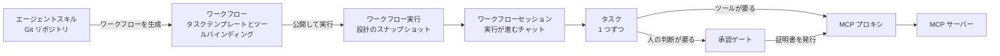

# 動作の仕組み

A2Flow は[エージェントスキル](../guides/agent-skills.md)を、走らせる前に手順が決まっているワークフローに変え、そのワークフローを、エージェントと関係者が共有するチャットの中で実行します。各段階は、ひとつ前の段階を凍結した写しを受け取ります。だから設計が先へ進んだあとも、実行は公開された時点の内容に忠実なままです。

| 段階 | 何が起きるか | 詳しくは |
|---|---|---|
| **設計** | スキルがワークフローになります。AI の設計実行が依頼を手順に割り、各手順が必要とするツールを束ねます。 | [ワークフローの設計](./workflow-design.md) |
| **実行** | ワークフローを実行すると、公開された設計が新しいワークフロー実行へ写され、そのチャットが開きます。 | [ワークフローの実行](./workflow-execution.md) |
| **会話** | エージェントと複数の人がそのチャットを共有します。エージェントは文章を書くだけでなく、対話的な画面をそこに描けます。 | [セッション](./sessions.md) |
| **承認** | 人の判断が要るタスクは、誰かが決めるまで何もできません。その決定は署名されて証明書になります。それ以外のタスクも、実行を始めた人の権限で証明書を持ちます。 | [承認ゲート](./approvals.md) |
| **実施** | ツールの呼び出しはすべて、A2Flow を出る前にポリシーチェーンで判定され、判定されたことが記録されます。 | [MCP プロキシ](./mcp-proxy.md) |

その下には 2 つの保管場所があります。すべてのレコードが入る[データベース](./database.md)と、資格情報を解決する[シークレットの保管](./secrets.md)です。

## 2 種類のチャット {#the-two-chats}

A2Flow のチャットはちょうど 2 種類です。同じ仕組みを別のエージェントに向けたもので、違いは、それぞれのエージェントに何が許されているかです。

| チャット | 動かすエージェント | 何ができるか |
|---|---|---|
| **設計セッション** | スキルに従う設計エージェント | ワークフローのタスクテンプレートを書き、並べ替えます。何も実行しません。 |
| **ワークフローセッション** | 実行が固定しているスキルリビジョンに従う実行エージェント | 実行のタスクを順に進め、承認を求め、MCP ツールを呼びます。 |

どちらのチャットも自分のレコードを持ちません。設計セッションはワークフローで、ワークフローセッションはワークフロー実行で指し示され、背後の会話は最初に使われたときに作られてその ID のもとに保たれます。だから開き直せば続きから再開します。
