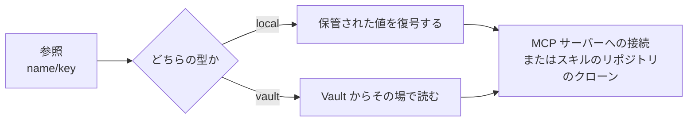

# シークレットの保管

[シークレット](../guides/secrets.md)は名前の付いた key/value のエントリの束で、参照はつねにちょうど 1 つのエントリを指します。MCP サーバーのヘッダーや環境変数なら `${secret:name/key}`、エージェントスキルなら名前とキーの組です。参照は名前のまま保持され、**使うときに初めて解決されます**。だから資格情報を必要とする側が、資格情報そのものを抱えることはありません。

| | **ローカル** | **HashiCorp Vault** |
|---|---|---|
| 保管されるもの | エントリそのもの。値はそれぞれ暗号化されます | KV v2 の参照だけ。マウントとパスです |
| 値の出どころ | 暗号化された保管場所 | Vault。解決するその瞬間に読みます |
| キー一覧の読み方 | 保管されたマップから。何も復号せずに読めます | その瞬間に Vault から読みます |
| クライアントが読み返せるもの | キーだけ。値は平文でも暗号文でも返りません | キーだけ |

## ローカルシークレット {#local-secrets}

値は配備が持つ 1 つの鍵で暗号化されます。エントリのキーはその横に平文のまま置かれ、これのおかげでピッカーは何も復号せずにキーを並べられます。値はどの形でもクライアントへ渡りません。ローカルシークレットの詳細画面が、キーを値の空欄とともに表示するのはそのためです。

暗号化の鍵はプロセスごとに一度だけ解決されます。環境変数に設定されていればそこから、なければ鍵ファイルから読み、それもなければ最初の使用時に生成してそのファイルへ書き、警告をログに残します。

**この鍵はバックアップしてください。** 失うと、保管済みのローカルシークレットはすべて復号できなくなります。さらに同じ鍵が[ツール証明書](./approvals.md)を発行する認証局の署名鍵も守っているので、証明書の発行も検証もできなくなります。つまり MCP ツールの呼び出しがすべて止まります。どちらも[設定リファレンス](../operations/configuration.md#secret-management)にあります。

## HashiCorp Vault シークレット {#hashicorp-vault-secrets}

Vault 型のシークレットについて、A2Flow は値をいっさい保管しません。保管するのは読みに行くためのマウントとパスだけです。値もキーの一覧も、必要になるたびにその場で取得されます。だから Vault 側で値を入れ替えれば、A2Flow に触らなくてもそれが効きます。

Vault への接続は配備全体で 1 つ設定し、認証は静的トークンか AppRole の資格情報で行います。AppRole のトークンはリースが切れる直前まで再利用され、そのあと改めてログインして更新されます。Vault を設定するまで、`vault` 型のシークレットはそもそも解決できません。

## 解決される場所 {#where-resolution-happens}

| 使う側 | 解決されるタイミング |
|---|---|
| MCP サーバーのヘッダーと環境変数の値 | [プロキシ](./mcp-proxy.md)がそのサーバーへ接続するとき |
| エージェントスキルのリポジトリのパスワード | リポジトリをクローンまたは Pull するとき |

解決が遅延されるので、まだ参照されているシークレットの名前を変えたり削除したりしても、編集の時点では失敗しません。代わりに次に使ったときに、見つからなかったシークレットの名前を挙げて失敗します。詳しい理由は呼び出し元へは渡らず、サーバーのログに残ります。
