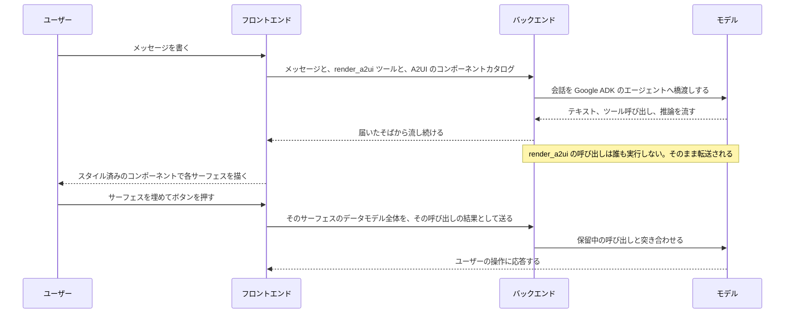

# セッション

セッションは複数の参加者が共有するチャットです。エージェント、それを開いた人、そして作業が呼び込む誰かが同じ場所にいます。エージェントが対話的な画面を描くのもここです。だからやり取りは、散文で答える段落ではなく、埋めるフォームにもなります。

## 誰が共有するか {#who-shares-one}

| セッション | 共有する人 | それ以外の人 |
|---|---|---|
| **ワークフローセッション** | 実行を始めた人と、その[承認](./approvals.md)の宛先になっている承認者 | テナントの Admin は読み取りだけ見えます。ほかの人はアクセスできません |
| **設計セッション** | テナントのすべての Developer、加えて Super Admin とワークフローの作成者 | アクセスできません |

グループ宛の承認は、`approver` を持つメンバー全員をチャットに呼び込みます。つまりチャットはグループのメンバーシップに追随します。決められるようにすることが、このアクセスの存在理由だからです。複数の人が 1 つの会話に書き込むので、どのメッセージにも**送信者のアバター**が付きます。画面は数秒ごとに自分を更新するので、ほかの参加者の発言もエージェントの進み具合も、再読み込みなしで見えます。

## 1 ターンの流れ {#how-a-turn-runs}

バックエンドは AG-UI プロトコルと Google ADK のエージェントを橋渡しします。イベントを双方向に変換し、会話を同期させ、届いたそばからブラウザへ流します。だからテキストは最後にまとめてではなく、少しずつ現れます。会話の状態はチャットの ID のもとに保たれるので、開き直せば続きから再開します。

## 対話的なサーフェス {#interactive-surfaces}

`render_a2ui` ツールを添えるのはバックエンドではなくフロントエンドで、エージェントが描いてよい [A2UI](https://a2ui.org) コンポーネントカタログのスキーマも一緒に添えられます。モデルがこれを呼んでも、バックエンドは何も実行しません。呼び出しをそのまま転送し、描くのはブラウザです。

| コンポーネント | 使いどころ |
|---|---|
| `Text`、`Card`、`Row`、`Column` | 構造と文言 |
| `TextField` | 自由入力 |
| 選択ピッカー | 許される値からの選択。選択肢が 5 つ以上ある単一選択のピッカーはドロップダウンに畳まれるので、エージェントは EC2 のインスタンスタイプやリージョンをすべて列挙しても会話を埋もれさせません |
| `Button` | サーフェスの送信 |

ボタンを押すと、そのサーフェスの**データモデル全体**が送り返されます。押されたボタンだけでなく、入力・選択された値がすべてです。だからエージェントはユーザーが実際に入れた内容に応答できますし、再読み込みしたチャットでは、回答済みのサーフェスがエージェントの既定値ではなくユーザー自身の値で埋まった状態で再表示されます。

## チャットに出るエージェントの動き {#agent-activity-in-the-chat}

返信と返信のあいだにエージェントが何をしているのかが見えるよう、途中の作業もチャットの流れの中に出します。

- **作業中の表示** — 実行中でまだ画面に何も出ていないあいだ、メッセージ一覧の下に控えめな明滅が出ます。
- **ツール呼び出しの行** — バックエンドのツール呼び出し(`create_workflow_task`、`list_workflow_tasks` など)はすべて、スピナー(`running…`)からチェック(`done`)へ変わるコンパクトなステータス行になります。[ツールのプロキシ](./mcp-proxy.md)を通した呼び出しは、**本来の MCP ツール名**で `MCP` タグとともに出ます。`render_a2ui` と `render_approval` のクライアントツールは専用の UI を持つので、ツールの行としては出ません。
- **呼び出しの詳細** — 引数や結果を持つツールの行は**クリックで展開**し、両方を整形した JSON で表示します。エージェントが実際に何を送って何を受け取ったのかを、チャットを離れずに確認できます。[ツールモック](./mcp-proxy.md#tool-mocks-and-dry-runs)が答えた行には `Mocked` のバッジが付きます。差し替えられた呼び出しはプロキシに届かず監査の記録を残さないので、確認できる場所はチャットだけです。
- **推論** — 思考を出せるモデルが推論を流すと、その思考が「Thinking」の控えめなパネルとして描画されます。内部で推論するだけで思考の要約を出さないモデルでは、このパネルは出ません。

セッションを再開したときに履歴から復元されるのは、**MCP のツール呼び出し**だけです。A2Flow 内部のツール呼び出しと推論はその場限りです。
