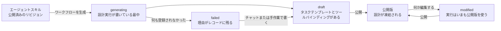

# ワークフローの設計

ワークフローを空の状態から作ることはできません。ワークフローは[エージェントスキル](../guides/agent-skills.md)、つまり A2Flow がクローンして最新に保つ Git リポジトリから生成され、設計を凍結する価値が出るまで磨かれます。

公開済みのリビジョンがないスキルは、ワークフローの生成にも実行にも使えません。2 つのエージェントが従うのはクローンそのものなので、それが出るまでは従う先がないからです。

## 設計実行 {#the-design-run}

生成はワークフローをその場で登録し、設計の作業は背後で進めます。LLM に対する本物のエージェント実行なので、画面を開いたまま待たせるのではなく、レコードのほうが作業中に自分を更新します。

1. 生成ダイアログのプロンプトが、そのワークフローの**設計セッション**の最初のメッセージとして送られます。
2. 設計エージェントはスキルを読み、依頼を手順に割り、**タスクテンプレート**として登録します。これは依存グラフで、各手順が「どの手順が先に終わっている必要があるか」を宣言します。
3. 必要な手順には、その手順が呼んでよい MCP ツールを束ねます。
4. 会話がワークフローの **Generated description** に要約され、ワークフローが `draft` になります。

プロンプト自体はワークフローの項目としては残りません。設計会話の最初のメッセージとして残り続けます。だから同じチャットをあとから開いて結果を磨けますし、何も登録できずに終わった実行でも、空のレコードではなく使える出発点が残ります。

## タスクテンプレートが持つもの {#what-a-task-template-carries}

| テンプレートが持つもの | 補足 |
|---|---|
| **タイトルと説明** | 実行エージェントが読む形の手順です。タイトルはタスク一覧でチップとして読めるよう短く保たれます。 |
| **依存先** | 同じワークフローのテンプレートへの辺です。閉路になる辺は拒否されます。 |
| **MCP ツール** | この手順が呼んでよい `(サーバー, ツール)` の組です。 |
| *ステータスは持たない* | ライフサイクルは設計ではなく実行のものだからです。 |

テンプレートは設計チャットからでも、管理画面のフォームからでも、その両方を混ぜても磨けます。画面については[ワークフロー](../guides/workflows.md#adjusting-the-task-templates)を参照してください。設計エージェントはテンプレートを直接編集し、何も実行しません。だから設計セッションはチーム全員で共有しても安全です。

## 設計時のツールの束ね方 {#binding-tools-at-design-time}

ツールを選ぶことと、ツールを呼ぶことは、意図的に別の規則で扱われます。

| 操作 | 誰がするか | どう制限されるか |
|---|---|---|
| サーバーが広告するツールの**一覧取得** | 判断中の設計エージェント | 制限されません。ツールを見つけることこそ設計実行の目的だからです |
| ツールの**呼び出し** | 実行中の実行エージェント | 実行がいま進行中にしているタスクに束ねられたツールだけに制限されます。[MCP プロキシ](./mcp-proxy.md)を参照してください |

つまり、ここで書かれたバインディングはモデルへのヒントではありません。実行時に[プロキシ](./mcp-proxy.md)が強制する許可そのものであり、そのタスクに承認が必要になったときには[承認証明書](./approvals.md)が凍結する集合でもあります。

## 公開 {#publishing}

公開は設計を凍結します。ワークフローの名前、実効的な説明、そしてテンプレート一覧の全体(依存の辺とツールバインディングを含みます)が公開版として取り込まれ、前の公開版を置き換えます。ここで AI は動きません。公開はスナップショットであって、レビューではないからです。

そのあとの編集はワークフローを `modified` にしますが、実行される内容は変わりません。実行は次に公開されるまで公開版を使い続けます。すでに始まっている実行はどちらにせよ影響を受けません。開始した時点で自分の写しを取っているからです。
