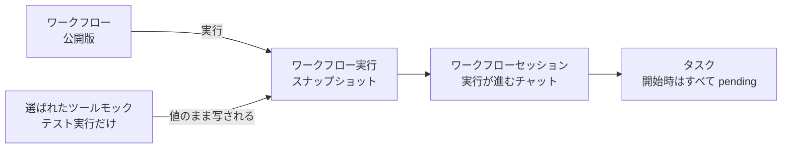
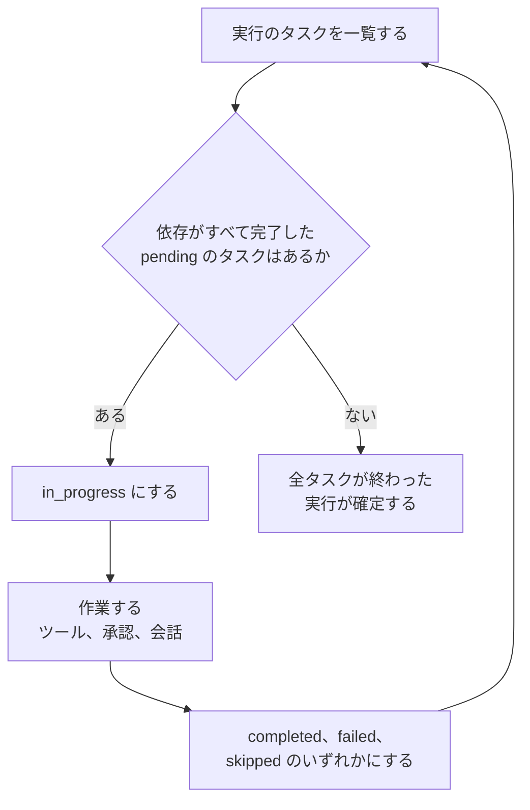

# ワークフローの実行

ワークフローを実行しても、実行がワークフローを指すわけではありません。公開された設計が新しい[ワークフロー実行](../guides/workflow-executions.md)へ**写され**、以後その実行はそのレコードの中で進みます。

| 実行に写されるもの | 写し元 |
|---|---|
| 名前と実効的な説明 | 最後の公開版。まだ `draft` のワークフローの場合、および Developer が `modified` のワークフローの[未公開の編集内容](../guides/workflows.md#trying-the-edits-out)を選んだ場合は現在の内容 |
| タスク(すべて `pending`)と、その依存とツールバインディング | 同じ設計のタスクテンプレート |
| 実行が従うエージェントスキルのリビジョン | その時点でスキルが公開しているリビジョン |
| 選ばれた[ツールモック](./mcp-proxy.md#tool-mocks-and-dry-runs)(値のまま) | その時点でのモックの内容 |

この一覧のどれも、あとから写し元を読み直すことはありません。ワークフローを編集しても、スキルを Pull しても、どちらかを削除しても、すでに始まっている実行には届きません。そして終わった実行は、元のワークフローが消えたあとも読めるままです。

## 実行の進み方 {#how-the-run-advances}

ワークフローセッションは決まったキックオフメッセージで開き、実行エージェントはすでに動いています。計画の承認は公開の時点で済んでいるので、始める前に確認することはありません。

すべてのタスクが終端ステータスに達し、その中に失敗がなければ実行は `completed` で終わります。1 つでも失敗していれば `failed` です。ステータスは実行の読み取り専用のタスク画面で、表としても依存グラフとしても、その場で追えます。

## in_progress であることの意味 {#why-in_progress-matters}

タスクを `in_progress` にするのは帳簿づけではありません。それがそのタスクのツールの鍵です。[プロキシ](./mcp-proxy.md)は、呼ぼうとしているツールが「実行がいま進行中にしているタスク」に束ねられているときだけ通します。終わったタスクはもう動けませんし、まだ始まっていないタスクは最初から動けません。

エージェントは、作業上必要なら実行中にタスク一覧を作り替えることもできます。いま作業しているタスクのツールバインディングも含めてです。だからこそ[承認](./approvals.md)は、肝心のときにそのバインディングを読み直しません。承認者が決めた瞬間に見えていた集合のほうに署名します。
