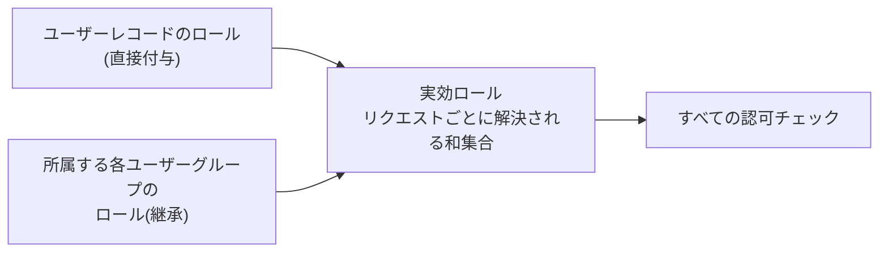
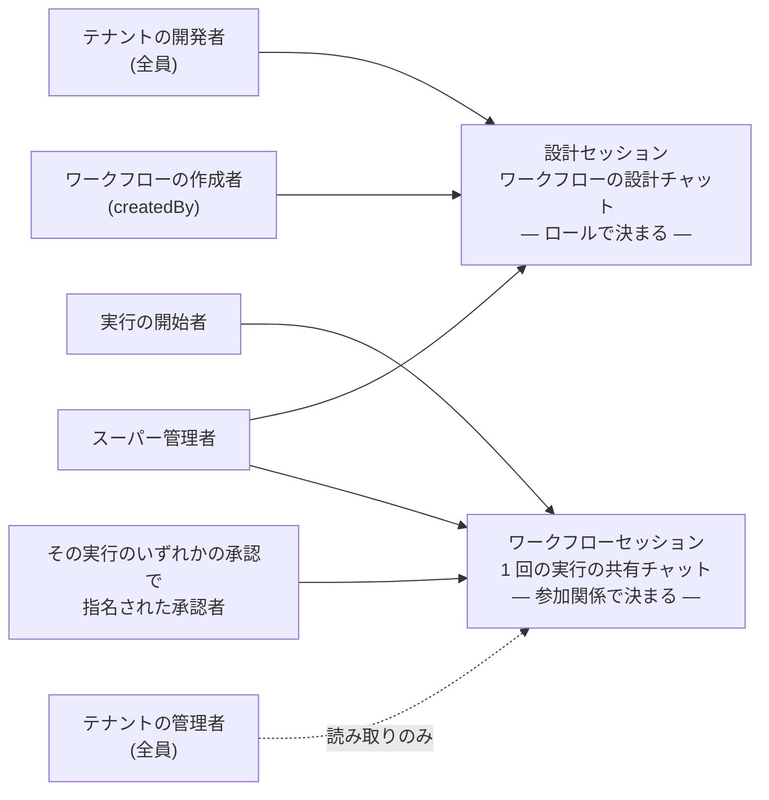

# ロールと認可

ユーザーはそれぞれ**ロール**を持ち、実行できる操作がそれで決まります。ロール同士に**上下関係はありません**。例外が一つだけあります。**スーパー管理者はロールによるチェックをすべて素通り**します。そのため、ほかのどのロールとも**排他**です。あるユーザーはスーパー管理者であるか、残る 4 つのロールの組み合わせを持つかのどちらかで、両方ということはありません。この素通りには意図的な例外が 2 か所あり、いずれも所有者レベルのチェックです。どちらも後述の[セッションへのアクセスの表](./authorization.md#workflow-execution-access)に出てきます。**ロールを一つも持たない**ユーザーも有効です。自分の[アカウント](../guides/users-and-groups.md#users)(アバター)は管理できますが、それ以外は何もできません。

## 実効ロール {#effective-roles}

ロールがユーザーに届く経路は 2 つあり、認可のチェックはすべてその**和集合**、つまりユーザーの**実効ロール**を見ます。

- **直接付与** — [ユーザー](../guides/users-and-groups.md#users)ページからユーザーレコードに付与します。
- **継承** — 所属する[ユーザーグループ](../guides/users-and-groups.md#user-groups)から受け取ります。グループにロールを割り当てると、メンバー全員がそれを得ます。

グループ経由でしか持っていないロールも、直接付与されたものとまったく同じ価値があります。同じゲートを通過し、承認者として指名できるようになり、[なりすまし](./impersonation.md)からも同じように守られます。キャッシュは一切なく、和集合はリクエストのたびに解決するので、グループへの追加や削除は再同期の手順なしにその場で効きます。

グループ自体を宛先にすることもできます。[承認](../guides/approvals.md#human-approval)は個人ではなくグループに送れて、`approver` を持つメンバーなら誰でも決裁できます。

**グループが `super_admin` を付与することはできません**。UI に選択肢が出ず、API も拒否し(HTTP 422)、データベースの CHECK 制約が両方を裏打ちしています。スーパー管理者はプラットフォーム全体を対象とし、グループはちょうど 1 つの[テナント](./tenants.md)に属するので、スーパー管理者がグループのメンバーになることもありません。

## ロール一覧 {#the-roles}

| ロール | 権限 |
|---|---|
| `super_admin` | すべて(ロールによるゲートをすべて素通りします。ただし[後述の表](./authorization.md#workflow-execution-access)にある、指名された承認者のチェック 2 つは素通り**しません**) |
| `admin` | ユーザーの CRUD、シークレットの CRUD、ワークフロー実行の削除、そして自テナント内のすべてのワークフロー実行とそのタスク、チャット履歴、すべての承認への読み取り(後述の[ワークフロー実行とそのワークフローセッション](./authorization.md#workflow-execution-access)を参照。削除を除けば、管理者は実行のエージェントを動かしたり、タスクを作成・編集・削除したり、承認を決裁したりはできません) |
| `developer` | シークレットの CRUD、MCP サーバーの CRUD、[ツールモック](../guides/tool-mocks.md)の CRUD、エージェントスキルの CRUD、ワークフローの生成・編集・公開・無効化(AI が生成した `generatedDescription` の再生成を含みます。ただしこのフィールドを直接編集できるのはスーパー管理者だけです)、タスクテンプレートの CRUD、設計セッションのチャット、ワークフローの実行(`POST /workflows/{id}/execute`。公開前テストのため `draft` のワークフローと、`modified` のワークフローの未公開の編集内容も実行できます)。その未公開の編集内容を**見る**ことができる唯一のロールでもあります。他のロールにはワークフローの名前・説明・タスクテンプレートが最後に公開したときの内容として見えます |
| `requester` | **公開済み**(および `modified`)のワークフローの実行(`POST /workflows/{id}/execute`)。常に最後に公開した設計に対して実行されます |
| `approver` | ワークフロー承認の指名先になれること(個人として、または承認の宛先となったグループのメンバーとして)と、自分宛の承認を決裁すること |

初期投入される **`root`** ユーザーは `super_admin` を持ち、プラットフォーム全体を対象とします(テナントなし)。**Default** テナントに初期投入される **`admin`** ユーザーは `admin` を持ち、そのテナントに閉じます。それ以外のユーザーはロールなしから始まります。

## ロールが制限するもの {#what-roles-gate}

**読み取りは開いたままです。** ロールで制限されるのは書き込みとワークフロー実行と承認だけで、認証済みのユーザーなら誰でもコレクションを `GET` できます(名前の解決、承認者の選択、ワークフローの一覧表示に UI が必要とするためです)。シークレットの*値*は、ロールに関係なく API から返りません。

ロールの割り当ては[ユーザー](../guides/users-and-groups.md#users)の管理ページから、まとめて割り当てる場合は[ユーザーグループ](../guides/users-and-groups.md#user-groups)のページから行います。`super_admin` を付与・剥奪できるのはスーパー管理者だけです。拒否されたリクエストは HTTP 403(`FORBIDDEN`)を返します。

### UI が隠すもの {#what-the-ui-hides}

管理画面はロールで許されない操作やナビゲーション項目を隠すので、拒否されるリクエストはふつう「断られる」より前に「たどり着けない」ようになっています。

| 画面 | ロールがないときの見え方 |
|---|---|
| **一覧ページ** | 追加ボタンと行ごとの操作列が消えます。削除と、MCP サーバーの「レジストリを見る」(作成フォームに進むだけの導線です)がそれにあたります |
| **詳細ページ** | **読み取り専用**で描画されます。各フィールドは入力欄ではなく沈んだ表示の値になり、保存と削除は消え、キャンセルは戻るに変わります |
| **作成フォーム**(`/admin/<section>/new`) | アクセス拒否の画面になります。そこへ導く追加ボタンはすでに隠れているので、たどり着くのは直リンクの場合だけです |

読み取りが開いているため、書き込み権限のない人が詳細ページを開くこともあります。エージェントスキル、MCP サーバー、ツールモック、シークレット、テナント、ユーザー、ワークフロー、タスクテンプレートは、いずれも上の読み取り専用の描画になります。シークレットのエントリはキーだけが並び(値はそもそも返りません)、ユーザーのパスワード欄は完全に省かれます。テナントの `name` やユーザーの `username` のように*誰にとっても*変更できないフィールドは、ロールに関係なく同じ見た目になります。作成フォームには読み取り専用の姿がないので、フォームではなく画面のほうを返します。

## セッションへのアクセス {#session-access}

A2Flow のチャットには 2 種類あり、ゲートの掛け方が違います。

- **設計セッション**はワークフローを設計するチャットです。アクセスは**ロール**で決まります。設計は開発者の仕事なので、そのテナントの開発者どうしで共有します。
- **ワークフローセッション**は 1 回の実行が行われるチャットです。アクセスは**参加関係**で決まります。実行を始めた人と、その中で何かの承認を頼まれた人が、ロールに関係なく共有します。

### 設計セッション {#design-session-access}

ワークフローの設計チャット(`GET /workflows/{id}/messages`、`POST /workflows/{id}/agent`)は、レコードごとの参加関係ではなくロールで共有されます。チームで設計を練り上げられるようにするためです。

| 対象 | 履歴を読む | エージェントを動かす |
|---|---|---|
| そのテナントの**開発者**なら誰でも | ✅ | ✅ |
| ワークフローの**作成者**(`createdBy`)。`developer` を失ったあとも | ✅ | ✅ |
| **スーパー管理者** | ✅ | ✅ |
| それ以外 | ❌ 403 | ❌ 403 |

作成者を明示的に通しているので、自分が始めたチャットから締め出される人は出ません。他テナントのワークフロー ID は 403 ではなく **404** になります。例外はスーパー管理者が[全テナント](./tenants.md#all-tenants)を選んでいるときの `GET .../messages` で、この場合ワークフローはテナントに関係なく解決され、いま説明したロールと作成者とスーパー管理者のチェックが、テナント境界の代わりを務めます。

### ワークフロー実行とそのワークフローセッション {#workflow-execution-access}

ロールとは別に、ワークフロー実行に対する各操作には、呼び出し元がその実行の**開始者**(ワークフローを実行したユーザー)であるか、**その実行の承認のいずれかで指名された承認者**であることが必要です。指名された承認者とは、名指しされたユーザーか、承認の宛先となったグループのメンバーで `approver` を持つ人です([人による承認](../guides/approvals.md#human-approval)を参照)。承認者がチャットを共有する設計(承認者が開始者のチャットに加わる)を保ちつつ、第三者を締め出すためです。読み取りはもう少し広く、2 つの操作はもっと狭くなっています。

| 操作 | エンドポイント | 開始者 | 指名された承認者 | 管理者(同テナント) | スーパー管理者 |
|---|---|---|---|---|---|
| 実行を読む | `GET /workflow-executions/{id}` | ✅ | ✅ | ✅ | ✅ |
| タスクを一覧・閲覧する | `GET .../workflow-tasks` | ✅ | ✅ | ✅ | ✅ |
| ワークフローセッションの履歴を読む | `GET .../messages` | ✅ | ✅ | ✅ | ✅ |
| エージェントを動かす | `POST .../agent` | ✅ | ✅ | ❌ | ✅ |
| タスクを作成・更新・削除する | `/workflow-tasks` | ✅ | ✅ | ❌ | ✅ |
| **承認が紐づくタスク**のステータスを変える | `PATCH /workflow-tasks/{id}` | ✅ | その承認の承認者のみ | ❌ | ❌ |
| 承認を決裁する | `PATCH /approvals/{id}` | ❌ | その承認の承認者のみ | ❌ | ❌ |
| 実行を削除する | `DELETE /workflow-executions/{id}` | 管理者であれば ✅ | 管理者であれば ✅ | ✅ | ✅ |

この列に入らないユーザーには HTTP 403 が返ります。同じ `GET /approvals` の一覧は、管理者にはテナント内のすべての承認を見せます。上の読み取りの行と揃っています。

**最後の 3 行は二度読む価値があります。**

承認に関わる 2 行が、このページの冒頭で予告した**所有者レベルの例外、つまりスーパー管理者の素通りが効かない箇所**です。承認を決裁できるのは指名された承認者だけで、紐づいたタスクのステータスを動かせるのは実行の開始者かその承認の承認者だけです。その実行の承認者なら誰でもよいわけではなく、どちらでもないスーパー管理者や管理者も通りません。そうしないと、タスクをいきなり `completed` にすることで誰でも宛先の代わりを務められてしまいます([人による承認](../guides/approvals.md#human-approval)を参照)。

実行の**削除**は逆の形をしています。所有者のチェックが一切ない、素のロールゲートです。そのため管理者はテナント内のどの実行でも削除できる一方、管理者ロールを持たない開始者は自分の実行すら削除できません。削除すると、その実行のタスクと ADK セッションも一緒に消えます。

## プラットフォーム全体のセクション {#platform-wide-sections}

[テナント](../guides/users-and-groups.md#tenants)と[システム設定](../guides/system-settings.md)の 2 つは、**スーパー管理者**が自分のものとして抱えている管理セクションです。ほかと違って読み取りも制限されます。どちらもテナントのデータではなくプラットフォームレベルの設定を持つため、サイドバーの項目も、ウェルカム画面のカードも、背後のエンドポイントもすべて、ほかのロールには閉じています。

## 承認者の適格性は時間とともに変わる {#approver-eligibility}

⚠️ 承認者として適格かどうかは、承認を作成する時点で検証します。`list_users` と `list_user_groups` は実際に承認できる宛先しか返さず、`request_approval` はそれ以外を拒否します(適格なメンバーがいないグループも含みます)。*そのあと*どうなるかは宛先によって違い、この違いは意図したものです。

- **宛先がユーザーの場合** — あとから `approver` ロールを剥奪しても、すでにそのユーザー宛になっている承認は**無効になりません**。引き続き決裁できるので、進行中のワークフローが止まってしまうことはありません。
- **宛先がグループの場合** — 所属とロールを決裁時に再チェックします。「そのグループ」は固定の個人ではなく、動く集合だからです。だからこそ新しく加わったメンバーが保留中の依頼を拾えるのですが、逆にも働きます。グループから `approver` の付与を外したり、適格なメンバーが一人もいなくなったりすると、保留中の依頼は**誰にも決裁できなく**なり、その実行はいつまでも待ち続けます。ロールを付け直すか、メンバーを戻せば、すぐに解けます。
