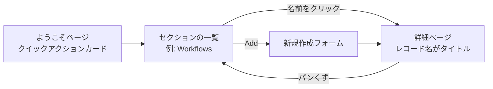

# 管理画面

A2Flow のレコードは、すべて管理画面で作成し、確認し、編集します。上部のアプリバーと左側のセクションサイドバーからなる 1 つの枠組みで、その中のどのセクションも同じ作りです。1 つの一覧の使い方を覚えれば、13 セクションすべてに通じます。

## ようこそページ {#welcome-page}

ようこそページが入口です。サインインした直後、サイトのルートを開いたとき、アプリバーの **A2Flow** ロゴをクリックしたときに、ここに着きます。自分のロールで使える管理セクションが、1 枚ずつのクイックアクションカードとして並びます。

各ページのタイトル上にあるパンくずは、この道筋をそのまま表します。`Admin › Workflows › my-workflow` のように並び、最後の 1 つを除くすべてが上の階層へのリンクです。

## セクション一覧

| セクション | 扱うもの | サイドバーに出るロール |
|---|---|---|
| **Tenants** | テナント組織 | Super Admin |
| **Users** | アカウントとそのロール | Admin、Developer |
| **User Groups** | 複数のアカウントにまとめてロールを与える名前つきの束 | Admin、Developer |
| **Tags** | レコードを分類するラベル | Admin、Developer |
| **Secrets** | ツールやリポジトリで使う資格情報 | Admin、Developer |
| **Agent Skills** | Git リポジトリからクローンしたエージェントの能力 | Developer、Admin |
| **MCP Servers** | エージェントが呼び出せるツールサーバー | Developer、Admin |
| **Tool Mocks** | 下書きワークフローの実行でツールを差し替える代役 | Developer、Admin |
| **Workflows** | 複数ステップの流れとそのタスクテンプレート | Developer、Requester、Admin |
| **Workflow Executions** | ワークフローの実行とその履歴 | サインインした全員 |
| **Approvals** | 承認依頼とその判断 | サインインした全員 |
| **Audit Logs** | ツール呼び出し、なりすまし、与えた権限、送ったメール | Admin、Super Admin |
| **System Settings** | 通知メールを送るメールサーバー | Super Admin |

サイドバーに出ていないセクションは、自分のロールでは書き込めないセクションです。読み取りは開いているので、同僚から中のレコードへの直リンクを受け取れば開けます。詳しくは[ロールと権限](../concepts/authorization.md)を参照してください。

例外は[監査ログ](./audit-logs.md)です。こちらは読み取りも制限されているので、Admin ロールがないと直リンクを開いてもアクセス拒否の画面になります。

## 一覧画面 {#the-list-screen}

どのセクションも一覧の表から始まります。表の操作はすべて共通です。

| 操作 | できること |
|---|---|
| **列ヘッダーのメニュー** | その列での並べ替えと絞り込み。どちらも画面に出ている分だけでなく、データ全体に効きます。 |
| **列の境界をドラッグ** | 列幅の変更。幅はそのセッションの間だけ保たれ、保存はされません。 |
| **セルにマウスを乗せる** | 列幅で切れている文字列の全体が出ます。 |
| **▥ Columns** | 列ピッカーを開きます(後述)。 |
| **Refresh** | 一覧を読み直します。 |
| **Add** | 新規作成フォームを開きます。書き込みロールがなければ出ません。 |
| **Actions 列** | 行ごとの操作。削除のほか、そのレコード種別が持つ操作が並びます。書き込みロールがなければ出ません。 |

### 列を選ぶ

Refresh の隣の **▥** ボタンを押すと、その表が出せる列がすべて並びます。

- **Show all** / **Hide all** でまとめて切り替え、**Reset to default** で既定の組み合わせに戻ります。
- 大事な列に幅を回すため、最初は隠れている列があります。MCP サーバーのトランスポート、シークレットの参照、エージェントスキルの Ref とリビジョン、ユーザーのメールアドレスと確認済みフラグなどです。
- 識別子の列と Actions 列は常に表示されるので、一覧には出てきません。
- 選んだ内容は表ごとにブラウザーに記憶され、リロードしても残ります。記憶されるのは既定からの差分だけなので、あとから列が増えても、その列は意図した既定の状態で現れます。
- 並べ替えや絞り込みに使っている列を隠すと、その並べ替えや絞り込みは解除されます。画面に出ていない条件で行が絞られたままになることはありません。

このパネルは常に画面に収まります。下に余白がなければ上向きに開き、一覧部分だけを内側でスクロールさせて全体の切り替えボタンは見えたままにし、切り替えられる列が 8 個を超えると 2 列に分かれます。17 列ある Agent Skills でも、縦の狭いノート PC の画面から届きます。

## 詳細画面

一覧の識別子の列でレコード名をクリックすると、詳細ページが開きます。このページがそのレコードの唯一の画面です。属性の表示に加えて、そのレコードが持つ操作 — 編集の保存、削除、ワークフローの公開やスキルのリポジトリの Pull といった種別ごとの操作 — がここにまとまっています。タイトルは操作名ではなく、**レコード自身の名前**です。

書き込みロールがない場合、同じページが読み取り専用で描画されます。各項目は入力欄ではなく沈んだ表示になり、Save と Delete は消え、Cancel は Back になります。

[ワークフロー実行](./workflow-executions.md)だけは例外です。実行は編集するレコードではなく履歴なので、行をクリックすると編集フォームではなく、その実行のチャットか読み取り専用のタスク一覧が開きます。
