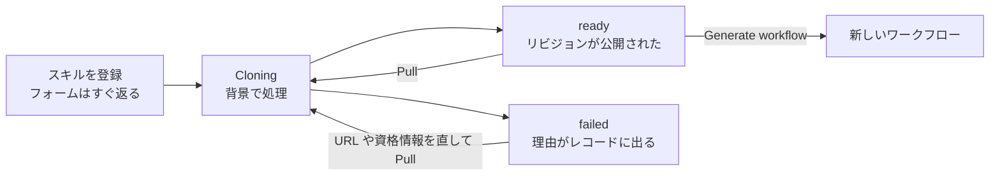

# エージェントスキル

エージェントスキルは、エージェントができることを Git リポジトリにまとめたものです。A2Flow はその目録を持ちます。レコードごとにリポジトリを指定すると、A2Flow がそれをクローンし、最新に保ちます。

管理サイドバーの **Agent Skills** を開くと目録を管理できます。

スキルが使えるようになるのは、リビジョンが公開されてからです。それまでは、そのスキルからのワークフロー生成も実行も拒否されます。

## スキルのレコードが持つもの {#what-a-skill-record-holds}

| 項目 | 説明 |
|---|---|
| **Name** | ほかの画面でこのスキルを指す名前です。 |
| **Repo URL** | クローンするリポジトリ。 |
| **Repo Path** | スキルがリポジトリのルートにない場合の、その中での位置。 |
| **Ref** | 任意。クローンと Pull を固定するブランチ名かタグ名。空ならリポジトリの既定ブランチが使われます。 |
| **Description** | 自由入力。 |
| **Auth Username** / **Auth Password** | プライベートリポジトリ用。後述します。 |
| **Tags** | スキルを分類する[タグ](./tags.md)。 |

## Status と Revision {#status-and-revision}

一覧と詳細ページには 2 つの状態が出ます。意味は別々です。

| 列 | 何を表すか |
|---|---|
| **Status** | *直近*のクローンまたは Pull の結果。`Cloning`、`ready`、あるいは理由つきの `failed`。 |
| **Revision** | 現在公開されているリビジョン。これが入って初めてスキルは実行できます。 |

この 2 つは意図的に独立しています。Pull が失敗しても公開済みのリビジョンは**消えません**。動いていたスキルは、それまでのリビジョンのまま動き続けます。変わるのはステータスとエラーだけです。

## Pull する {#pulling}

**Pull** は、設定された **Ref**(なければ既定ブランチ)でリポジトリをクローンし直します。上流の変更を取り込む操作であり、URL や資格情報を直したあとに失敗した登録をやり直す操作でもあります。ブランチの先端が進んだり、タグの指す先が変わったりした場合は、次に Pull したときに反映されます。

公開されたリビジョンは、必要としているものがある限り残ります。ワークフロー実行は開始時のリビジョンに固定されるので、Pull が進行中の実行の参照先を変えることはありません。保存場所と保持期間は[設定リファレンス](../operations/configuration.md#agent-skill-store)で扱います。

## プライベートリポジトリ {#private-repositories}

資格情報をスキルのフォームに直接入力することはありません。[シークレット](./secrets.md)として一度登録し、スキルからはその 1 エントリを指します。

1. **Auth Username** を設定します。既定は `x-access-token` で、GitHub のパーソナルアクセストークン向けです。実際のアカウント名が必要なホストでは、それを設定します。
2. **Auth Password** の 1 つ目のドロップダウンで**シークレット**を選び、2 つ目でその中の **Entry Key** を選びます。そのエントリの値が、クローン時のパスワードとして使われます。

どちらの種類のシークレットも選べます。Vault のシークレットは、エントリキーがローカルに保存されていないため、Vault から直接読み出されます。

参照は名前とキーとして保存され、クローンのときに解決されます。そのためシークレットをあとから削除したり改名したりしても、その場では失敗しません。次の Pull が失敗し、理由がスキルに記録されます。詳細ページは、解決できなくなった参照を黙って落としたりはしません。選ばれたまま `(not found)` と示され、警告が出ます。消すかどうかは利用者が決めます。

## スキルからワークフローを生成する {#generating-a-workflow-from-a-skill}

各行の Actions 列に **Generate workflow** があり、スキルの詳細ページのヘッダーにも同じ操作のアイコンボタンがあります。どちらも同じダイアログを開き、どちらもスキルがリビジョンを公開するまでは押せません。[ワークフローを生成する](./workflows.md#generating-a-workflow)を参照してください。
