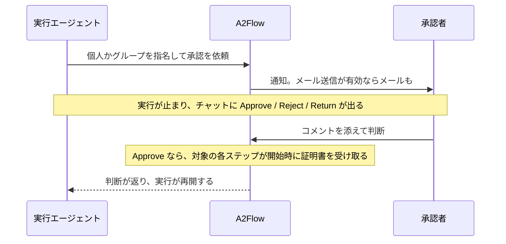

# 承認

承認は、実行が人を待って止まるための仕組みです。エージェントが実行の途中で承認を求め、指名された承認者がチャットで判断し、その判断が、承認の対象になったステップのツールを解放します。

## 人による承認 {#human-approval}

破壊的な操作や取り消せない操作など、エージェントが動く前に明示的な了解が要るステップでは、エージェントは承認を求めて処理を止めます。

### 誰に依頼されるか {#who-is-asked}

依頼の宛先は**必ず 1 つ**です。両方でも、どちらでもなしでもありません。

| 宛先 | 通知される人 | 判断できる人 |
|---|---|---|
| **個人** | その人だけ | その人だけ |
| **[ユーザーグループ](./users-and-groups.md#user-groups)** | `approver` ロールを持つメンバー全員。それぞれに通知が届きます | その全員。**最初の**判断で決まります |

グループを宛先にすれば、承認が特定の 1 人の都合で止まりません。承認できるメンバーが 1 人もいないグループは、その場で拒否されます。誰も決められない依頼になってしまうからです。誰かが判断しても、ほかのメンバーの通知が消えることはありません。ただ、そこから操作できなくなるだけです。実際に判断した人は記録されます。グループ名だけでは「誰が承認したのか」に答えられないからです。

エージェントには、チームの誰が決めてもよいときはグループを、スキルが特定の人を求めるときは個人を指名するよう指示してあります。

### 判断する {#deciding}

エージェントは依頼の内容を文章で説明し、その下のチャットに操作が出ます。ただし出るのは**指名された承認者だけ**です。宛先がグループなら、複数の人が同時に操作を持ちます。それ以外の人には、読み取り専用の待機メッセージが見えます。

| 判断 | 意味 | エージェントの動き |
|---|---|---|
| **Approve** | 進めてよい | 対象のステップのツールが解放された状態で続行します |
| **Reject** | やってはいけない | タスクを `failed` か `skipped` にします |
| **Return** | 直してもう一度出して | 依頼を決着させず、作業を差し戻します |

**Return** は Reject の変種ではなく、3 つ目の判断です。差し戻しが多いことは、そもそも依頼すべきでなかった仕事があることではなく、上流の品質に問題があることを示します。

どの判断にも任意で**コメント**を添えられます。判断そのものは**最終**です。承認者グループでは 2 人が本当に同時に押しうるので、記録済みの判断を変えてしまう 2 つ目の判断は、上書きせずに拒否されます。あとからコメントを直すことはできますが、記録された判断者も判断時刻も動きません。依頼から判断までの所要時間は、承認者の実際の時間のまま残ります。

判断できるのは指名された承認者だけです。**例外はありません。宛先でない Super Admin でも判断できません**。同じ規則は紐づいたタスクのステータスにも及びます。手作業でそのタスクを `completed` にできるのは、実行を始めた人と、その承認の資格を持つ承認者だけです。そうでなければ、ステータスを変えるだけで、実行に関わる誰もが宛先の代わりを務められてしまいます。

### 依頼が許可する呼び出し {#what-a-request-authorizes}

依頼は、賛成するかどうかだけの一文ではありません。**This authorizes** の下に、その依頼が
許可することになる呼び出しが並びます。ツールと、その入力ごとに取りうる値です。判断の対象は
この一覧であり、承認したあとに実行が守らされるのもこの一覧です。

入力の範囲は次の 5 通りのいずれかで書かれます。

| 表示 | 意味 |
|---|---|
| `is "ap-northeast-1"` | ちょうどその値だけ |
| `is one of ["t3.micro", "t3.small"]` | 並んだ値のどれか |
| `is at most 2` | それ以下の数値 |
| `is at least 8` | それ以上の数値 |
| `matches "^dev-"` | その形の文字列。ここでは `dev-` で始まるもの |

**optional** と付いた入力は省けます。並んでいる他の入力は必ず渡されます。そして**一覧にない
入力は拒否されます**。承認者が見ていない入力を実行が紛れ込ませることはできません。

判断する前に範囲を読んでください。広い範囲は、そのまま広い判断です。2 台で足りる仕事に
`is at most 100` を承認すれば、100 台分の権限を渡したことになります。仕事に対して範囲が広すぎる
なら、**Return** で差し戻してそう伝えてください。エージェントはより狭い範囲で依頼し直せます。

**Any input** と付いた呼び出しだけは例外です。そのツールは読むだけだとワークフローの設計が
述べているので — 一覧や参照です — 依頼は呼び出しの値への同意を求めず、実行は必要な値を自由に
渡せます。それ以外は変わりません。あなたの判断の対象ですし、承認するまで呼び出せません。
この表示のツールが何かを変えうるように見えるなら、それは **Return** で差し戻して尋ねる理由に
なります。

読み違えないでください。入力が**ひとつも**並んでいない呼び出しは逆の意味です。そのツールは
呼べますが、何ひとつ渡せません。

ツール呼び出しを一切許可しない依頼には、この一覧は出ません。掲示文の文面に同意するような、
A2Flow 自身は実行しない行為への承認です。

### 承認が解放するもの {#what-approval-unlocks}

**承認の関門を守っているのはサーバーであって、エージェントではありません。** 承認の対象になったステップは、その承認が下りるまで、割り当てられた [MCP ツール](./mcp-servers.md)をひとつも呼び出せません。呼び出しはサーバーに届く前に拒否されます。対象の各ステップは、自分が始まった時点で短命の**証明書**を受け取り、以後そのステップからのツール呼び出しは、毎回それを提示しなければなりません。

証明書が要るのは、誰かに承認を求めたステップだけではありません。どの承認の対象でもないステップも、**進行中**にされた瞬間に、その実行を始めた人の権限で証明書を受け取ります。だから記録は必ず「誰の権限で呼んだのか」を語りますし、権限の主が分からないままツールに届く経路はありません。承認するというのは、その権限を承認者自身のものに差し替えることです。

モデルへの指示では得られないものが 2 つあります。

- **プロンプトインジェクションやバグで承認を飛ばせません。** 関門はサーバーが確認する規則であって、エージェントの指示文と「再開しない」フロントエンドの組み合わせではありません。
- **与えられるツールは固定されます。** 証明書は、そのステップが始まった時点で割り当てられていたツールを持ち、承認の対象になったステップのツールはそもそも変更できなくなります。実行のステップとそのツールは公開されたワークフローの設計から来ていてエージェントには変えられないので、判断のあとに起きることで許可が広がることはありません。ファイルを読む承認が、ファイルを消す承認に化けることはありません。
- **承認された入力も固定されます。** 依頼は、許可する呼び出しも一緒に持ちます。ツールと、渡してよい値の範囲です。判断する前に依頼が見せるのはこれで、あとの呼び出しはすべてこれと照合されます。「東京に小さいサーバーを 1 台」の承認が、別の場所に大きいものを 10 台立てる承認に化けることはありません。[依頼が許可する呼び出し](#what-a-request-authorizes)を参照してください。

**1 つの判断が対象とするのは**、依頼が指定したステップ**と、その後ろに続くステップすべて(次の承認まで)**です。ワークフローでは依頼そのものが 1 つのステップになっていることが多く、たとえば「承認を依頼する」のあとに「インスタンスを起動する」が続きますが、1 回の判断で両方が対象になります。同じひと続きの作業のたびに承認者が聞き直されることはありません。知っておくとよい帰結が 2 つあります。

- 承認済みの分岐が 2 つ合流する地点のステップは、**両方**の判断が揃わないと動けません。
- 依頼より前にあるものが対象になることはありません。承認が届くのは前方だけです。

判定されたツール呼び出しは、許可も拒否も、提示された証明書とともに実行の [Tool Invocations](./workflow-executions.md#tool-invocations) のページに記録されます。あとから「誰が、どんな根拠で許可したのか」に答えられます。

これらに設定は要りません。証明書の有効期間だけは[設定リファレンス](../operations/configuration.md#mcp-tools-and-approvals)で調整できます。

> **保証の範囲について。** ツールプロキシは現在バックエンドのプロセス内で動いているので、証明書が証明できるのは、同じプロセスを共有する検証者に対する所持の事実です。すでにバックエンドを掌握した攻撃者に対する防御ではありません。得られるのは、閉じる側に倒れる単一の関門と、事後に広げられない許可と、検証できる記録です。

## 承認を一覧する {#browsing-approvals}

管理サイドバーの **Approvals** を開くと、すべての承認依頼を一覧できます。この画面は見るためのものです。判断はチャットの Approve / Reject / Return から行います。

| 列 | 既定で表示 |
|---|---|
| タイトル、ステータス(`pending` / `approved` / `rejected` / `returned`)、説明、作成時刻 | する |
| ワークフロー実行 — 依頼元の実行へのリンク | する |
| Decided By — 判断したユーザー名、または承認者グループ名(そのページへのリンク) | 列ピッカーから |
| 承認者のコメントと判断時刻 | 列ピッカーから |

各行には **Open Workflow Session** の操作もあり、その実行のチャットへ直接移れます。[ワークフロー実行](./workflow-executions.md)の一覧にあるものと同じです。

承認済みの依頼の詳細ページには、その承認が許可した内容も **Authorized MCP tools** として出ます。すでに始まった対象ステップごとに 1 件ずつ並び、それぞれに与えられたツール、有効期間、証明書が失効しているかどうかが載ります。この欄が少しずつ埋まっていくのは正常です。ステップは自分が始まったときに証明書を受け取るので、承認した直後はまだ何も出ていないことがあります。ある項目のツール一覧が空でも異常ではありません。そのステップが MCP ツールを使わずに仕事をする、という意味です。

**Authorized Calls** には、承認者が判断前に読んだのと同じ一覧が出ます。その依頼が許可した呼び出しと、入力の範囲です。すぐ上の欄と違ってステップの開始を待たず、依頼した時点で埋まり、あとから変わることはありません。判断が何についてのものだったかの記録です。A2Flow がこの範囲を記録するようになる前の承認では、ここはダッシュになります。

**Takes Effect From** の欄は、その承認がどのステップから効き始めるかを示します。そこから次の承認までのステップも対象です。
