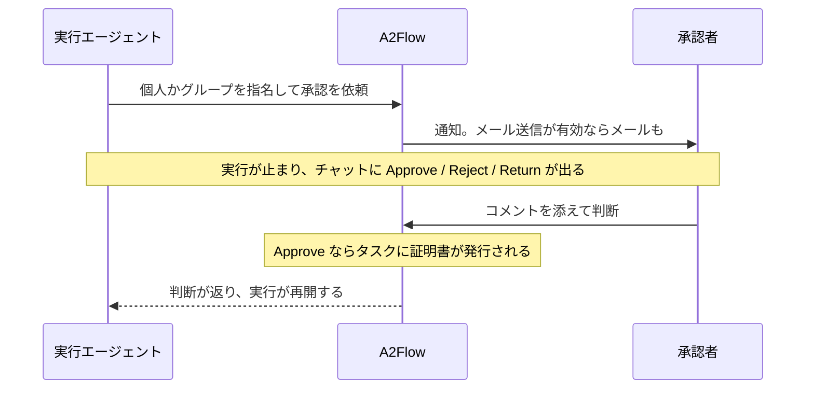

# 承認

承認は、実行が人を待って止まるための仕組みです。エージェントが実行の途中で承認を求め、指名された承認者がチャットで判断し、その判断がそのタスクのツールを解放します。

## 人による承認 {#human-approval}

破壊的な操作や取り消せない操作など、エージェントが動く前に明示的な了解が要るタスクでは、エージェントは承認を求めて処理を止めます。

### 誰に依頼されるか {#who-is-asked}

依頼の宛先は**必ず 1 つ**です。両方でも、どちらでもなしでもありません。

| 宛先 | 通知される人 | 判断できる人 |
|---|---|---|
| **個人** | その人だけ | その人だけ |
| **[ユーザーグループ](./users-and-groups.md#user-groups)** | `approver` ロールを持つメンバー全員。それぞれに通知が届きます | その全員。**最初の**判断で決まります |

グループを宛先にすれば、承認が特定の 1 人の都合で止まりません。承認できるメンバーが 1 人もいないグループは、その場で拒否されます。誰も決められない依頼になってしまうからです。誰かが判断しても、ほかのメンバーの通知が消えることはありません。ただ、そこから操作できなくなるだけです。実際に判断した人は記録されます。グループ名だけでは「誰が承認したのか」に答えられないからです。

エージェントには、チームの誰が決めてもよいときはグループを、スキルが特定の人を求めるときは個人を指名するよう指示してあります。

### 判断する {#deciding}

エージェントは依頼の内容を文章で説明し、その下のチャットに操作が出ます。ただし出るのは**指名された承認者だけ**です。宛先がグループなら、複数の人が同時に操作を持ちます。それ以外の人には、読み取り専用の待機メッセージが見えます。

| 判断 | 意味 | エージェントの動き |
|---|---|---|
| **Approve** | 進めてよい | タスクのツールが解放された状態で続行します |
| **Reject** | やってはいけない | タスクを `failed` か `skipped` にします |
| **Return** | 直してもう一度出して | 依頼を決着させず、作業を差し戻します |

**Return** は Reject の変種ではなく、3 つ目の判断です。差し戻しが多いことは、そもそも依頼すべきでなかった仕事があることではなく、上流の品質に問題があることを示します。

どの判断にも任意で**コメント**を添えられます。判断そのものは**最終**です。承認者グループでは 2 人が本当に同時に押しうるので、記録済みの判断を変えてしまう 2 つ目の判断は、上書きせずに拒否されます。あとからコメントを直すことはできますが、記録された判断者も判断時刻も動きません。依頼から判断までの所要時間は、承認者の実際の時間のまま残ります。

判断できるのは指名された承認者だけです。**例外はありません。宛先でない Super Admin でも判断できません**。同じ規則は紐づいたタスクのステータスにも及びます。手作業でそのタスクを `completed` にできるのは、実行を始めた人と、その承認の資格を持つ承認者だけです。そうでなければ、ステータスを変えるだけで、実行に関わる誰もが宛先の代わりを務められてしまいます。

### 承認が解放するもの {#what-approval-unlocks}

**承認の関門を守っているのはサーバーであって、エージェントではありません。** 承認が紐づいたタスクは、その承認が下りるまで、割り当てられた [MCP ツール](./mcp-servers.md)をひとつも呼び出せません。呼び出しはサーバーに届く前に拒否されます。承認が下りると、そのタスクに短命の**証明書**が発行され、以後そのタスクからのツール呼び出しは、毎回それを提示しなければなりません。承認が紐づいていないタスクは影響を受けず、通常の[ツール割り当ての規則](./workflows.md#mcp-tools-for-tasks)のもとで動き続けます。

モデルへの指示では得られないものが 2 つあります。

- **プロンプトインジェクションやバグで承認を飛ばせません。** 関門はサーバーが確認する規則であって、エージェントの指示文と「再開しない」フロントエンドの組み合わせではありません。
- **与えられるツールが判断の瞬間に固定されます。** 証明書は、承認者が Approve を押した時点でそのタスクに割り当てられていたツールを持ちます。エージェントは実行中に自分のタスクのツール割り当てを書き換えられるので、呼び出し時に割り当てを読み直す確認は、エージェントの側から広げられてしまいます。ファイルを読む承認が、ファイルを消す承認に化けることはありません。

判定されたツール呼び出しは、許可も拒否も、提示された証明書とともに実行の [Tool Invocations](./workflow-executions.md#tool-invocations) のページに記録されます。あとから「どの承認が許可したのか、誰が承認したのか」に答えられます。

これらに設定は要りません。証明書の有効期間だけは[設定リファレンス](../operations/configuration.md#mcp-tools-and-approvals)で調整できます。

> **保証の範囲について。** ツールプロキシは現在バックエンドのプロセス内で動いているので、証明書が証明できるのは、同じプロセスを共有する検証者に対する所持の事実です。すでにバックエンドを掌握した攻撃者に対する防御ではありません。得られるのは、閉じる側に倒れる単一の関門と、事後に広げられない許可と、検証できる記録です。

## 承認を一覧する {#browsing-approvals}

管理サイドバーの **Approvals** を開くと、すべての承認依頼を一覧できます。この画面は見るためのものです。判断はチャットの Approve / Reject / Return から行います。

| 列 | 既定で表示 |
|---|---|
| タイトル、ステータス(`pending` / `approved` / `rejected` / `returned`)、説明、作成時刻 | する |
| ワークフロー実行 — 依頼元の実行へのリンク | する |
| Decided By — 判断したユーザー名、または承認者グループ名(そのページへのリンク) | 列ピッカーから |
| 承認者のコメントと判断時刻 | 列ピッカーから |

各行には **Open Workflow Session** の操作もあり、その実行のチャットへ直接移れます。[ワークフロー実行](./workflow-executions.md)の一覧にあるものと同じです。

承認済みの依頼の詳細ページには、その証明書が許可した内容も出ます。**Authorized MCP tools**、有効期間、そして証明書が失効しているかどうかです。
