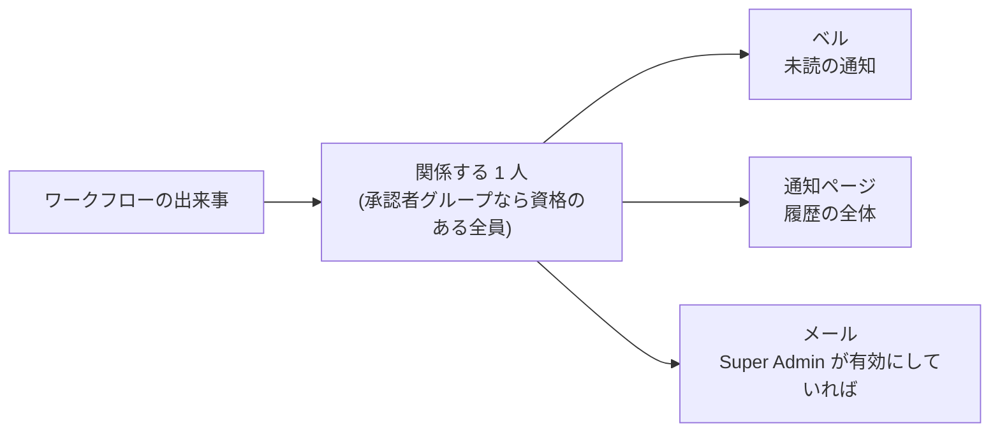

# 通知

ワークフローの仕事は背景で進みます。よそ見をしている間に設計の実行が終わり、アプリを開いていない人を承認が待ちます。通知は、その出来事を必要な人へ届ける仕組みです。

上部のツールバー — チャットのヘッダーにも管理サイドバーにも — に**ベルのアイコン**があり、未読件数のバッジが付きます。

## 4 つの出来事 {#the-four-events}

| 種類 | 発生するとき | 受け取る人 |
|---|---|---|
| `workflow_draft_ready` | [ワークフローの生成](./workflows.md#generating-a-workflow)の背景実行が終わり、下書きのタスクテンプレートを確認できるようになった。 | 生成を始めた人 |
| `workflow_generation_failed` | その設計実行が失敗した。誰も見ていないところで走るので、これが知る手立てです。理由はワークフローの詳細ページと設計チャットに出ます。 | 生成を始めた人 |
| `approval_request` | エージェントが実行中の判断を求めて待っている。 | [指名された承認者](./approvals.md#human-approval)。グループ宛なら資格のあるメンバーごとに 1 通 |
| `execution_completed` | 実行のすべてのタスクが終端の状態に達した。実行 1 回につき 1 度だけ発生します。 | 実行を始めた人 |

通知をクリックすると既読になり、その通知が指す場所へ移ります。実行に関する出来事なら実行のチャットへ、ワークフローに関する出来事ならワークフローの詳細ページへ移ります。

## 通知が出る場所 {#where-notifications-appear}

| | **ベルのドロップダウン** | **[通知ページ](./notifications.md#notification-history-page)** |
|---|---|---|
| **表示** | 未読だけ。まだ対応が要るもの | 既読を含む履歴の全体 |
| **たどり方** | ツールバーのベル | ツールバーのプロフィールボタン → **Notifications** |
| **既読にする** | 行ごと(✓)と、未読が残っている間だけ出るパネル見出しの **Mark all read** | 行ごと(✓) |
| **削除** | できません | 行ごと(✕)。確認あり |

ドロップダウンから通知が消えることはありません。既読にするのは、目の前からどけるだけです。一覧は 30 秒ごとに自分で更新されるので、新しい通知はリロードなしで届きます。

## 通知ページ {#notification-history-page}

通知ページには、自分が受け取ったすべての通知が、タイトル・種類・作成時刻の並べ替えと絞り込みができる表として出ます。上部の **All / Unread** の切り替えで、既読・未読の絞り込みを変えられます。通知を完全に削除できるのはここだけです。

通知は最初から最後までユーザーごとのものです。自分宛のものしか見えず、紐づくアカウント・実行・ワークフローが消えれば一緒に消えます。

## メール配信 {#email-delivery}

`super_admin` が[システム設定](./system-settings.md)で SMTP サーバーを設定すると、同じ 4 つの出来事が受信者へ**メールでも**届きます。承認依頼が、誰かがアプリを開くまで待たされずに済みます。

メールの件名は通知のタイトル、本文は通知の本文で、対象 — 実行かワークフロー — へのリンクが付きます。リンクは設定された **Application Base URL** から組み立てられ、未設定ならリンクなしで送られます。

届けようのない宛先は、リレーに接続する前に除かれます。内部のシステムユーザー、無効化または削除されたアカウント、アドレスが未確認のアカウント、アドレスのないアカウントです。ユーザーごとの配信停止はありません。メール配信はプラットフォーム全体で有効か無効かのどちらかです。

### 配信キュー {#the-delivery-queue}

ワークフローの処理が進んでいる間は何も送りません。通知と、組み立て済みのメッセージは一緒に書かれるので、通知だけあってメールがキューに入っていない状態は、途中で落ちても起こりません。そのあとワーカーがキューを掃き出します。

- **速度を抑える。** レート制限がリレーへの送信を一定の速度(と小さなバースト)に保ち、1 バッチは 1 本の接続を使い回して送られます。
- **再試行する。** 一時的な失敗 — リレーが落ちている、資格情報を拒否された — は、間隔を広げながら再試行されます。15 秒、30 秒、1 分、2 分と倍にしていき、1 時間で頭打ちになります。既定の回数で、およそ 1 時間の停止を乗り切れます。
- **見込みがなければ諦める。** 宛先不明のように、リレーが恒久的な失敗として返したものは再試行しません。回数を使い切ったメッセージや恒久的に失敗したメッセージは、最後のエラーとともに `failed` としてキューに残ります。黙って消えるのではなく、確認できる「配達不能」として残ります。送信済みのメッセージは 30 日で削除され、配達不能のものは残ります。

送信を行うプロセスは常に 1 つだけです。だからレート制限がおおよそではなく正確に効きます。ワーカーを増やして得られるのはフェイルオーバーであって、スループットではありません。バッチの途中で送信プロセスが落ちても再試行の回数は消費されず、次の周回がその仕事を引き取ります。

既定では API のプロセスがワーカーも兼ねます。Docker Compose では専用のワーカーサービスが動き、リクエストを捌くプロセスからメールの処理を外します。調整できる項目は[設定リファレンス](../operations/configuration.md#outgoing-email-queue)にまとめてあります。

滞留やリレーの不調は[メトリクスのエンドポイント](../operations/metrics.md)から見えます。
