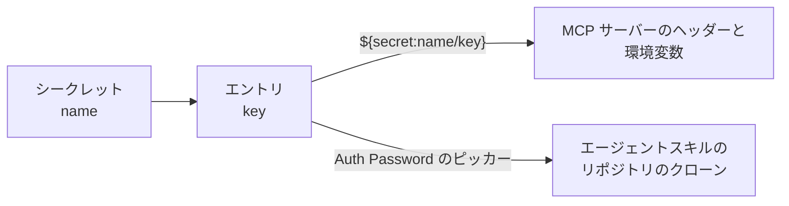

# シークレット

シークレットは、**名前のついたキー/値のエントリの束**です。[HashiCorp Vault の KV エンジン](https://developer.hashicorp.com/vault/docs/secrets/kv/kv-v2)と同じ形で、1 つのパスがキーと値のマップを持ちます。AWS のアクセスキー ID とシークレットアクセスキーのように、まとまって使う資格情報は、2 つのシークレットに分けず 1 つのシークレットの 2 エントリとして持ちます。

管理サイドバーの **Secrets** を開くと管理できます。レコードは **Name**、任意の **Description**、[タグ](./tags.md)、そして種類を持ちます。

## どこで使われるか {#where-a-secret-is-used}

- **[MCP サーバー](./mcp-servers.md)** — ヘッダーの値と環境変数の値には `${secret:name/key}` を埋め込めます。展開されるのは接続のときです。
- **[エージェントスキル](./agent-skills.md)** — スキルの **Auth Password** は 1 エントリへの参照で、入力ではなくドロップダウンから選びます。

1 つのエントリは必ず **`name/key`** で指します。エントリが 1 つしかないシークレットでもキーは必須です。名前だけではマップを指すことになり、値を指せないからです。キーのない `${secret:name}` は文字列としてそのまま渡されるのではなく、解決に失敗します。

## 2 つの種類 {#the-two-types}

| | **Local(暗号化)** | **HashiCorp Vault** |
|---|---|---|
| **保存されるもの** | エントリそのもの。値は暗号化されます | KV v2 への参照だけ。**Vault Mount** と **Vault Path** |
| **値の取得元** | 暗号化された保存領域 | 解決のたびに Vault から直接読みます |
| **詳細ページの表示** | 保存済みのキーすべてと、空の値 | マウントとパス |
| **エントリの編集** | 値を空のままにすると保たれ、入力し直すと置き換わり、行を消すとそのエントリが消えます | Vault の側で行います |

値はどちらの種類でも**返されません**。平文でも暗号文でも返りません。だから Local の詳細ページは、キーだけを並べて値を空にします。キーだけは読めるので、ピッカーが一覧できます。Local なら保存されたマップから、Vault ならその時点で Vault から読みます。

Vault への接続と、Local のシークレットを暗号化する鍵は、[設定リファレンス](../operations/configuration.md#secret-management)で一度だけ設定します。Vault を設定するまで、`vault` 種別のシークレットは解決できません。

## 改名と削除 {#renaming-and-deleting}

シークレットは**名前で**参照され、解決は使うときに行われます。何かから参照されているシークレットを改名したり削除したりしても、その場では失敗しません。次に使われたときに、見つからなかったシークレット名とともに失敗します。参照が切れた[エージェントスキル](./agent-skills.md)は、次に Pull したときに理由を自分のレコードに記録します。
