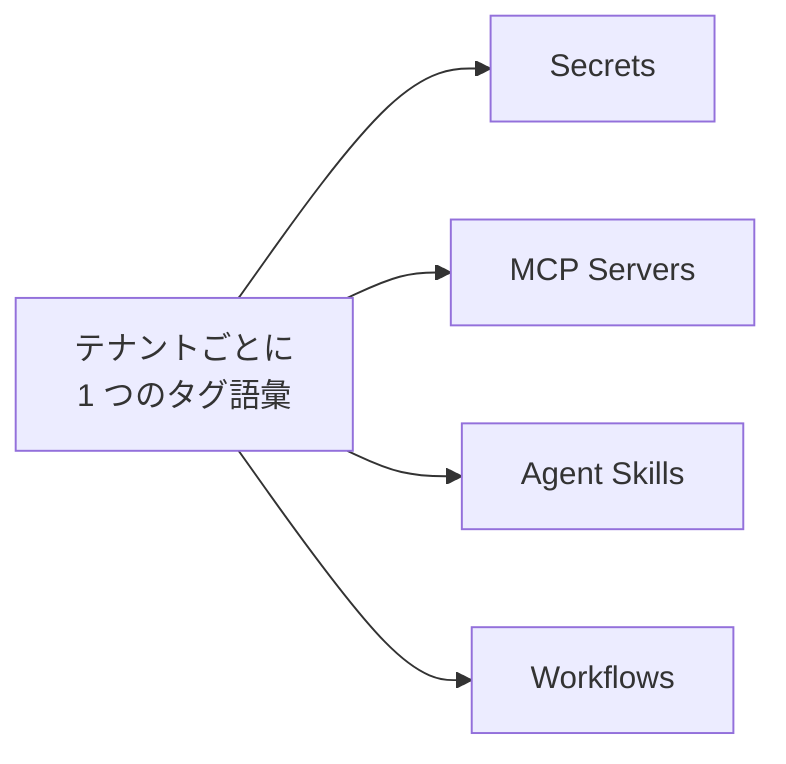

# タグ

タグはレコードを分類するラベルです。1 つの語彙を、タグを付けられる 4 つの登録簿すべてで共有します。`aws` というタグ 1 つで、シークレットも MCP サーバーも同じように絞り込めます。

管理サイドバーの **Tags** を開くと語彙を整えられます。各タグは、テナント内で一意の **Name**、任意の **Description**、そして固定の 8 色パレットから選ぶ**色**を持ちます。パレットにない色は拒否されます。

タグの作成には `admin` **または** `developer` が要ります。タグを付けられる 4 つのリソースのいずれかに書き込めるロールの和集合なので、タグを必要とする人はいつでも自分で作れます。読み取りはほかのセクションと同じく開いています。

## レコードにタグを付ける {#attaching-tags-to-a-record}

タグを付けられるレコードの新規作成フォームと詳細ページには **Tags** のピッカーがあります。今の選択が削除できる色付きチップとして **Select tags…** ボタンの上に並ぶので、この項目の高さは語彙の量ではなく選択の量で決まります。

1. **Select tags…** を押します。ダイアログには語彙全体が、折り返して並ぶ色付きチップとして出ます。1 つ 1 つがトグルです。押されたチップは色が濃くなり、頭にチェックも付くので、状態が色だけに頼ることはありません。
2. 必要なら絞り込みます。フィルターは 2 つあり、組み合わせて効きます。名前の入力欄と、8 色のパレット見本の並びです。見本はいくつでも同時に押せます。すべて解除した状態が「絞り込みなし」です。
3. **Select** で確定し、**Cancel** で下書きを捨てます。選んだあとに絞り込みで見えなくなったタグも、選択されたままです。

タグを付ける操作は、そのレコード自身の書き込みロールで守られます。タグを作ったロールとは無関係です。

## タグで絞り込む {#filtering-by-tag}

タグを付けられる一覧には **Tags** 列があり、各レコードのチップが並びます。列ヘッダーのメニューから複数選択で絞り込めます。この選択は**論理積**で、メニューにも "Filter (all of)" と出ます。選んだタグを*すべて*持つレコードだけが残るので、選ぶほど結果は狭まります。絞り込みは画面に出ている分だけでなく、データ全体に効きます。

タグはほかの列フィルターとは別の軸ですが、表示に関する規則は同じです。[列ピッカー](./admin-ui.md)で Tags 列を隠すとタグの絞り込みも解除されます。ほかの列を隠したときにその列の絞り込みが解除されるのと同じです。

## 改名と削除 {#renaming-and-deleting}

**改名はいつでも安全です。** レコードはタグを名前ではなく識別子で参照しているので、そのタグを持つすべてのレコードが新しい名前に追随し、同期し直す作業はありません。タグを各レコードに自由入力させず、あらかじめ登録する形にしている理由がこれです。

**削除**は逆向きに働きます。タグを持つレコードがあるからといって削除が止められることはなく、すべてのレコードからそのタグが外れます。確認ダイアログにもそう書かれています。
