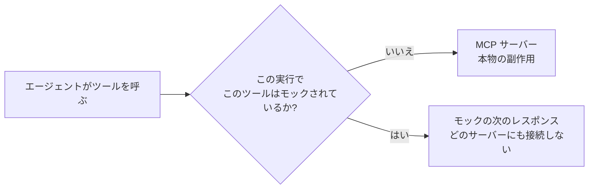

# ツールモック

ツールモックは、**下書き**のワークフローをツールの副作用なしに端から端まで動かすための代役です。モックされたツールは呼ばれません。代わりにモックに設定した結果が返るので、MCP サーバーへのリクエストは飛ばず、承認も記録されず、誰にもメールは届きません。

管理サイドバーの **Tool Mocks** を開くと管理できます。

## 使い方 {#using-one}

1. 差し替えたいツールのモックを作ります。
2. **下書き**のワークフローで **Run** を押します。ダイアログの **Mock tools** にテナントのモックが並びます。
3. この実行で使うものにチェックを入れ、実行を開始します。

公開済みのワークフローではダイアログにモックが出ませんし、指定しても拒否されます。実行を開始すると、選んだ各モックのその時点の内容が実行へ**コピー**されます。そのため、あとからモックを編集したり削除したりしても、すでに動いている実行が変わることはありません。差し替えられていた呼び出しが黙って本物に戻ることも起きません。

モックにするかどうかは実行単位ではなく**ツール単位**で選びます。リハーサルは現実的であってこそ役に立つからです。あるシステムを検索してから書き込むワークフローなら、書き込みだけを差し替えられます。読み取りは本物のサーバーに当たり続けるので、エージェントは実データをもとに考えます。

## モックが持つもの {#what-a-mock-holds}

| 項目 | 説明 |
|---|---|
| **Name** / **Description** | 実行ダイアログで見分けるための名前と説明。 |
| **Target** | [登録済みの MCP サーバー](./mcp-servers.md)のツール 1 つ(**Select MCP server** を押してサーバーを選び、そのサーバーから読み込んだ一覧で **Tool Name** を選ぶ)か、A2Flow の**組み込み**ツール。 |
| **Responses** | 呼び出しの回数で引く順序つきのリスト。 |

今のところモックできる組み込みツールは `request_approval` だけです。副作用を消さない限り、実行を続けるのに人の対応が要るツールだからです。

### そのツールが返すもの {#what-the-tool-returns}

ツールを選ぶと、その下に **Output format** が開き、ツール自身の説明と、返すと宣言している形が出ます。下のレスポンスを書くときの手本にしてください。モックは、ワークフローが本物と同じように読めて初めて役に立ちます。

返すものを宣言していないツールもあります。その場合はパネルにその旨が出て、形の決め方はあなたに委ねられます。

### レスポンス {#responses}

1 つ目がそのツールへの最初の呼び出しに、2 つ目が 2 回目に対応し、以下同様です。リストを使い切ると最後のレスポンスが繰り返されるので、レスポンスが 1 つだけなら定数のように振る舞います。これがあるおかげで、モック 1 つで固定値ではなく*シナリオ*を表現できます。最初の依頼は承認して 2 番目は却下し、ワークフローが両方をどう扱うかを見る、といった具合です。

| 種類 | 意味 |
|---|---|
| `structured` | 結果の構造化された部分に置く JSON オブジェクト。呼び出し側が結果からフィールドを読むツール向けです |
| `text` | 結果のテキスト部分に置く文字列 |
| `error` | 失敗した呼び出しとして返すメッセージ。エージェントからはツールがエラーを報告したように見えます |

ツールが出力の形を宣言している場合、`structured` のレスポンスには **Insert from schema** が出ます。押すとその形がキーごと入力欄に入るので、構造を書き写すのではなく値を埋めるだけで済みます。入力欄の中身は置き換わりますが、すでに何か書いてある場合は先に確認を求められます。

## モックが省かないもの {#what-a-mock-does-not-skip}

モックが省くのは副作用だけで、規則は省きません。モックされた呼び出しも、その実行の現在のタスクが使ってよいツールかどうか、そのタスクが待っている[承認](./approvals.md)があるかどうかを確認されます。本番で拒否されるワークフローは、リハーサルでも拒否されます。モックされた `request_approval` も宛先の検証は行うので、承認者として適格でない相手を指定したワークフローは、本番と同じようにリハーサルでも失敗します。

## モックされた呼び出しを確認する {#seeing-what-a-mocked-call-did}

差し替えられた呼び出しを確認する場所は、実行のチャットの記録です。ツールの行を展開すると引数と結果が出て、**Mocked** のバッジが付きます。実行の [Tool Invocations](./workflow-executions.md#tool-invocations) のページには意図的に出しません。あのページはツールプロキシが実際に下した判断を記録するもので、差し替えられた呼び出しはそこまで届かないからです。実行そのものには、[実行一覧](./workflow-executions.md)で **Mocked** のバッジが付きます。
