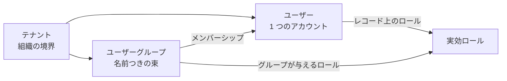

# ユーザー、グループ、テナント

サインインできるのは誰か、その人がどこに属するかは、3 つの管理セクションが受け持ちます。個々のアカウント、ロールをまとめて与える名前つきの束、そしてそれらすべてが収まるテナントです。

1 人のユーザーが属せるテナントは多くても 1 つで、そのテナントのグループにはいくつでも属せます。権限のチェックはすべて、アカウントに直接与えられたロールとグループから継承したロールの**和集合**で行われます。詳しくは[ロールと権限](../concepts/authorization.md)を参照してください。

## ユーザー {#users}

管理サイドバーの **Users** を開くと、アカウントを管理できます。一覧はアカウント 1 件につき 1 行で、ユーザー名をクリックすると詳細ページが開き、同じ項目を編集したりアカウントを削除したりできます。

| 項目 | 説明 |
|---|---|
| **Username** | テナント内で一意。作成後は変更できません。 |
| **First Name** / **Last Name** | ユーザー名が表示されるあらゆる場所で、この 2 つを並べた表示名が使われます。 |
| **Email** | 通知メールの宛先です。 |
| **Password** | 表示されることはありません。編集時に空のままにすると、今のパスワードが保たれます。 |
| **Enabled** | 外すと、アカウントを削除せずにサインインだけを止められます。 |
| **Email verified** | 未確認のアドレスは[メール配信](./notifications.md#email-delivery)の対象から外れます。 |
| **Roles** | ロールごとのチェックボックス。後述します。 |
| **Groups** | 所属グループ。どちら側からでも編集できます。 |

### ロール

新規作成フォームと詳細ページにはロールごとのチェックボックスが並び、一覧には **Roles** 列が出ます。

- **Super Admin** は、サインインしているのが Super Admin のときだけ選べます。それ以外からの付与や剥奪は拒否されます。
- Super Admin はほかのすべてのロールと排他です。チェックすると残りが選べなくなり(逆も同じ)、その理由が注記として出ます。
- Roles 列は並べ替えも絞り込みもできません。ロールが単一の値ではなくリストとして保存されているためです。

**グループからのロール**。このチェックボックスが編集するのは**直接**の付与だけです。[ユーザーグループ](./users-and-groups.md#user-groups)から継承したロールは、その下の **Roles from groups** に読み取り専用のチップとして出ます。変えられるのはグループ側の編集だけです。一覧の Roles 列には両方が出ますが、継承したものは淡く表示されるので、このページで変えられるのがどれかは一目で分かります。

### グループ

今の所属は削除できるチップとして並び、**Select groups…** を押すとテナントのグループの表がダイアログで開きます。ページ送りと絞り込みはサーバー側で効きます。プラットフォーム所属のアカウント(Super Admin と初期投入されるシステムユーザー)にはこのボタンが出ません。どのテナントにも属さないため、グループのメンバーにはなれないからです。同じ所属は[グループ](./users-and-groups.md#user-groups)側からも編集できます。

### 代理ログイン

代理ログインできる相手の行には **Impersonate** の操作が出ます。自分自身の行、Super Admin の行、そして自分が Super Admin でない限り Admin の行には出ません。確認するとようこそページに移り、その人として操作している状態になります。誰が誰になれるのか、どうやって元に戻るのかは[代理ログイン](../concepts/impersonation.md)を参照してください。

### ユーザーを削除する

ほかから参照されていないアカウントは、そのまま消えます。何かのレコードを持っている場合 — 作成者や最終更新者として記録されている場合 — は、無効化してユーザー一覧から隠す形で残ります。持っているレコードの名前解決が続くようにするためです。どちらの場合も、そのアカウントではサインインできなくなります。

レコードにユーザー ID がそのまま出ることはありません。詳細ページも一覧も、所有者を名前に解決して表示します。ただし 2 種類のアカウントだけは名前ではなくラベルになります。テナントをまたいでレコードを持つためで、内部のアカウントは **System User**、自分からは見えない Super Admin は **Super Admin** と表示されます。

## 自分のアカウント {#your-own-account}

アプリバーのプロフィールボタンから **Profile** を選ぶと、自分のアカウントを確認できます。ページの先頭はアイデンティティカードです。バナーがあり、その下端にアバターが重なり、表示名が見出しになり、その横に `@username`、ロール、状態のピルが並びます。その下には読み取り専用のカードが 2 枚あります。

| カード | 内容 |
|---|---|
| **Account** | ユーザー名、メールアドレス、姓名 |
| **Access** | ロール、グループからのロール、所属グループ |

ここはすべて読み取り専用です。これらの属性を変えるには `admin` ロールと管理側のユーザー詳細ページが要ります。自分で編集できるのはアバターだけで、編集の入口はアバターをクリックすることです。

### アバター

すべてのユーザーにアバターがあり、プロフィールボタン、管理側のユーザー一覧と詳細ページに出ます。既定ではテナントとユーザー名から生成されるので、画像は保存されず、2 つのテナントに同じユーザー名があっても別々の顔になります。

Profile ページでアバターをクリックすると、変更の方法が 2 つあるダイアログが開きます。

- 画像を**アップロード**する。PNG、JPEG、WebP、GIF で 2 MB まで。アップロードは即座に確定してダイアログが閉じます。削除すると生成されたアバターに戻ります。
- 生成されるアバターの**配色を変える**。描画に使うパレットを編集します。このダイアログで未保存になるのはパレットだけで、**Reset to default** で色見本を戻し、**Save** で確定します。保存せずに閉じたぶんは破棄されます。

| 優先順位 | 使われる条件 |
|---|---|
| 1. アップロードした画像 | 画像をアップロードしている |
| 2. 生成アバター(独自パレット) | パレットを保存している |
| 3. 生成アバター(既定パレット) | どちらもない |

どの色がどこに置かれるかは相変わらずシードが決めるので、パレットを共有していてもユーザーごとの見分けはつきます。既定とまったく同じパレットは「パレットなし」として保存されるため、リセットして保存すると本当に記録が消えます。アバターの編集は本人だけができます。管理側のユーザー詳細ページでは読み取り専用です。

## ユーザーグループ {#user-groups}

管理サイドバーの **User Groups** を開くと、グループを管理できます。グループはユーザーの名前つきの束で、持っているロールを全メンバーに与えます。グループが属するテナントはちょうど 1 つで、名前はそのテナント内で一意です。

| 項目 | 説明 |
|---|---|
| **Name** | テナント内で一意。 |
| **Description** | 自由入力。 |
| **Roles granted** | 各メンバーが、自分自身への付与に上乗せして持つロール。 |
| **Members** | グループに属するアカウント。 |
| **Tags** | グループを分類するラベル。ほかのタグを付けられるセクションと共有します。 |

**Roles granted** の選択肢は Users のページと同じもので、**Super Admin** だけがありません。グループが Super Admin を与えることはできず、この選択肢は Super Admin から見ても出ません。Super Admin はどのテナントにも属さないので、そもそもメンバーにもなれません。

**Tags** はシークレットなど、タグを付けられるほかの登録簿と共有するテナント共通の語彙です。新規作成フォームと詳細ページには **Tags** のピッカーがあり、一覧には絞り込みできる **Tags** 列があります。[タグ](./tags.md)を参照してください。

**Members** は削除できるチップとして並び、**Select members…** を押すとテナントのユーザーの表がダイアログで開きます。プラットフォーム所属のアカウントは出てきません。どのテナントにも属さないためです。メンバーを指定すると所属はまるごと置き換わり、編集時に触らなければそのまま保たれます。同じ所属は[ユーザー](./users-and-groups.md#users)側からも編集できます。

ユーザーのレコードに写しは持たないので、グループのロールやメンバーを変えると、影響を受ける全員に次のリクエストから効きます。グループを**削除**してもアカウントはそのままですが、グループが与えていたロールは失われます。

このセクションへの書き込みには `admin` ロールが要ります。読み取りは開いているので、ロールがなくても一覧と読み取り専用の詳細ページは見られます。

## テナント {#tenants}

管理サイドバーの **Tenants** を開くと、テナントを管理できます。テナントはマルチテナンシーの最上位の組織境界です。その境界がほかのすべてにとって何を意味するのか、Super Admin がどうやって操作対象のテナントを選ぶのかは[テナント](../concepts/tenants.md)で扱います。ここではレコードそのものを説明します。

ほかのどの管理セクションとも違い、ここは **Super Admin 専用**です。それ以外のロールにはサイドバーからもようこそページからも見えず、書き込みも拒否されます。

| 項目 | 説明 |
|---|---|
| **Display Name** | 人が読むためのラベル。一意。 |
| **Name** | URL に使える識別子で、小文字のケバブケース。一意で、作成後は変更できません。 |
| **Enabled** | 外すと、削除せずにテナントを止められます。所属ユーザーはサインインできなくなり、すでにサインインしている人も次のリクエストでサインアウトされます。 |

初回起動時に **Default** テナントが投入され、初期の `admin` ユーザーがそこに入ります。ユーザーが 1 人でも割り当てられているテナントは削除できません。先にそのアカウントを移すか削除してください。
