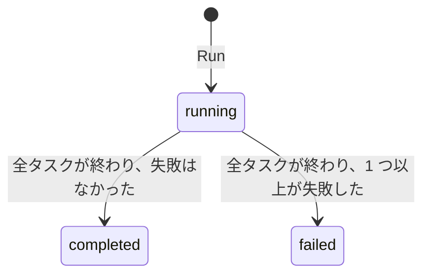
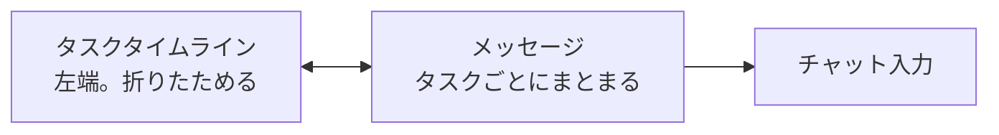

# ワークフロー実行

ワークフロー実行は、[ワークフロー](./workflows.md)の 1 回の実行です。ワークフローの名前、説明、タスクの写しを自分で持つので、元のワークフローがあとから編集されたり削除されたりしても、実行の履歴は実際に走った内容のまま残ります。

管理サイドバーの **Workflow Executions** を開くと一覧できます。ほかのセクションと違い、実行は編集するレコードではなく履歴なので、編集フォームはありません。画面はどれも、実行の内容を見せるか、実行に参加させるためのものです。

| 画面 | たどり方 | 見えるもの |
|---|---|---|
| **Workflow Executions** 一覧 | 管理サイドバー → Workflow Executions | すべての実行とそのステータス、行ごとの操作 |
| **ワークフローセッション** | 行の Open Workflow Session | 実行が進むチャット。参加する、眺める、答える |
| **Workflow Tasks** | 行のタスクへのリンク | その実行のタスクとステータス。読み取り専用で Table と Graph の 2 表示 |
| **Tool Invocations** | 実行の詳細ヘッダー | その実行が行った MCP ツール呼び出しと、それぞれの判定 |

一覧を絞るバッジが 2 つあります。**Draft** は `draft` のままのワークフローから始めた実行 — [公開前のテスト実行](./workflows.md#running-a-workflow)で、[運用メトリクス](../operations/metrics.md)には数えられません — を示し、Yes/No のフィルターとしても働くので隠せます。**Mocked** は[ツールモック](./tool-mocks.md)でいずれかのツールを差し替えた実行を示します。

## 実行のステータス {#run-status}

実行は `running` で始まり、タスクが 1 つ以上あり、そのすべてが終端の状態 — `completed`、`failed`、`skipped` — に達した時点で確定します。失敗したタスクを含む実行は `failed` で終わります。終了時刻はそのときに刻まれ、あとから編集しても動きません。タスクが 1 つもない実行は `running` のままです。[運用メトリクス](../operations/metrics.md)が数えるのはこの値です。

## ワークフローセッション画面 {#the-workflow-session-screen}

ワークフローセッションは、1 回の実行が進むチャットです。開くと実行の開始メッセージが並び、エージェントはすでに作業を始めています。

### 誰と共有されるか {#who-shares-it}

実行のチャットは、始めた人だけのものではなく、**参加者で共有**されます。

| 誰 | 何ができるか |
|---|---|
| 実行を始めた**申請者** | 会話の全体と、チャット入力 |
| その実行の[承認](./approvals.md)の**指名された承認者** | 同じ会話と同じ状態。承認すると、空のセッションが新しく始まるのではなく、元の実行が再開します |
| そのテナントの **Admin** | 読み取り専用での閲覧 |
| それ以外 | アクセスできません |

承認の宛先が**グループ**の場合、`approver` を持つメンバー全員が参加者になります。つまりチャットの参加範囲はグループのメンバーに追随します。承認者グループに人を加えると、そのグループが承認を求められているすべての実行が開き、外すとまた閉じます。「メンバーの誰が決めてもよい」ことの当然の帰結です。チャットへのアクセスは、判断できるようにするためにあります。`approver` を持たないメンバーは、所属していても何も得ません。

### 送信者のアバター {#sender-avatars}

1 つのチャットに複数の人 — 申請者、承認者、そしてエージェント — が書き込むので、どのメッセージにも**送信者のアバター**が付きます。マウスを乗せると送信者の名前が出ます。エージェントのバッジからはワークフロー名が出ます。描画された対話的な画面の中のボタンを押した場合も同じように扱われ、押した人のアバターがその画面の横に出ます。

### タスクタイムライン {#the-task-timeline}

左端には折りたためる**タスクタイムライン**があります。実行のタスクが順に並び、それぞれにステータス色の番号バッジが付き、進行中のものが強調されます。チャット側では、同じタスクに属する連続したメッセージが**タスクグループ**にまとめられます。ステータス色の縦線と、タイムラインのバッジと同じ番号の見出しが付くので、タスクの切れ目が一目で分かります。

2 つは双方向につながっています。

- チャットをスクロールすると、表示の先頭にあるタスクがタイムライン側で強調されます。
- タイムラインの項目かチャットのグループにマウスを乗せると、対応するもう一方が強調されます。
- タイムラインの項目をクリックすると、チャットがそのタスクのグループまでスクロールします。

### 自動更新 {#live-updates}

このページは数秒おきに自分で表示を更新するので、リロードしなくても、ほかの参加者のメッセージやエージェントの進み具合が見えます。自分のメッセージへの返答が届いている間は更新が止まるので、その場の返答が乱されることはありません。また、新しいメッセージを追って一番下までスクロールするのは、すでに下の方を見ているときだけです。

[設計セッション](./workflows.md#adjusting-the-task-templates)も共有チャットで、アバターも自動更新も同じです。共有する相手が実行の参加者ではなく、テナントの Developer である点だけが違います。

## Workflow Tasks {#workflow-tasks}

実行のタスクはここでは読み取り専用です。テンプレートを編集するのは[ワークフロー](./workflows.md#adjusting-the-task-templates)の側で、実行のステータスを進めるのは実行エージェントと承認の流れだからです。

各タスクはステータス — `pending`、`in_progress`、`completed`、`failed`、`skipped` — と依存関係を持ちます。**Table / Graph** の切り替えで一覧と依存グラフを行き来できます。グラフはタスクを依存順に縦 1 列に積み、先に終わるべきものを上に置き、それぞれが右へ、ツールを借りている MCP サーバー、さらに個々のツールへと枝分かれします。移動と拡大縮小、全体表示ができますが、編集はできません。

## Tool Invocations {#tool-invocations}

このページには、その実行で行われた MCP ツール呼び出しと、[プロキシ](./workflows.md#mcp-tools-for-tasks)が下した判定が並びます。上流に届いた `allowed` と、規則に阻まれた `denied` があり、ツール名、サーバー、拒否の理由、提示された[承認の証明書](./approvals.md#human-approval)が出ます。引数はダイジェストとしてのみ表示され、生の値は保存されません。

[モック](./tool-mocks.md)されたツールへの呼び出しは、結果がどうであれここには出ません。プロキシはモックされた呼び出しもほかと同じように検査しますが、最初から保存済みのレスポンスで答えられる呼び出しはどのサーバーにも届かないので、その許可も拒否もこの記録には属しません。差し替えられた呼び出しを確認する場所は、実行のチャットの記録です。

## 実行を削除する {#deleting-a-run}

行の **Delete** を押すと、確認のうえで実行が削除されます。レコード、そのタスク、そしてワークフローセッションが一緒に消えます。
