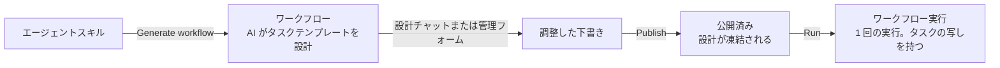
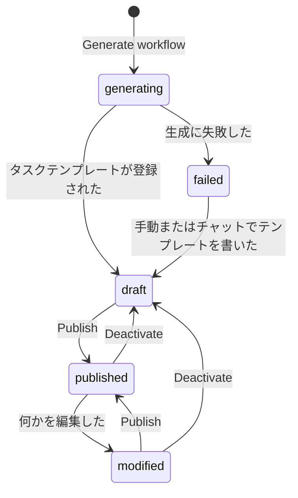
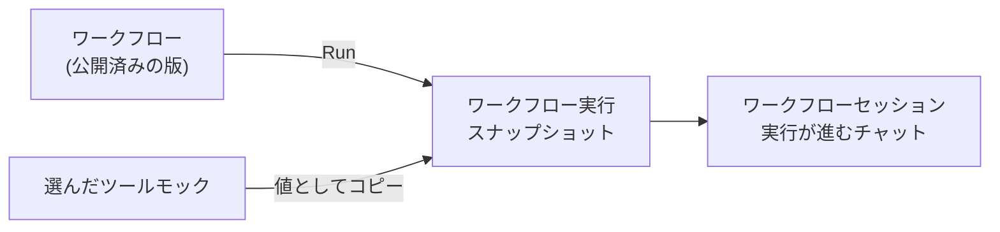
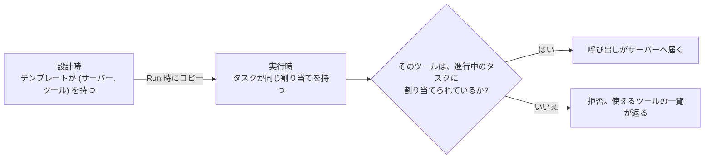

# ワークフロー

ワークフローは、繰り返し使える仕事の単位です。[エージェントスキル](./agent-skills.md)と、あらかじめ設計されたタスクの一覧 — *タスクテンプレート* — を組み合わせたものです。テンプレートは実行の**前に**決まっているので、ワークフローを実行すると、毎回同じ手順を設計し直すことなく、すぐに作業が始まります。

管理サイドバーの **Workflows** を開くと管理できます。

ワークフローを何もないところから作る方法はありません。スキルから生成することが、ワークフローの生まれ方です。

## ステータス

| ステータス | 意味 | 実行できる人 |
|---|---|---|
| `generating` | 背景の設計実行がまだタスクテンプレートを書いています。 | なし |
| `draft` | 設計はあるが、一度も公開されていないか、公開を解除された状態です。 | Developer と Super Admin(公開前のテスト用) |
| `failed` | 設計実行がテンプレートを作らずに終わりました。理由は詳細ページと設計チャットに出ます。 | なし |
| `published` | 設計が凍結され、実行できる状態です。 | `requester` 以上のロールを持つ全員 |
| `modified` | 一度公開したあとに編集された状態です。実行には公開済みの版が使われます。 | `published` と同じ |

`modified` というステータスが見えるのは **Developer** と **Super Admin** だけです。それ以外の人にはこのワークフローは `published` として見え、名前・説明・タスクテンプレートはすべて最後に公開したときのものが表示されます。未公開の編集はその人たちが見るべきものではありませんし、見えている設計こそが実際にその人の実行で動く設計です。

## 画面

| 画面 | たどり方 | できること |
|---|---|---|
| **Workflows** 一覧 | 管理サイドバー → Workflows | 一覧、[タグ](./tags.md)での絞り込み、**Run** による実行 |
| ワークフローの詳細 | ワークフロー名をクリック | 項目の編集、**Publish**、**Deactivate**、**Discard changes**、**Open design session** |
| **Task Templates** | 詳細ページの Task Templates へのリンク | 手作業でのステップの追加・編集・並べ替え(Table と Graph の 2 表示) |
| 設計セッション | 詳細ページの **Open design session** | 設計エージェントと会話しながらステップを詰める |

ワークフローのレコードは、**Name**、分類に使う[タグ](./tags.md)、従う **Agent Skill**、ステータス、そして 2 つの説明フィールドを持ちます。

## ワークフローを生成する {#generating-a-workflow}

**Generate workflow** は 2 か所から開けます。どちらもページを離れずに同じダイアログを開きます。[エージェントスキル](./agent-skills.md)一覧の行の操作と、スキル詳細ページのヘッダーにある Generate Workflow のアイコンボタンです。どちらも、そのスキルがリビジョンを公開するまでは押せません。

1. **Workflow Name**(スキル名が入っています)と、やってほしいことを書く **Prompt** を入力します。生成すると画面が移るので、詳細ページから開いた場合は未保存の編集を先に保存するか尋ねられます。断るとページはそのままで、生成も行われません。
2. ワークフローは `generating` としてすぐ登録され、その詳細ページに移ります。詳細ページは処理の間、自分で表示を更新し続けます。
3. 背景では、入力した Prompt がそのワークフローの**設計セッション**の最初のメッセージとして送られます。設計エージェントはスキルに従って依頼をステップに分解し、タスクテンプレートとして登録します。テンプレートは依存関係のグラフで、各ステップは自分より先に終わっているべきステップと、必要な [MCP ツール](./workflows.md#mcp-tools-for-tasks)を宣言します。
4. 実行が終わると設計の会話が要約されて **Generated description** に入り、ステータスが `draft` になり、[通知](./notifications.md)からワークフローへ直接戻れます。

実行が失敗した場合 — あるいはテンプレートを 1 つも登録せずに終わった場合 — ワークフローは理由つきで `failed` になり、通知でそれが伝わります。設計チャットはそのまま使えます。そこから、あるいは Task Templates の管理ページからタスクテンプレートを書けば、ワークフローは `draft` に戻り、失敗の記録も消えます。

入力した Prompt 自体はワークフローには保存されません。設計の会話の最初のメッセージとして残り、生成された要約が意図を引き継ぎます。

## 2 つの説明フィールド {#the-two-description-fields}

実行エージェントには、有効なほうの説明が実行の文脈として渡されます。どちらが使われるかは知っておく価値があります。

| フィールド | 書く人 | 直接編集できる人 |
|---|---|---|
| **Generated description** | AI。設計の会話を要約したもの | Super Admin だけ |
| **Description** | 人。多くは AI の要約を手で直したもの | Developer なら誰でも |

**Description** が空でなければそちらが、空なら **Generated description** が使われます。上書きは要約の写しから始まることが多いので、Description には **Show diff from the generated description** の操作があり、2 つの単語単位の差分をダイアログで表示します。フォームの現在の値を読むので、未保存の編集も差分に出ます。

### 説明を作り直す {#regenerating-the-description}

タスクテンプレートを調整していくと AI の要約は古びるので、**Generated description** には **Generate from the design conversation** の操作があります。設計の会話をその場で要約し直し、結果をそのまま保存します。公開時の自動要約はありません。作り直すかどうか、いつ作り直すかは利用者が決めます。

同じ操作は設計セッションのチャット入力の「+」メニューからも使えます。こちらは保存の前に、詳細ページと同じ差分ダイアログで変更を確認できます。会話を離れずに作り直したいときに便利です。タスクテンプレートの生成中は、このメニューは出ません。

どちらも Developer の操作です。`published` のワークフローで要約を書き直すと `modified` になります。Description が空の実行は要約のほうを使うので、そのままだと公開済みの版と食い違ってしまうためです。

## タスクテンプレートを調整する {#adjusting-the-task-templates}

下書きのタスクテンプレートは 2 通りの方法で詰められます。混ぜて使っても構いません。

**チャットで**。ワークフロー詳細ページの **Open design session** を押すと設計チャットが開きます。実行時と同じチャット画面で、左端にテンプレートの一覧が並び、設計エージェントがテンプレートを直接編集します。設計エージェントは何も実行しません。このセッションはテナントの **Developer** 全員(に加えて Super Admin とそのワークフローの作成者)で共有されるので、チームで設計を詰められます。共有チャットとしての挙動は[ワークフローセッション](./workflow-executions.md#the-workflow-session-screen)と同じで、メッセージごとの送信者アバターも付きます。

**手作業で**。**Task Templates** のページには **Table** と **Graph** の 2 つの表示、新規作成フォーム、そして **Depends on** と **MCP Tools** のピッカーを持つテンプレートごとの詳細ページがあります。Graph 表示はテンプレートを依存順に縦 1 列に積み、それぞれが右へ、ツールを借りている MCP サーバー、さらに個々のツールへと枝分かれします。

テンプレートの構造は実行時のタスクと同じで、タイトル、説明、依存の辺、ツールの割り当てを持ちます。ただし**ステータスは持ちません**。ライフサイクルは設計ではなく実行のものだからです。依存先は同じワークフローのテンプレートでなければならず、循環を作る辺は拒否されます。

## 公開する {#publishing}

ワークフロー詳細ページの **Publish** が、ワークフローを実行できる状態にする操作です。テンプレートが 1 つ以上あり、生成が走っていないことが条件です。

公開は**設計を凍結**します。ワークフローの名前、有効な説明、テンプレートの一覧(依存の辺とツールの割り当てを含む)が公開済みの版として取り込まれ、前の版を置き換えます。ここで AI は動きません。要約の作り直しは[別の操作](./workflows.md#regenerating-the-description)です。調整と再公開は何度でもできます。各実行はタスクの写しを持っているので、すでに始まっている実行は影響を受けません。

## 公開済みのワークフローを編集する {#editing-a-published-workflow}

公開後の編集が、実行される内容を黙って変えることはありません。詳細フォームの保存、AI の説明の作り直し、タスクテンプレートの追加・編集・削除 — 設計エージェントがチャットで加えた変更も含みます — はいずれもワークフローを `modified` にします。

| `modified` の間 | |
|---|---|
| 実行が使うもの | **最後に公開した版**の名前・有効な説明・テンプレート。ただし Developer が編集内容を選んだ場合はその限りではありません([編集内容を試す](#trying-the-edits-out)) |
| 実行できる人 | `published` のときと同じです。Run ボタンの条件は変わりません |
| 編集内容が見える人 | Developer と Super Admin だけです |
| **Publish** | 編集内容を以後の実行に反映し、他の人にも見えるようにします |
| **Discard changes** | 編集を捨てます。テンプレートは公開済みの版から書き直され、名前は元に戻り、公開済みの版の説明が書き戻され、ワークフローは `published` に戻ります |

**Discard changes** は詳細ページのステータスバーの、Publish の隣にある取り消しアイコンです。未公開の変更がないワークフローで押しても、その旨が返るだけで何も起きません。

Developer ロールを持たない人には、この間ずっと公開済みの版が返ります。一覧と詳細ページの名前・説明も、**Task Templates** の画面も、さらには一覧で名前を検索したときにヒットする対象も公開済みの版です。ステータスは `published` と表示され、最後の公開より後に追加されたタスクテンプレートはそもそも存在しません。ですから作りかけの設計変更が、ワークフローを実行するだけの人を混乱させることはありませんし、その人に見えているものは常に実行される内容と一致します。

## 公開を解除する {#deactivating-a-workflow}

**Deactivate** は、ワークフローが `published` か `modified` のときに Publish の隣に現れる電源アイコンです。押すとワークフローは `draft` に戻ります。これで `requester` ロールの実行権限がなくなり、一度も公開していないワークフローと同じ状態になります。Developer と Super Admin はテストのために実行を続けられます。タスクテンプレート、2 つの説明フィールド、公開済みのスナップショットはそのまま残るので、もう一度公開すればすぐ元に戻ります。

## ワークフローを実行する {#running-a-workflow}

ワークフロー一覧の **Run** を押すと、**ワークフロー実行**が作られます。実行はその時点のワークフローのスナップショットを持つ、独立したレコードです。

**テスト実行**では、実行ダイアログの **Mock tools** に、このワークフローのいずれかのタスクが使うツールの[ツールモック](./tool-mocks.md)と、ビルトインツールのモックが並びます。チェックするとそのツールがこの実行の間だけ差し替えられるので、ツールの副作用なしに公開前のテストを何度でも繰り返せます。テスト実行とは、`draft` のワークフローか、`modified` のワークフローの未公開の編集内容(下記)を実行する場合です。それ以外ではモックは出ませんし、指定しても拒否されます。本物に見えて何もしなかった実行が返るくらいなら、実行しないほうがましだからです。

### 編集内容を試す {#trying-the-edits-out}

`modified` の間、ワークフローは 2 つの設計を抱えています。そのため実行ダイアログは **Developer** にどちらを実行するかを尋ねます。

| 選択肢 | 実行される内容 | 記録のされ方 |
|---|---|---|
| **Published version** | 最後に公開したときの設計。他の全員に見えているもの | 本番の申請として |
| **Unpublished edits** | いま編集中の設計そのもの | **テスト実行**として。ツールをモックでき、[運用メトリクス](../operations/metrics.md)からは除外されます |

初期選択は公開済みの版です。ここで本番の申請といえばそれを指すからです。編集内容を選ぶのは、設計変更を確定させる前に最後まで通しでリハーサルするためで、Developer の操作です。そもそも他の人にはその編集内容が見えません。`draft` や `published` のワークフローではこの選択肢は出ません。実行できる設計が 1 つしかないからです。

実行に必要なものは、開始時にすべて実行側へコピーされます。あとからの編集が実行に入り込むことはありません。

| 実行にコピーされるもの | どこから |
|---|---|
| 名前と有効な説明 | 最後に公開した版。ただし `draft` のまま実行した場合、および Developer が未公開の編集内容を選んだ場合は編集中の内容 |
| タスクテンプレート。依存とツールの割り当てを持つ `pending` のタスクとして | 同じ設計 |
| 実行が固定されるエージェントスキルのリビジョン | スキルの公開済みリビジョン |
| 選んだツールモック。値として | その時点のモックの内容 |

そのあと**ワークフローセッション** — 実行が進むチャット — に移ります。決まった開始メッセージが自動で送られ、エージェントはすぐに作業を始めます。タスクは公開によって承認済みなので、改めて確認するものがないからです。ここから先は普通のチャットと同じで、描画される対話的な画面やその中のボタンも使えます。この画面については[ワークフロー実行](./workflow-executions.md)で説明します。

### エージェントがタスクを進める仕組み {#how-the-agent-works-through-the-tasks}

実行エージェントは実行のタスクを一覧し、次に着手できるもの — 依存がすべて完了している `pending` のタスク — を選び、`in_progress` にし、スキルの指示どおりに作業して、`completed`、`failed`、`skipped` のいずれかにします。すべてのタスクが終端の状態になると、実行の完了が[通知](./notifications.md)されます。

ステータスが変わっていく様子は、実行の読み取り専用の **Workflow Tasks** 表示(Table と Graph)で追えます。実行のタスク一覧は固定です — ワークフローを公開したときに凍結されたものです — ので、エージェントは各タスクのステータスを進めるだけで、タスクを追加したり削除したりはしません。

## タスクが使う MCP ツール {#mcp-tools-for-tasks}

タスクは [MCP サーバー](./mcp-servers.md)に登録されたサーバーのツールを使えます。ツールは設計時に割り当てられ、実行時に検査されます。

設計中、エージェントは登録済みの各サーバーが公開しているツールを一覧し、必要なものをステップに与えられます。この割り当てはテンプレートに保存され、実行開始時にその実行のタスクへコピーされます。

実行時は、サーバーに届く前にすべての呼び出しが検査されます。その (サーバー, ツール) の組が、現在進行中のタスクに割り当てられていなければなりません。割り当てのないツールへの呼び出しは、使えるツールを列挙したメッセージとともに拒否されます。ワークフロー間で共有されるエージェントでも、そのタスクに与えられていないツールには手が届きません。[承認](./approvals.md)が紐づいているタスクは、それによっても止められます。

**手作業でツールを割り当てる**。テンプレートのフォームにある **MCP Tools** のピッカーは 2 段階です。まずページ送りのあるダイアログでサーバーを選び、次にそのサーバーのツールをドロップダウンから追加します。追加したツールは削除できるチップになります。問い合わせるのは選んだサーバーだけなので、フォームを開くだけで登録済みの全サーバーに接続しにいくことはありません。到達できないサーバーはツール一覧の代わりにその旨を表示しますが、すでに割り当て済みのツールのチップはそのまま残ります。割り当てたツールは、Task Templates と Workflow Tasks の一覧の **Tools** 列にチップとして出ます。

**タスクのタイトル**。この 2 つの一覧はページ送りをせず全件を表示します。おかげで **Depends on** 列が相互参照として働きます。依存はタイトルで示され、そのチップにマウスを乗せると、指している行が強調されます。設計エージェントには簡潔な命令形のタイトル — 2〜4 語、30 文字 — が課されていて、チップとして読みやすく収まります。長すぎるタイトルは、詳細は説明のほうに書くよう促すメッセージとともに拒否されます。この制限がかかるのはエージェントだけです。管理フォームから編集するタイトルは 200 文字まで使えます。チップからあふれたタイトルは省略され、マウスを乗せると全体が出ます。

## ワークフローを削除する {#deleting-a-workflow}

ワークフローを削除すると、そのタスクテンプレート、公開済みの版、設計セッションも一緒に消えます。すでにある[ワークフロー実行](./workflow-executions.md)は残ります。実行はそれぞれ自分のスナップショットを持っているので、元のワークフローがなくなっても実行の履歴は読めます。
