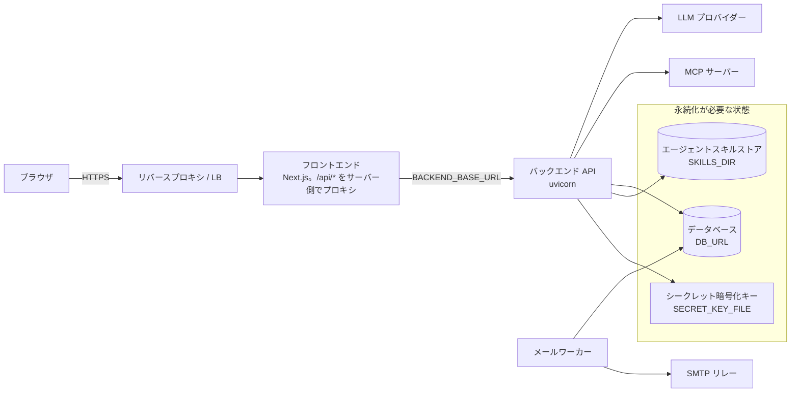

# デプロイ

デプロイの構成要素は、フロントエンドとバックエンドと 1 つのリレーショナルデータベースです。3 つをまとめて立ち上げる一番短い道は [Docker Compose で動かす](../getting-started/docker-compose.md)です。ここから先は、その構成がプロキシの背後に入り、残しておく価値のあるデータを抱えるようになったときに変わることです。

ブラウザが話す相手はフロントエンドだけです。サーバー側のプロキシが `/api/*` をバックエンドへ転送し、認証クッキーをファーストパーティに保ちます。したがってバックエンドを公開する経路は要りません。ここに出てくる変数はすべて[設定リファレンス](./configuration.md)で説明しています。

## リバースプロキシとロードバランサー {#reverse-proxy-and-load-balancer}

**スティッキーセッション(セッションアフィニティ)は不要です。** [水平スケーリング](./scaling.md)を参照してください。1 つの会話を同時に 1 つのドライバーに留めているのはルーティングのアフィニティではなく PostgreSQL のアドバイザリロックで、しかもそれが効くのは 1 本の SSE ストリームのあいだだけです。

SSE のエージェントルート(`POST /api/v1/workflow-executions/{id}/agent` と `POST /api/v1/workflows/{id}/agent`)には、プロキシの層で次の設定が必要です。

| 設定 | 必要な値 | 理由 |
|---|---|---|
| レスポンスのバッファリング | この 2 つのパスでは無効 | アプリは `X-Accel-Buffering: no` を付けており、nginx は全体でバッファリングが有効でもこれをレスポンス単位で尊重します。ほかのプロキシは自分の設定で無効にする必要があります |
| 圧縮 | `text/event-stream` には一切かけない | アプリ自身がレスポンスを圧縮することはないので、クライアントから見える圧縮はこの層から来ています |
| 読み取り / アイドルのタイムアウト | 想定する最長のエージェント実行より十分長く | エージェントの実行にサーバー側の時間制限はないため、ストリームを終わらせられるのはプロキシの読み取りタイムアウトだけです。短すぎると正当な長時間の応答を黙って切ります。「一般的な」リクエストではなく、自分の最長の実行に合わせてください |

ローリングデプロイでは、コンテナが SIGTERM を受け取ってから 30 秒後にまだ開いている SSE ストリームは強制的に終了します(バックエンドの `Dockerfile` の `CMD` にある `--timeout-graceful-shutdown 30`)。これは安全です。アドバイザリロックは接続とともに解放され、クライアントは新しいリクエストで再開します。中断されたストリームがすでにそう振る舞っているのと同じです。

## HTTPS の背後に置く {#behind-https}

次の 3 つの既定値は、ローカルの HTTP 開発にしか合いません。実利用者の前に出す前に 3 つとも変えてください。

| 変数 | 設定する値 | 既定のままだと |
|---|---|---|
| `SESSION_COOKIE_SECURE` | `true` | セッションと CSRF のクッキーに `Secure` が付かず、ブラウザは平文の HTTP にもそれを送ります |
| `CORS_ORIGINS` | ブラウザから見える origin(例 `https://a2flow.example.com`) | API を呼べるのは `http://localhost:3000` だけです |
| `APP_BASE_URL` | 同じ origin | 通知メールがアプリへのリンクなしで送られます。[通知メール](./configuration.md#notification-email)を参照してください |

## プロセス構成 {#process-layout}

API と並んで、デプロイでは [MCP のサンドボックス](../architecture/mcp-proxy.md#the-sandbox)を動かします。テナントが登録した MCP サーバーを実際に起動したり接続したりするプロセスです。分けていること自体が目的で、第三者のコードが動く場所なので、データベースへのアクセスもシークレット暗号鍵も LLM の API キーも持ちません。`compose.yml` では `mcp-proxy` コンテナとして動きます。コンテナを自前で組む場合は [MCP のサンドボックス](./configuration.md#mcp-sandbox)で設定します。

押さえるべき点が 2 つあります。

- **API が先に起動している必要があります。** 両端が互いを識別するための資材を発行するのは API なので、それが書き出されるまでサンドボックスは何も受け付けません。`compose.yml` と同様に、API のヘルスチェックを待ってからサンドボックスを起動してください。
- **共有ディレクトリが要ります。** `MCP_PROXY_TLS_DIR` は両側で同じ場所を指す必要があります。API からは書き込み可能、サンドボックスからは読み取り専用にします。そこに永続的なものは置かれません。欠けていたり期限が近づいたりすれば書き直されます。

サンドボックスを使わないこともできます。`MCP_PROXY_URL` を未設定にすれば API 自身が MCP サーバーに到達します。ローカル開発での動かし方がこれです。ただし登録されたサーバーがデプロイの資格情報の隣で動くことになるので、誰でもサーバーを登録できる環境で選ぶ構成ではありません。

バックエンドはまた、同じデータベースに対する 2 つのエントリポイントとして提供されます。どちらを動かすかで、通知メールをどこから送るかが決まります。

| 構成 | やり方 | 向いている場面 |
|---|---|---|
| API のみ | 既定。`EMAIL_WORKER_IN_PROCESS` が `true` なので、`uvicorn main:app` がメールキューも処理します | 単一プロセスのデプロイや、リレーの停滞がリクエスト処理に載っても許容できる規模 |
| API + ワーカー | API と並べて `python -m worker` を動かし、API 側を `EMAIL_WORKER_IN_PROCESS=false` にします | リレーの停滞がリクエスト処理に一切響いてはいけない場合。`compose.yml` はこの構成です |

ワーカープロセスについて 2 点あります。

- **マイグレーションもシードもしません。** どちらも API の起動時処理が担当するので、ワーカーは API が立ち上がったあとに開始する必要があります。`compose.yml` は API のヘルスチェックを待ってから起動しています。
- **レプリカを増やしても得られるのはフェイルオーバーで、スループットではありません。** `email-queue` アドバイザリロックを取り合い、1 つを除いて意図的に待機します。これが送信レートを正確に保っています。

## ヘルスチェック {#health-checks}

オーケストレーターやロードバランサーは `GET /api/v1/health` に向けてください。[ヘルスチェック](./health.md)を参照してください。

## 永続化が必要な状態 {#state-that-has-to-persist}

コンテナより長生きし、デプロイが元どおり立ち上がるために永続ストレージに置く必要があるものが 3 つあります。

| 対象 | 実体 | 失うと |
|---|---|---|
| **データベース** | `DB_URL` が指すデータベース | すべてです。あらゆるレコードがここに入っています。[データベース](../architecture/database.md)を参照してください |
| **エージェントスキルストア** | `SKILLS_DIR` | 実行が固定しているスキルのリビジョンを読み込めなくなります(HTTP 409 `SKILL_NOT_READY`)。キャッシュではなく永続的な状態です。[エージェントスキルストア](./configuration.md#agent-skill-store)を参照してください |
| **シークレット暗号化キー** | `SECRET_ENCRYPTION_KEY`、または `SECRET_KEY_FILE` のファイル | 保存済みのローカルシークレットがすべて復号できなくなり、認証局も、MCP ツール呼び出しに必要な証明書を発行も検証もできなくなります。[シークレットの管理](./configuration.md#secret-management)を参照してください |

3 つそれぞれの取り方と戻し方は[バックアップと復旧](./backup.md)にあります。
