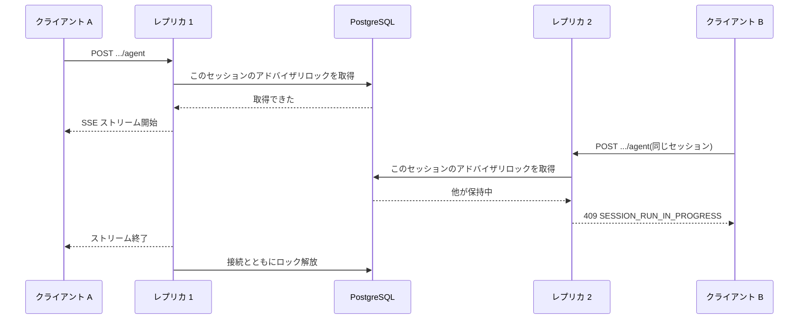

# 水平スケーリング

フロントエンドは自分の状態を持たず(`/api/*` をプロキシするだけで、リクエストのあいだに何も残しません)、自由にスケールできます。以下はすべてバックエンドの話です。

## 2 レプリカ以上で動かすための要件 {#what-running-more-than-one-replica-requires}

| 要件 | 理由 |
|---|---|
| **PostgreSQL** | SQLite はシングルライター、シングルプロセスです。全レプリカが 1 つのデータベースを共有し、レプリカを協調させるのもそのデータベースです |
| **`SKILLS_DIR` の共有** | 全レプリカが同じ[エージェントスキルストア](./configuration.md#agent-skill-store)をマウントする必要があります(ReadWriteMany)。実行は開始時のスキルのリビジョンに固定され、その実行の次のリクエストはどのレプリカに届くか分かりません |
| **トランザクションプーリングのプロキシを挟まない** | 後述の[コネクションプーリング](#connection-pooling)を参照してください |
| **`MCP_PROXY_TLS_DIR` の共有** | 各レプリカは [MCP のサンドボックス](../architecture/mcp-proxy.md#the-sandbox)に対する自分の身元を示す資材をそこに書き、そこから読みます。サンドボックスも同じディレクトリを読みます。レプリカごとに別の場所を持つと、サンドボックスが見たことのない資材を発行することになります |
| スティッキーセッション | 不要です。ルーティングのアフィニティに求めたい役割は、後述のアドバイザリロックが果たします |

MCP のサンドボックス自体は別の理屈でスケールします。呼び出しのあいだに何も持たないので、レプリカ間の協調は一切不要です。バックエンドのレプリカ数ではなく、同時に走るツール呼び出しの数に合わせて増やしてください。

## 1 つの会話につき 1 つのドライバー {#one-driver-per-conversation}

1 つの会話への書き込みは、レプリカをまたいでもすでに安全です。セッションサービスが、追記トランザクションの全体にわたって追記先の行に `SELECT ... FOR UPDATE` を掛けるので、追記は直列化され、会話の状態もイベントの行も失われません。

手当てが要るのは読み取りのほうです。ADK の `Runner` は 1 回の呼び出しのあいだ、メモリ上のセッションを 1 つ抱えます。そのため、そのあいだに別のレプリカが追記したイベントは届かず、実行の残りは欠けた会話をもとに考えることになります。書き込みを直列化してもこれは直りません。直せるのは、1 つのセッションを同時に 1 つのドライバーに限ることだけです。

そこで各エージェント実行(`POST /api/v1/workflow-executions/{id}/agent`、`POST /api/v1/workflows/{id}/agent`)は、**PostgreSQL のセッションレベルのアドバイザリロック**を取り、SSE ストリームの全体にわたって保持します。

同じセッションの 2 つ目の同時実行は、静かにずれていくのではなく、SSE のヘッダーを送る前に拒否されます。異なるセッションどうしが競合することはありません。ロックはあきらめる前に少しだけ待つので、ストリームを中断してすぐ再試行したクライアントが、放棄された実行の後始末中に拒否されることもありません。

人が介在する処理には影響しません。フロントエンドのツール呼び出しは実行を終わらせてストリームを閉じ、ロックを解放します。承認は*新しい*エージェント要求として再開し、これはどのレプリカに届いてもかまいません。

## コネクションプーリング {#connection-pooling}

このロックはトランザクションレベルではなくセッションレベルなので、アプリと PostgreSQL のあいだに**トランザクションプーリング**のプロキシ(`transaction` モードの PgBouncer や、大半のサーバーレス PostgreSQL のプーラー)を挟んではいけません。ロックがステートメントをまたいで残らないからです。セッションレベルのプーリング、または直結が必要です。

## 通知メール {#notification-email}

送信メールのワーカーについて、こちらで調整することはありません。API プロセスの中で動いていても専用プロセスであっても、`email-queue` アドバイザリロックがデプロイ全体でちょうど 1 つの送信者を選ぶので、レプリカが二重に送ることはなく、設定したレート制限も正確なままです。ワーカーのレプリカを増やして得られるのはフェイルオーバーで、スループットではありません。[プロセス構成](./deployment.md#process-layout)を参照してください。
